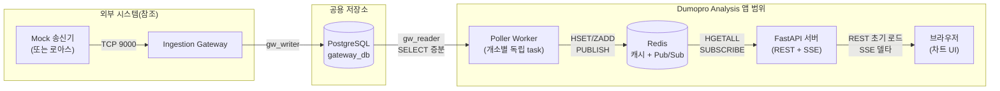
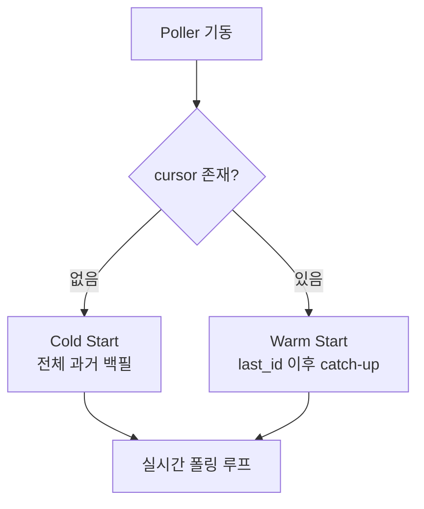
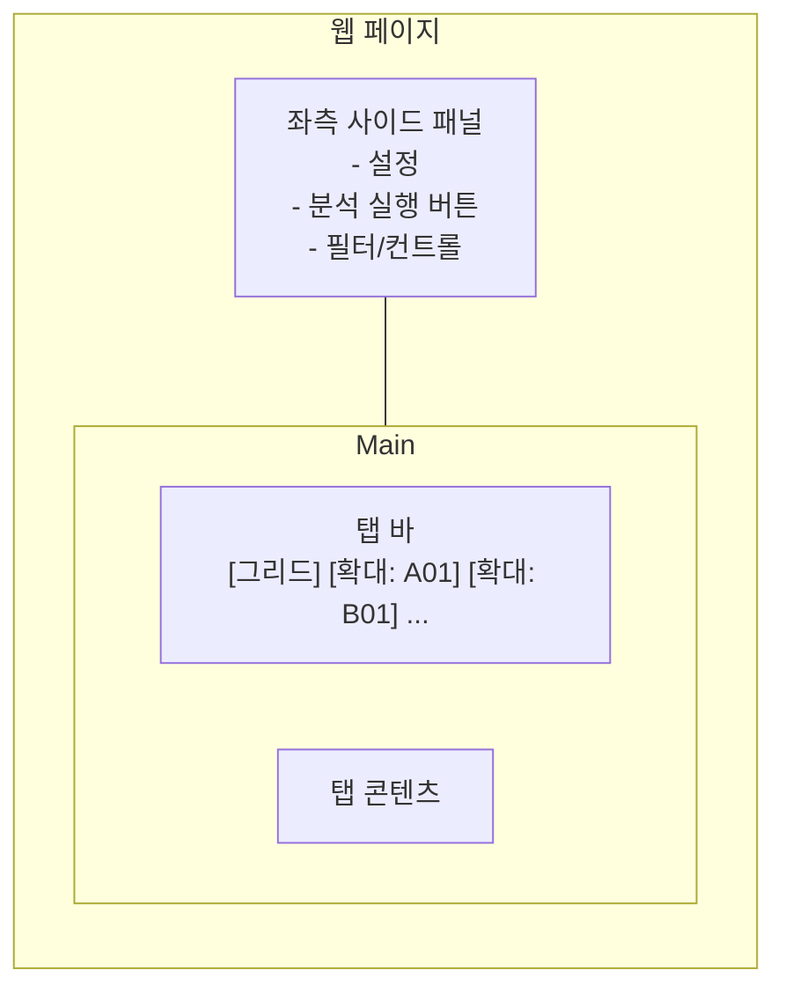
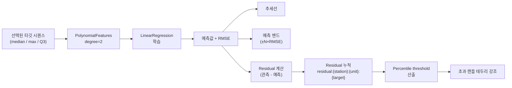
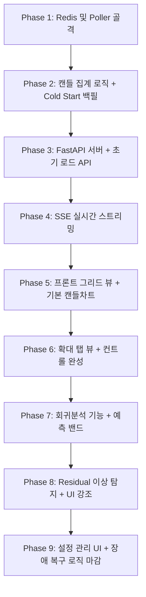

# Dumopro Data Analysis 웹 앱 기획안

> 작성일: 2026-04-18
> 문서 버전: v0.1 (초안)
> 선행 문서: `gateway_plan.md`, `gw_protocol_spec.md`, `consumer_access_guide.md`, `mock_sender_plan.md`, `UXUI_디자인_시_반영사항_260327.pdf`
> 본 문서의 목적: Ingestion Gateway가 공용 저장소에 적재한 Dumopro 분진 센서 데이터를 실시간에 가깝게 시각화하고, 간단한 회귀분석을 통해 이상 징후를 포착하기 위한 웹 어플리케이션의 요구사항을 정의한다. 본 어플리케이션은 AMR 기반 분진 이상탐지 시스템의 Anomaly Detection 축 중 하나이며, 영상 기반 오토인코더 탐지와 병렬 축으로 운영된다.

---

## 1. 범위와 전제

### 1.1 포함 범위

- 공용 저장소(PostgreSQL)의 `sensor_sample` 데이터를 실시간에 가깝게 가져와 시각화
- 캔들차트(박스플롯 변형) 기반의 분진 농도 추이 표시
- 공용 저장소에 등록된 모든 개소의 동시 표시 및 개소별 확대 뷰
- 사용자 요청 기반 회귀분석 및 추세 시각화
- 회귀 residual을 이용한 캔들 단위 이상 징후 표시

### 1.2 데이터 수신 방식의 배경

본 앱은 공용 저장소(PostgreSQL)를 **짧은 주기의 증분 SELECT 폴링**으로 조회하는 방식을 채택한다. 대안으로 검토했으나 배제한 방식들은 다음과 같다.

| 배제한 방식 | 배제 이유 |
|---|---|
| Ingestion Gateway의 TCP 9000 포트에 직접 붙어 수신 | `consumer_access_guide.md`에서 명시적으로 금지. Gateway의 TCP 포트는 외부 송신측(로아스/Mock)으로부터의 수신 전용이며, 내부 Consumer를 위한 스트리밍 포트가 아니다. Consumer는 공용 저장소를 읽는 것만 허용된다. |
| Mock 송신기에 직접 연결하여 데이터 수신 | Mock은 테스트용 데이터 생성기일 뿐이며, 실운영에서는 로아스 시스템으로 교체된다. Mock 고유 구현에 결합되면 실데이터 전환 시 재작업이 필요하다. |
| PostgreSQL에 상시 소켓 연결을 열어 push 수신 | 일반적인 RDBMS 운영 관례에서 벗어난다. PostgreSQL의 `LISTEN/NOTIFY`는 원리상 유효하나, Gateway가 현재 INSERT 시 `pg_notify`를 발행하지 않는다(`consumer_access_guide.md §7.2`). 추후 확장 여지로만 남겨둔다. |

폴링이 가지는 지연(polling interval만큼의 최대 지연)은 브라우저 체감상 무시 가능한 수준이며, 백엔드는 수집된 신규 샘플을 즉시 SSE로 푸시하여 "실시간에 가까운" 체감을 구현한다. 구체 아키텍처는 §2에서 다룬다.

### 1.3 명시적 제외 범위

- 공용 저장소(`station`, `sensor_sample` 등)에 대한 쓰기 작업
- 영상 데이터 탐지 결과 표시(Autoencoder/YOLO Consumer의 영역)
- 알림 발송(현 단계 보류)
- 사용자 인증/RBAC(현 단계 보류)

### 1.4 핵심 설계 원칙

- **공용 저장소는 읽기 전용**: `gw_reader` 계정으로만 접근. 본 앱 고유의 분석 결과는 Redis(캐시) 및 필요 시 독자 DB에 기록한다.
- **실시간성의 현실적 구현**: DB는 알림을 보내지 않으므로, 백엔드가 짧은 주기로 증분 폴링하여 신규 샘플을 감지하고, 브라우저에는 SSE로 델타만 푸시한다.
- **과거와 현재의 계층 분리**: 확정된 과거 캔들은 불변 캐시로 유지하고, 현재 진행 중인 캔들만 재계산 대상이다.
- **개소별 독립성**: 각 개소는 자신만의 시간축과 상태를 가진다. 한 개소의 장애가 다른 개소에 영향을 주지 않는다.
- **가상 시간 동작 보장**: Mock 송신기가 가상 시간으로 동작하더라도 동일한 아키텍처가 그대로 적용된다. 실데이터 전환 시 코드 변경 없음.

---

## 2. 시스템 아키텍처

### 2.1 전체 구성



### 2.2 컨테이너 구성

| 컨테이너 | 역할 | 호스트 노출 포트 | 상태 |
|---|---|---|---|
| `dumopro-redis` | 캐시, Pub/Sub 브로커 | `6380` | 신규 |
| `dumopro-poller` | 공용 저장소 폴링, Redis 적재 | `9106` (health/상태 API) | 신규 |
| `dumopro-api` | REST API + SSE 스트림 + 정적 프론트 제공 | `9105` | 신규 |
| `postgres` (기존) | 공용 저장소. `gw_reader` 계정으로 조회 | `2345` (기존) | 기존 (Gateway와 공유) |

- Gateway와 동일한 Docker network(`gw-net`)에 참여한다.
- Redis는 본 앱 전용으로 분리한다. Autoencoder 앱이 사용하는 Redis(`6379`)와 포트·인스턴스를 분리하여 `6380`을 사용한다.
- 기존 시스템 포트와의 관계:
  - Autoencoder API: `9104` (기존)
  - Dumopro API / 정적 프론트: `9105`
  - Dumopro Poller: `9106`
  - Autoencoder Redis: `6379` (기존), Dumopro Redis: `6380` (+1 카운트)

### 2.3 Poller와 API의 분리 이유

- API 서버는 수평 확장될 수 있으나, Poller는 개소당 단일 task로만 동작해야 한다(중복 적재 방지).
- 장애 격리: API 재시작이 폴링 루프에 영향을 주지 않는다.
- 백필 중에도 API는 독립적으로 기동 가능하다.

---

## 3. 데이터 모델 (Redis)

### 3.1 키 네이밍 규칙

```
live:raw:{station}:{unit}:{bucket_key}             Sorted Set   원본 샘플 (통계 재계산용)
live:stats:{station}:{unit}:{bucket_key}           Hash         라이브 캔들 통계 스냅샷
cursor:{station}                                   Hash         폴링 커서 + 현재 라이브 버킷 키
frozen:{station}:{unit}:{bucket_key}               Hash         확정된 과거 캔들 통계
frozen:index:{station}:{unit}                      Sorted Set   확정 캔들 인덱스 (기간 조회용)
residual:{station}:{unit}:{target}                 List or ZSet 회귀 residual 누적 (이상 탐지용)
```

- `{station}`: `station_name` 사용 (UUID보다 가독성 우선)
- `{unit}`: `day` / `week` / `month`
- `{target}`: 회귀 타깃 구분자. `median` / `max` / `q3` 중 하나 (§8.2)
- `{bucket_key}` 형식:
  - day: `YYYY-MM-DD`
  - week: `YYYY-Www` (ISO 주차, 예: `2026-W16`)
  - month: `YYYY-MM`

### 3.2 단위별 TTL 정책

| 용도 | 키 | TTL | 근거 |
|---|---|---|---|
| 라이브 원본 | `live:raw:*` | 48h / 14d / 60d | 단위별 버킷 지속 기간 여유분 |
| 라이브 스냅샷 | `live:stats:*` | (확정 시 명시 삭제) | 확정 후 불필요 |
| 확정 캔들 | `frozen:*` | 없음(영구) | Egress Gateway로 전송 전까지 유지 |
| 확정 인덱스 | `frozen:index:*` | 없음(영구) | 동일 |
| 커서 | `cursor:*` | 없음(영구) | Poller 재시작 시 이어서 폴링 |

> Redis 용량 관리: 확정 캔들은 영구 보존하되, Egress Gateway가 로아스로 전송한 시점 이후로는 삭제하는 정책을 추후 추가할 수 있다. Egress Gateway 구현 지연 시 Redis 용량이 임계치에 도달하면 경고한다(§10 참조).

### 3.3 버킷 단위 연산량 검토

| 단위 | 최대 샘플 수 | 통계 재계산 시간(추정) |
|---|---|---|
| day | 600 | < 1ms |
| week | 4,200 | ~2ms |
| month | ~18,000 | ~5ms |

폴링 주기 1.5초 × 개소 수 × 단위 3개 수준의 재계산 부하. 개소 수가 수십 개로 늘어나도 Redis 및 numpy 연산량 기준 무시 가능.

---

## 4. Poller 요구사항

### 4.1 개소 목록 수집 정책

- Poller는 기동 시 공용 저장소의 `station` 테이블을 조회하여 활성 개소 전체 목록을 확보한다. 개소 개수와 이름은 **사전에 알 필요가 없으며** 본 앱 내에 하드코딩해서는 안 된다.
- 운영 중 신규 개소가 관리자 도구로 등록될 수 있으므로, Poller는 주기적으로(예: 수 분 간격) `station` 테이블을 재조회하여 신규 개소용 독립 task를 동적으로 추가한다. 구체 간격은 설정값으로 노출한다.
- 비활성화되거나 제거된 개소에 대해서는 해당 task를 정상 종료시킨다. Redis의 `frozen:*` 데이터는 유지하여 이력 조회가 가능하도록 한다.

### 4.2 기본 동작

- 개소당 하나의 독립 asyncio task를 기동한다.
- 각 task는 다음 루프를 반복한다:
  1. `cursor:{station}`에서 `last_id` 조회
  2. `sensor_sample`에서 `id > last_id` 증분 조회 (상한: 500건 등)
  3. 수신 샘플을 단위별로 분류하여 `live:raw:*`에 ZADD
  4. 버킷 경계 감지 시 이전 버킷을 `frozen:*`으로 확정 + 인덱스 등록
  5. 더티 상태가 된 라이브 버킷의 통계 재계산 → `live:stats:*` 갱신 + Pub/Sub 발행
  6. `cursor:{station}` 갱신
  7. `POLL_INTERVAL_SEC`만큼 sleep
- 샘플 조회 기준 컬럼은 `id`(bigserial, 증가 순서 = 도착 순서).

### 4.3 Cold Start vs Warm Start



- **Cold Start**: 공용 저장소의 해당 개소 전체 `sensor_sample`을 시간순으로 읽어 모든 단위(일/주/월)의 확정 캔들을 일괄 구축한다. 마지막 버킷만 라이브 상태로 두고 나머지는 즉시 `frozen:*`에 기록한다.
- **Warm Start**: 커서 이후 증분만 catch-up하여 현재 시점까지 동기화한 뒤 실시간 모드로 전환한다.
- Cold Start 완료 전에는 API 서버가 데이터를 제공할 수 없으므로, Poller에 "백필 완료" 헬스 신호를 두고 API는 이를 확인한 후에 기동하도록 docker-compose에서 순서를 보장한다.

### 4.4 장애 복구

| 항목 | 기본값 | 사용자 설정 가능 여부 |
|---|---|---|
| 예외 발생 후 재시작 대기 시간 | 10초 | 예 |
| 연속 실패 허용 횟수 | 5회 | 예 |
| 한계 도달 시 | 해당 개소 task 종료 | — |

- task 종료 시 API 및 로그로 해당 개소가 오프라인 상태임을 알린다.
- 사용자가 관리자 화면에서 해당 개소 task를 수동 재기동할 수 있다(구현 여부는 후속 기획).

### 4.5 폴링 주기 및 배치 제한

| 항목 | 기본값 | 비고 |
|---|---|---|
| `POLL_INTERVAL_SEC` | 1.5 | 목업 초당 1건 기준 자연스러움 |
| `POLL_BATCH_LIMIT` | 500 | catch-up 시 한 사이클 상한 |
| 샘플 필터 | `measurement_type = 'dust_concentration'` | Dumopro 전용 |

---

## 5. 캔들 집계 요구사항

### 5.1 박스플롯 통계 정의

UI/UX 문서 및 첨부 `dust_candle_final.html`의 규칙을 그대로 따른다.

| 항목 | 정의 |
|---|---|
| Q1 | 하위 25% 값 |
| Q3 | 상위 25% 값 |
| median | 중앙값 |
| IQR | Q3 − Q1 |
| upper fence | Q3 + 1.5 × IQR |
| extreme upper | Q3 + 3 × IQR |
| whisker_high | upper fence 이하 값들 중 최댓값 |
| whisker_low | lower fence 이상 값들 중 최솟값 |
| outliers | upper fence 초과 ~ extreme upper 이하 값 목록 |
| extremes | extreme upper 초과 값 목록 |
| count | 버킷에 포함된 샘플 수 |

출력 단위는 `mg/m³`.

### 5.2 단위별 집계 정책

- 일별: 해당 날짜의 모든 샘플을 모아 단일 박스플롯 산출
- 주별: ISO 주차 단위로 모든 샘플을 모아 산출 (일별 통계의 재집계가 아니라 원본 기반)
- 월별: 해당 월의 모든 샘플을 모아 산출

> 재집계가 아닌 **원본 기반 집계**를 채택하는 이유: 주별/월별 통계를 일별 Q1/Q3의 평균으로 근사할 경우 통계학적으로 부정확하다. 원본 샘플 수가 많지 않아(§3.3) 매번 전체 재계산이 가능하다.

### 5.3 버킷 경계 처리 (그레이스 기간)

신규 샘플의 타임스탬프가 현재 라이브 버킷을 벗어나면 이전 버킷을 확정한다. 다만 네트워크 지연·재전송으로 인해 지각 샘플이 도착할 가능성이 있으므로, 다음 옵션을 둔다.

| 항목 | 기본값 | 사용자 설정 가능 여부 |
|---|---|---|
| 그레이스 기간 | 30초 | 예 |
| 0으로 설정 시 | 즉시 확정 | — |

- 그레이스 기간 동안은 이전 버킷을 "확정 대기" 상태로 유지한다.
- 기간 내에 지각 샘플이 도착하면 이전 버킷 통계에 포함시켜 재계산한다.
- 기간 경과 후 최종 확정하여 `frozen:*`에 기록한다.

---

## 6. 실시간 스트리밍 요구사항

### 6.1 채널 설계

개소당 하나의 Pub/Sub 채널을 운용한다.

```
channel:candle:{station}
```

### 6.2 이벤트 타입

| 이벤트 | 발행 시점 | 페이로드 |
|---|---|---|
| `candle_update` | 라이브 버킷에 샘플 추가되어 통계 재계산됨 | `{unit, bucket_key, stats, updated_at}` |
| `candle_frozen` | 버킷 확정 완료 | `{unit, bucket_key, stats}` |
| `station_stalled` | 개소 task가 장애로 종료됨 | `{station, reason}` |

### 6.3 브라우저 구독 방식

- 기본 그리드 뷰에서는 화면에 표시 중인 모든 개소의 채널을 구독한다.
- 확대 탭에서는 해당 개소 채널만 구독하면 충분하지만, 이미 기본 뷰에서 구독 중이므로 중복 연결을 만들지 않는 것을 권장한다.
- SSE 연결 끊김 시 자동 재연결한다(EventSource 기본 동작).

### 6.4 초기 로드 API

```
GET /api/chart/{station}?unit={day|week|month}&range={90|180|365|all}
```

응답에는 다음이 포함된다:

- `frozen`: 지정 기간 내 확정 캔들 목록 (`frozen:*`에서 조회)
- `live`: 현재 라이브 캔들 (`live:stats:*`에서 조회)
- `last_sampled_at`: 해당 개소의 최종 수신 타임스탬프 (상태 표시용)

페이지 진입 시 1회 호출하여 차트를 그리고, 이후 변동분은 SSE로만 반영한다.

---

## 7. 프론트엔드 요구사항

### 7.1 디자인 기조

본 앱의 프론트엔드는 **Windows 9x/2000 시대의 클래식 어드민 UI 스타일**을 따른다. 동일 시스템 내 `Mock Sensor Admin` 페이지(`mock_sender`의 HTTP 관리 페이지)와 일관된 비주얼 언어를 유지한다.

**준수 사항**

| 항목 | 지침 |
|---|---|
| 배경 | 순백(`#ffffff`) 단색. 그라데이션·패턴·질감 금지. |
| 글자색 | 순흑(`#000000`) 기본. 보조 정보는 회색 계열(`#444`) 수준까지만 허용. |
| 에러·경고 강조 | 어두운 빨강(`#a00000`) 정도. 채도 높은 형광색 금지. |
| 폰트 | `MS Sans Serif`, `Courier New` 등 클래식 sans-serif / monospace 계열 |
| 테두리 | 1px 단선(`#000`). 둥근 모서리(`border-radius`) 금지. 그림자(`box-shadow`) 금지. |
| 섹션 구분 | `<fieldset> + <legend>` 또는 동등한 사각 박스 + 라벨 |
| 표 | `border-collapse: collapse`, 얇은 단선. 줄무늬/호버 하이라이트 금지. |
| 버튼 | OS 기본 스타일에 가깝게. 커스텀 컬러 버튼·아이콘 버튼 지양. |
| 아이콘/이모지 | 원칙적으로 사용하지 않는다. 필요한 경우 단색 기호(✔, ✗, → 등)로 제한. |
| 애니메이션 | 불필요한 트랜지션·페이드·슬라이드 금지. 탭 전환, 모달 열림 등 기능적 전환만 즉시 반영. |

**차트 색상 예외**

캔들차트 내부의 데이터 표현(몸통/수염/Outlier/Extreme/이동평균선/추세선/예측 밴드 등)은 시각적 구분을 위해 채도 있는 색상 사용을 허용한다. 단, 배경·프레임·UI 크롬(chrome)은 위 모노톤 규칙을 따른다. 첨부 `dust_candle_final.html`의 색 팔레트를 기준으로 하되 배경·테두리만 본 지침에 맞춘다.

**의도**

- 관제/운영 환경에서의 장시간 응시 피로 최소화
- 동일 시스템 내 타 관리자 페이지(`Mock Sensor Admin`)와의 시각적 통일성
- 정보 밀도 우선. 장식적 요소 배제.

### 7.2 전체 레이아웃



- 좌측 고정 사이드 패널: 설정 및 제어 컨트롤을 집중 배치
- 메인 영역: 탭 구조. 첫 탭은 항상 "그리드 뷰"로 고정되며 닫을 수 없다.
- 확대 탭은 사용자가 개소를 클릭할 때 생성되며, 닫기 가능.

### 7.3 기본 그리드 뷰

- 메인 영역을 **2열 구조**로 분할한다.
- 각 셀에 개소별 캔들차트를 렌더링한다.
- 개소 수가 3개를 초과하면 **세로 스크롤**로 확장된다 (개소 N개 → 2열 × ⌈N/2⌉행).
- 각 셀에 표시되는 정보:
  - 개소명
  - 캔들차트 (현재 선택된 단위 기준)
  - 이동평균선 1개 (MA7 기본, 선택 가능)
  - 현재 라이브 캔들의 중앙값
  - 최종 갱신 표시: "n초 전" 텍스트 (라이브 캔들 `updated_at` 기준)

### 7.4 확대 뷰 (탭)

- 그리드 셀 클릭 시 해당 개소의 확대 뷰 탭을 연다.
- **동일 개소 중복 오픈 금지**: 이미 열려 있는 탭이 있으면 해당 탭으로 포커스 이동.
- **동일 개소 단위별 중복 오픈 금지**: 일별 탭과 월별 탭을 동시에 두지 않는다. 사용자는 하나의 탭 안에서 단위를 전환해 본다.
- 확대 뷰 구성 요소 (`UXUI_디자인_시_반영사항_260327.pdf` 및 `dust_candle_final.html` 기준):
  - 단위 전환 드롭다운 (일/주/월)
  - 기간 필터 드롭다운 (90일/180일/전체)
  - 이동평균 토글 4종 (MA7, MA30, MA120, MA365)
  - 범례 (몸통 Q1~Q3, 수염 min-max, Outlier, Extreme, 단위 표기)
  - 캔들차트 본체
  - 캔들 호버 툴팁 (Q1, Q3, 중앙값, 수염 최대/최소, outliers, extremes, 집계 일수 등)
  - **회귀분석 결과 표시 영역** (§8)

### 7.5 초기 진입 기본값

| 항목 | 기본값 |
|---|---|
| 표시 단위 | 일(day) |
| 기간 필터 | 전체 |
| 활성 이동평균 | MA7, MA30 |

### 7.6 상태 표시

- 각 셀 및 확대 탭 상단에 "최종 갱신 n초 전" 텍스트를 표시한다.
- Mock 송신기가 라운드로빈으로 다른 개소를 돌고 있는 2분(실시간) 동안 해당 개소는 신규 수신이 없으므로 "n초 전" 값이 증가한다. 이는 정상 동작이다.
- 개소 task가 종료된 상태(`station_stalled` 이벤트 수신 후)에는 셀 전체를 회색 오버레이로 처리하고 "오프라인" 라벨을 표시한다.

### 7.7 Residual 초과 캔들 표시

- §8에서 산출한 residual이 threshold를 초과한 캔들은 **몸통 테두리 색**을 달리하여 강조한다(구체 색상은 디자이너 재량, 단 Outlier/Extreme 색과 혼동되지 않아야 함).
- 호버 툴팁 하단에 해당 캔들의 residual 값과 threshold 값을 함께 표시한다.

---

## 8. 회귀분석 기능

### 8.1 실행 방식

- **자동 실행 없음.** 사용자가 좌측 사이드 패널의 "분석 실행" 버튼을 클릭할 때만 동작한다.
- 분석은 현재 활성 탭의 개소 및 현재 선택된 단위 기준으로 수행된다.
- 결과는 해당 탭에만 반영되며 다른 탭에는 영향을 주지 않는다.

### 8.2 입력 변수

#### 타깃(Y) — 사용자 선택

회귀 대상 값은 사용자가 선택할 수 있도록 옵션으로 노출한다.

| 옵션 | 대상 값 | 사용 의미 |
|---|---|---|
| 중앙값 (기본) | 각 캔들의 median | 전체적인 수준의 장기 추세 파악. 안정적이지만 순간적인 튐에는 둔감 |
| 최댓값 | 각 캔들의 whisker_high | 하루 중 가장 튄 값의 추세. 분진 누출처럼 "평소엔 괜찮다가 순간 튀는" 이상 패턴 포착에 유리 |
| Q3 | 각 캔들의 Q3 | 상위 25% 경계의 추세. 최댓값보다 안정적이면서 중앙값보다 민감 |

- Residual threshold는 타깃별로 독립적으로 산출·저장한다. 타깃이 다르면 residual 분포도 다르기 때문이다.
- UI는 좌측 사이드 패널의 "분석 실행" 버튼 근처에 타깃 선택 드롭다운을 배치한다.

#### 피처(X)

- **시간축**: 순차 인덱스(`time_index`)
- **주기 기반 피처**: 시간의 파생이지만 장기 추세와는 다른 축으로 작용하여, "추세 + 반복 패턴"을 분리해서 학습 가능하게 한다. 단위별로 유효한 구성이 다르며, 단위에 맞지 않는 피처는 추가하지 않는다.

| 활성 단위 | 주기 기반 피처 구성 |
|---|---|
| 일별 | `time_index`, `day_of_week`, (선택) `week_of_month` |
| 주별 | `time_index`, `month`, (선택) `quarter` |
| 월별 | `time_index`, `month`(연중 계절성), `quarter` |

> **참고**: 주기 기반 피처도 결국 시간에서 파생된다. 다만 단일 시간축만으로는 "장기 추세선 1개"만 얻지만, 주기 기반 피처를 추가하면 "추세 + 반복 패턴"을 분리해서 학습할 수 있다. Mock 데이터는 주기 패턴이 설계되어 있지 않으므로, 실데이터 전환 전까지는 효과가 제한적일 수 있다.

### 8.3 모델 구성

- `scikit-learn`의 `PolynomialFeatures(degree=2) + LinearRegression` 파이프라인을 사용한다.
- degree는 파라미터로 노출하여 추후 튜닝 가능하게 한다.
- 개소별로 독립 모델을 학습한다(상태 공유 없음).

### 8.4 최소 데이터 요구량

- 현재 활성 단위 기준 **5개 이상의 확정 캔들**이 있어야 실행 가능.
- 미충족 시 경고 모달을 띄우고 실행을 차단한다.
  - 예시 메시지: "분석 실행에는 최소 5개의 확정 캔들이 필요합니다. 현재 {N}개입니다."

### 8.5 차트 표시 — 예측 밴드

- **추세선**: 회귀 예측값을 연결한 곡선
- **예측 밴드**: 추세선 ± N × RMSE 영역을 음영 처리 (N 기본값 2, 설정 가능)
- 두 요소 모두 기존 이동평균선과 구분되는 스타일로 표현한다.



### 8.6 이상 탐지 연동

- 각 캔들의 residual(관측값 − 예측값)을 `residual:{station}:{unit}:{target}` 키에 누적한다. `{target}`은 `median` / `max` / `q3` 중 하나이며, 타깃별로 독립 저장된다.
- 분석 실행 시점에 누적 분포에서 percentile threshold를 산출한다 (예: 95%, 99% — 설정값).
- threshold를 초과하는 캔들은 §7.7에 따라 테두리 색을 바꿔 표시한다.
- 타깃이 여럿 선택되어 있을 경우 여러 타깃 중 **하나라도 threshold를 초과하면** 강조 대상으로 간주한다(조건: OR). 구체 기준은 설정으로 노출 가능.
- 알람 발송은 본 단계에서 보류한다(차후 기획 반영 여지).

---

## 9. 설정 관리

사용자가 조정 가능한 파라미터를 좌측 사이드 패널의 "설정" 영역에 노출한다.

| 구분 | 항목 | 기본값 |
|---|---|---|
| Poller | 폴링 주기(초) | 1.5 |
| Poller | 재시작 대기 시간(초) | 10 |
| Poller | 연속 실패 허용 횟수 | 5 |
| 집계 | 그레이스 기간(초) | 30 |
| 회귀 | 다항 차수(degree) | 2 |
| 회귀 | 예측 밴드 배수(N × RMSE) | 2 |
| 회귀 | Residual percentile threshold | 95 |
| 회귀 | 타깃 선택 | median (추가로 max, Q3 선택 가능) |
| 회귀 | 다중 타깃 threshold 조합 | OR (하나라도 초과 시 강조) |
| 차트 | 초기 표시 단위 | day |
| 차트 | 기본 활성 이동평균 | MA7, MA30 |

- 설정 변경 시 반영 범위:
  - Poller 관련 설정: 서버 재기동 필요 또는 시그널 기반 핫 리로드(구현 재량)
  - 회귀 관련 설정: 다음 분석 실행 시 반영
  - 차트 관련 설정: 즉시 반영

---

## 10. 운영 고려사항

### 10.1 Redis 용량 모니터링

- 확정 캔들 영구 보존 정책은 Egress Gateway로 외부 송신이 이루어지기 전까지 유지하기 위한 것이다.
- Egress Gateway 구현이 지연되어 Redis 메모리 사용량이 임계치에 도달하면 다음을 수행한다:
  1. 관리자 로그에 경고
  2. 가장 오래된 확정 캔들부터 삭제 (필요 시)
- 현재 데이터 규모로는 수개월 분도 MB 단위로 추정되므로 실제 문제가 될 가능성은 낮다.

### 10.2 가상 시간과 UI 간의 관계

- Mock 송신기는 실시간 10분 = 가상 1일로 동작하므로, 확정 캔들이 실시간 분 단위로 빠르게 쌓인다.
- 이로 인해 다음 현상이 발생하며, 모두 정상 동작으로 간주한다:
  - 주별/월별 경계도 실시간 기준 수 시간 단위로 넘어감
  - 라이브 캔들이 특정 개소에서 수 분간 정지 상태가 됨 (다른 개소를 순회 중)
- UI의 "n초 전" 표시와 스크롤/탭 동작이 이 속도에서 매끄럽게 동작해야 한다.

### 10.3 초기 백필 완료 대기

- Poller가 Cold Start 백필을 수행 중인 동안 API 서버는 기동을 지연시킨다.
- docker-compose에서 `depends_on` + healthcheck를 활용하여 순서를 보장한다.
- 백필 소요 시간은 데이터 누적량에 비례하며, 수백만 건 기준 10초 이내로 완료될 것으로 추정.

---

## 11. 구현 순서 제안



각 Phase는 독립적으로 동작 가능한 단위로 잘라 구현하며, 직전 Phase 완료 후 간단한 수동 검증을 거친 후 다음 Phase로 진입한다.

---

## 12. 미결정 사항 및 후속 결정 필요

| 항목 | 현 상태 | 후속 결정 시점 |
|---|---|---|
| Extreme outlier 발생 시 알림 발송 | 보류 | 실데이터 확보 후 |
| 외부 환경 변수(온도/습도 등) 피처 활용 | 보류 | 실데이터 확보 후 |
| Poller task 수동 재기동 관리자 화면 | 미기획 | 장애 경험 누적 후 |
| Egress Gateway와의 연계 방식(확정 캔들 삭제 정책) | 미기획 | Egress Gateway 구현 후 |
| 사용자 인증 / RBAC | 미기획 | 운영 단계 진입 시 |

---

## 13. 변경 이력

| 버전 | 날짜 | 작성자 | 변경 |
|---|---|---|---|
| v0.1 | 2026-04-18 | 이상현 | 초안. Claude와 기획 논의 결과 반영. |
