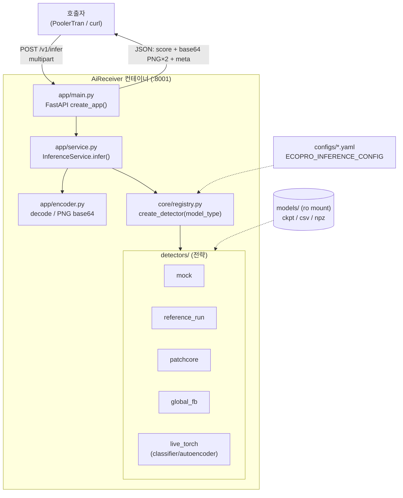

# AiReceiver 프로그램 구조 분석

> 분석 대상: `AiReceiver/` (DemoReceiver = EcoProBM AMR Inference Module 의 도커화 이식본)
> 작성일: 2026-06-12
> 목적: AiReceiver 의 추론 서버 구조 — REST 계약·요청 처리 흐름·디텍터(전략 패턴)·설정 체계·도커 구성을 구현 코드 기준으로 분석한 참고 문서
> 관련 문서: [PoolerTran_구조.md](PoolerTran_구조.md), [SocketDaim_구조.md](SocketDaim_구조.md), [AiReceiver/DOCKERIZATION.md](AiReceiver/DOCKERIZATION.md), [AiReceiver/docs/api_contract.md](AiReceiver/docs/api_contract.md)

---

## 1. 개요

AiReceiver 는 순찰 AMR 이 촬영한 **best-shot 이미지 1장을 받아 이상치 점수(score)와 시각화 이미지를 돌려주는 독립 FastAPI 추론 서버**다. SocketDaim/PoolerTran 과 동일하게 Docker 컨테이너로 가동하며 `gw-net` 에 `external` 로 합류한다(PoolerTran 등이 `http://ai-receiver:8001` 로 호출).

### 1.1 핵심 설계 원칙

| 원칙 | 내용 |
|------|------|
| **점수만, 판정 없음** | 0/1 알람 결정을 하지 않는다. 임계값(threshold) 처리는 **외부(decision_agent)** 책임 — 응답의 `threshold_managed_by: "external_decision_agent"` |
| **무상태(stateless)** | DB 없음·저장 없음. 입력 이미지 → 추론 → 응답(JSON)으로 끝나는 순수 함수에 가깝다 |
| **전략(Strategy)/레지스트리** | `model_type` 으로 디텍터 구현체를 교체. 새 모델 추가 = 디텍터 1개 + 레지스트리 1줄 |
| **설정 구동** | 모델/디바이스/전처리/가중치 경로를 `ECOPRO_INFERENCE_CONFIG` yaml 로 주입. 코드 변경 없이 모델 전환 |
| **torch 지연 로딩** | torch 는 live 디텍터 내부에서만 import → mock/reference 는 torch 없이 경량 동작 |
| **위치 식별자 = inspection_point_id** | 고정 카메라가 아니라 AMR 순회 구조라 `camera_id` 대신 점검 지점 ID 사용 |

### 1.2 파이프라인 내 위치

```
SocketDaim(ingestion) ─프레임 저장→ PoolerTran ─/v1/infer→ AiReceiver ─score 응답→ PoolerTran ─result_db 적재
                                       (전달·기록)        (추론, 본 문서)        (decision_agent 가 임계값 판정)
```
AiReceiver 는 **연산 계층**이고, 신뢰성 전달·기록은 PoolerTran, 임계값 기반 판정은 decision_agent 가 맡는다.

---

## 2. 전체 아키텍처



---

## 3. 디렉토리 구조

```
AiReceiver/
├── app/
│   ├── main.py        # FastAPI 엔트리: /healthz, /v1/metadata, /v1/infer
│   ├── config.py      # Settings + load_settings(): yaml/json 로딩
│   ├── service.py     # InferenceService: 이미지 디코드→디텍터→응답 조립
│   └── encoder.py     # PIL 디코드, PNG base64 인코드
├── core/
│   ├── base.py        # DetectionResult, InferenceResponse, BaseDetector
│   └── registry.py    # create_detector(): model_type → 디텍터 인스턴스
├── detectors/         # 전략(Strategy) 구현체
│   ├── common.py      # resize_crop_rgb(전처리), score_overlay, heatmap_overlay
│   ├── mock.py        # MockDetector (휘도 기반 더미 점수)
│   ├── reference_run.py   # CSV 점수 리플레이 (검증용)
│   ├── artifact_replay.py # PatchCore / GlobalFeatureBank (CSV+npz 산출물)
│   └── live_torch.py  # LiveTorchDetector / LiveStubDetector (ckpt 추론)
├── configs/           # mock / live.* / packaged.* / reference.* 모델별 yaml
├── models/            # 체크포인트·CSV·npz (374MB, 런타임 ro 마운트)
├── Dockerfile         # slim + (옵션)torch, uvicorn :8001
├── docker-compose.yml # ai-receiver, gw-net, models 마운트
├── requirements.txt / requirements-torch.txt
└── docs/ handoff/ scripts/ tests/
```

---

## 4. 요청 처리 흐름 (`POST /v1/infer`)

1. **[main.py]** multipart 폼 수신 → `file.read()` 로 이미지 바이트 + 메타(`image_id, amr_id, mission_id, inspection_point_id, captured_at`)
2. **[service.py `infer()`]**
   - `decode_image(bytes)` (encoder, PIL) → 원본 크기 기록
   - `detector.analyze(image, filename)` → `DetectionResult(score, preprocessed, visualization, meta)`
   - `total_ms` 측정, `meta` 에 `original_size`/`total_ms` 추가
   - `preprocessed`/`visualization` 을 **PNG base64** 로 인코드
   - `InferenceResponse` 조립 → `to_dict()`
3. **[응답]** score + score_range + base64 이미지 2장 + meta + 입력 메타 에코

> 모듈은 **process 시작 시 1회** `InferenceService.from_settings(load_settings())` 로 디텍터를 로드(`detector.load()`)해 둔다(main.py 모듈 레벨). 요청마다 모델 재로딩 없음.

---

## 5. REST API 계약

[docs/api_contract.md](AiReceiver/docs/api_contract.md) 기준.

### `POST /v1/infer` (multipart/form-data)
| 필드 | 필수 | 의미 |
|---|---|---|
| `file` | ✅ | 이미지 파일 |
| `image_id` | | 추적 ID |
| `amr_id` | | AMR 식별자 |
| `mission_id` | | 주행/점검 mission |
| `inspection_point_id` | | 점검 위치 ID (camera_id 아님) |
| `captured_at` | | 촬영 시각(ISO-8601) |

**응답(JSON)**: 입력 메타 에코 + `model_type`, `model_version`, `score`, `score_range`, `preprocessed_image`(base64 PNG), `visualization_image`(base64 PNG), `meta{input_size, original_size, total_ms, viz_type, score_name}`

### 기타
- `GET /healthz` → `{ok, model_loaded, model_type}`
- `GET /v1/metadata` → `{model_type, model_version, input_size, score_range, viz_type, threshold_managed_by}`

---

## 6. 설정 체계 (`app/config.py`)

`ECOPRO_INFERENCE_CONFIG`(기본 `configs/mock.yaml`)의 yaml/json 을 `Settings` 로 로딩.

| 설정 | 내용 |
|---|---|
| `model_type` | 디텍터 선택 키 (mock/classifier/autoencoder/patchcore/global_fb/…) |
| `model_version` | 버전 문자열(응답에 포함) |
| `device` | cpu/gpu |
| `preprocess` | `image_size`(256), `portrait_crop_anchor`(0.85), `landscape_crop_anchor`(0.5) |
| `score_range` | 점수 해석 범위(기본 0.0~1.0) |
| `reference_run` | CSV 리플레이용(`score_csv`, `score_column`, `viz_type`) |
| `live_model` | ckpt/아티팩트 경로·백본 등(`weights_path`, `score_csv`, `heatmap_path`, `backbone`, …) |

**config 종류**: `mock`(모델 불필요) · `live.*`(ckpt 추론) · `packaged.*`(핸드오프 ZIP 의 `models/` 사용) · `reference.*`(CSV 점수 검증).

---

## 7. 디텍터 (전략 패턴) — `core/registry.py`

`create_detector(settings)` 가 `model_type` 으로 분기:

| model_type | 디텍터 클래스 | 동작 | torch | viz_type |
|---|---|---|---|---|
| `mock` | `MockDetector` | 전처리 후 **휘도 평균**을 점수로(더미) | ❌ | mock_heat_overlay |
| `reference_run` | `ReferenceRunDetector` | 업로드 **파일명으로 CSV 점수 매칭**(검증 리플레이) | ❌ | (config) |
| `patchcore` | `PatchCoreArtifactDetector` | CSV 점수 + **npz heatmap 오버레이** | ❌(numpy) | patchcore_heatmap |
| `global_fb` | `GlobalFeatureBankArtifactDetector` | CSV 점수(이미지 레벨, 공간 위치 없음) | ❌ | global_feature_distance_overlay |
| `live_stub` | `LiveStubDetector` | torch 경량 스텁 | (live) | — |
| 그 외(`classifier`/`autoencoder` 등) | `LiveTorchDetector` | **ckpt 로드 후 실제 추론** + Grad-CAM/diff map | ✅ | grad_cam / diff_map |

모든 디텍터는 `BaseDetector` 를 따르며 `load()`(1회) + `analyze(image, filename) -> DetectionResult` 계약을 구현한다.

### 7.1 전처리·시각화 (`detectors/common.py`)
- **`resize_crop_rgb`**: EXIF 보정 → RGB → 짧은 변 기준 `image_size` 로 리사이즈 → 앵커(세로 0.85/가로 0.5)로 정사각 크롭
- **`score_overlay`**: 점수 비례 적색 블렌딩 + 텍스트(점수/viz_type)
- **`heatmap_overlay`**: heatmap 정규화 → 컬러맵 → 입력 위에 알파 블렌딩

---

## 8. Docker 구성

| 항목 | 값 |
|---|---|
| 베이스 | `python:3.11-slim` |
| torch | build arg `INSTALL_TORCH`(기본 false) — live 모델만 `requirements-torch.txt`(torch/torchvision/timm/scikit-learn) |
| 기본 config | `configs/mock.yaml`(모델 없이 즉시 기동) |
| 포트 | `8001` |
| 모델 | `./models:/app/models:ro`(374MB, 이미지에 안 굽고 런타임 마운트) |
| 네트워크 | `gw-net`(external `socketdaim_gw-net`) |

상세는 [DOCKERIZATION.md](AiReceiver/DOCKERIZATION.md) 참조.

---

## 9. 의존성

| 구분 | 패키지 |
|---|---|
| 기본(`requirements.txt`) | fastapi, uvicorn[standard], python-multipart, pillow, numpy, pyyaml |
| live(`requirements-torch.txt`) | + torch, torchvision, timm, scikit-learn |

→ mock/reference/patchcore/global_fb 는 **torch 불필요**(경량 이미지), classifier/autoencoder 만 torch 필요.

---

## 10. 데이터 계약 객체 (`core/base.py`)

- **`DetectionResult`**: 디텍터 내부 산출 — `score`, `preprocessed`(PIL), `visualization`(PIL), `meta`
- **`InferenceResponse`**: HTTP 응답 — 입력 메타 + score/range + base64 이미지 2장 + meta, `to_dict()` 직렬화

`service.py` 가 `DetectionResult`(PIL 이미지) → `InferenceResponse`(base64) 로 변환하는 경계.

---

## 11. 한계 / 통합 시 주의

- **응답에 base64 PNG 2장 포함** → PoolerTran 이 `result_db.result_payload`(JSONB)에 그대로 적재하면 **DB 비대화**. score/meta 만 저장하도록 거르는 것을 권장.
- **입력이 multipart 이미지 바이트** → PoolerTran 의 경로(JSON) 기본 계약과 다름. PoolerTran 의 `infer_multipart` 모드([rest_client.py](PoolerTran/src/poolertran/rest_client.py))가 파일을 읽어 multipart 로 보내야 직접 연동된다.
- **동기 추론** → 느린 모델을 PoolerTran 트랜잭션 뒤에 직접 두면 큐 락이 길어짐. fast-ACK 버퍼(AnalysisReceiver) 경유 검토.
- **무상태** → 결과 영속·재시도는 호출자(PoolerTran)의 책임. AiReceiver 자체는 보관하지 않는다.
- **reference/artifact 모드는 파일명 매칭 의존** → 업로드 파일명이 CSV 행과 일치해야 점수가 나온다(운영용 아님, 검증용).

---

## 12. 요약

AiReceiver 는 **이미지 1장 → 점수 + 시각화** 를 돌려주는 **무상태 FastAPI 추론 서버**다. `model_type` 으로 디텍터(전략)를 교체하고, 임계값 판정·결과 영속·재시도는 모두 외부(decision_agent / PoolerTran)에 위임한다. 경량 mock 부터 torch 기반 classifier 까지 같은 REST 계약(`/v1/infer`)으로 응답하며, EcoProBM 파이프라인의 **연산(추론) 계층**을 담당한다.
