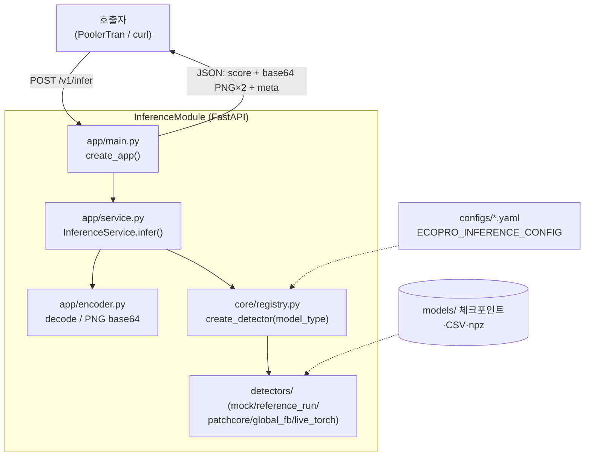

# InferenceModule 프로그램 구조 분석

> 분석 대상: `InferenceModule/` (EcoProBM AMR Inference Module — REST API 담당 프로그램)
> 작성일: 2026-06-17
> 목적: InferenceModule 의 추론 REST 서버 구조(엔드포인트·요청 처리·디텍터·설정·도커)와,
>   **PoolerTran 연동 시 입력 파라미터 변경 지점**을 구현 코드 기준으로 정리
> 관련 문서: [PoolerTran_구조.md](PoolerTran_구조.md), [AiReceiver_구조.md](AiReceiver_구조.md),
>   [InferenceModule/docs/api_contract.md](InferenceModule/docs/api_contract.md),
>   [PoolerTran/docs/rest_api_input_param.md](PoolerTran/docs/rest_api_input_param.md)

---

## 1. 개요

InferenceModule 은 순찰 AMR 이 촬영한 best-shot 이미지를 받아 **이상치 점수(score)와 시각화
이미지를 돌려주는 독립 FastAPI 추론 서버**다. 임계값 판정은 하지 않으며(외부 decision_agent
책임), **PoolerTran 이 호출하는 REST API 를 담당**한다.

### 1.1 핵심 설계 원칙

| 원칙 | 내용 |
|------|------|
| **점수만, 판정 없음** | 0/1 알람 결정 안 함. 임계값은 외부(decision_agent) — 응답 `threshold_managed_by` |
| **무상태(stateless)** | DB·저장 없음. 이미지 입력 → 추론 → JSON 응답으로 끝 |
| **전략(Strategy)/레지스트리** | `model_type` 으로 디텍터 교체. 새 모델 = 디텍터 1개 + 레지스트리 1줄 |
| **설정 구동** | 모델/디바이스/전처리/가중치 경로를 `ECOPRO_INFERENCE_CONFIG` yaml 로 주입 |
| **torch 지연 로딩** | live 디텍터 내부에서만 import → mock/reference 는 torch 없이 경량 |
| **위치 = inspection_point_id** | 고정 카메라 아님(AMR 순회) → `camera_id` 대신 점검지점 ID |

---

## 2. 전체 아키텍처



---

## 3. 디렉토리 구조

```
InferenceModule/
├── app/
│   ├── main.py        # FastAPI 엔트리: /healthz, /v1/metadata, /v1/infer
│   ├── config.py      # Settings + load_settings(): yaml/json 로딩
│   ├── service.py     # InferenceService: 이미지 디코드→디텍터→응답 조립
│   └── encoder.py     # PIL 디코드, PNG base64 인코드
├── core/
│   ├── base.py        # DetectionResult, InferenceResponse, BaseDetector
│   └── registry.py    # create_detector(): model_type → 디텍터
├── detectors/         # 전략 구현체
│   ├── common.py      # resize_crop_rgb(전처리), score_overlay, heatmap_overlay
│   ├── mock.py / reference_run.py / artifact_replay.py / live_torch.py
├── configs/           # mock / live.* / packaged.* / reference.* 모델별 yaml
├── requirements.txt / requirements-torch.txt
├── docs/ (api_contract.md, manual_ko.md, verification.md)
└── examples/ handoff/ scripts/ tests/
```
> 현재 git 저장소 아님(독립 폴더). torch/모델 포함 시 ~379MB.

---

## 4. REST API (현재 계약)

[docs/api_contract.md](InferenceModule/docs/api_contract.md) 기준.

### `POST /v1/infer` — **multipart/form-data**
| 필드 | 필수 | 의미 |
|---|---|---|
| `file` | ✅ | **이미지 파일(바이너리)** |
| `image_id` | | 추적 ID |
| `amr_id` | | AMR 식별자(예: `patrol_amr_01`) |
| `mission_id` | | mission id |
| `inspection_point_id` | | 점검 위치 id (camera_id 아님) |
| `captured_at` | | 촬영시각(ISO-8601) |

**응답(JSON)**: 입력 메타 에코 + `model_type`, `model_version`, `score`, `score_range`,
`preprocessed_image`(base64 PNG), `visualization_image`(base64 PNG), `meta{input_size, original_size, total_ms, viz_type}`.

### 기타
- `GET /healthz` → `{ok, model_loaded, model_type}`
- `GET /v1/metadata` → 모델 정체/score_range/input_size/viz_type/`threshold_managed_by`

---

## 5. 요청 처리 흐름 (`/v1/infer`)
1. **[main.py]** multipart 수신 → `await file.read()` 로 이미지 바이트 + 메타
2. **[service.py `infer()`]** `decode_image` → `detector.analyze(image, filename)` →
   `DetectionResult(score, preprocessed, visualization, meta)` → PNG base64 인코드 →
   `InferenceResponse` 조립 → `to_dict()`
3. **[응답]** score + base64 이미지 2장 + meta
- 모델은 **프로세스 시작 시 1회** `detector.load()` (요청마다 재로딩 없음).

---

## 6. 설정 체계 (`app/config.py`)
`ECOPRO_INFERENCE_CONFIG`(기본 `configs/mock.yaml`) yaml 로딩 → `Settings`.

| 설정 | 내용 |
|---|---|
| `model_type` | 디텍터 선택 키 |
| `model_version` | 버전 문자열(응답 포함) |
| `device` | cpu/gpu |
| `preprocess` | image_size(256), portrait/landscape crop anchor |
| `score_range` | 점수 범위(기본 0~1) |
| `reference_run` / `live_model` | CSV 리플레이 / ckpt·아티팩트 경로 |

config 종류: `mock`(모델 불필요) · `live.*`(ckpt 추론) · `packaged.*`(핸드오프 모델) · `reference.*`(CSV 검증).

---

## 7. 디텍터 (전략 패턴) — `core/registry.py`

| model_type | 클래스 | 동작 | torch |
|---|---|---|---|
| `mock` | MockDetector | 휘도 기반 더미 점수 | ❌ |
| `reference_run` | ReferenceRunDetector | 파일명으로 CSV 점수 매칭(검증) | ❌ |
| `patchcore` | PatchCoreArtifactDetector | CSV 점수 + npz heatmap 오버레이 | ❌(numpy) |
| `global_fb` | GlobalFeatureBankArtifactDetector | CSV 점수(이미지 레벨) | ❌ |
| `live_stub` | LiveStubDetector | torch 경량 스텁 | (live) |
| 그 외(classifier/autoencoder) | LiveTorchDetector | ckpt 로드 후 실제 추론 + Grad-CAM/diff | ✅ |

전처리/시각화는 `detectors/common.py`(`resize_crop_rgb`, `score_overlay`, `heatmap_overlay`).

---

## 8. 도커 / 의존성
- 베이스 `python:3.11-slim`. 기본(`requirements.txt`): fastapi, uvicorn, python-multipart, pillow, numpy, pyyaml.
- live(`requirements-torch.txt`): + torch, torchvision, timm, scikit-learn (classifier/autoencoder 만 필요).
- 기동: `uvicorn app.main:app --host 0.0.0.0 --port 8001`, `ECOPRO_INFERENCE_CONFIG` 로 모델 선택.
> ※ 도커 파일(Dockerfile/compose)은 현재 폴더에 없음 — 필요 시 AiReceiver 방식 참고.

---

## 9. ★ PoolerTran 연동 — 입력 파라미터 변경 지점

PoolerTran 이 이 모듈을 호출한다. **현재 `/v1/infer` 계약과 PoolerTran 의 `batch_paths` 송신
계약이 달라, 입력부 수정이 필요**하다(핵심 변경 지점).

| 구분 | InferenceModule 현재 `/v1/infer` | PoolerTran `batch_paths` 송신 ([rest_api_input_param.md](PoolerTran/docs/rest_api_input_param.md)) |
|---|---|---|
| 형식 | `multipart/form-data` | `application/json` |
| 입력 | **이미지 파일(바이트)** + 메타 | **파일 경로(file_path)** + 메타 |
| 단위 | 프레임 1장 (per-row) | **waypoint 배치** (여러 프레임 1콜) |
| 핵심 필드 | file, image_id, amr_id, mission_id, inspection_point_id, captured_at | `amr_id`, `waypoint_id`, `frames:[{received_time(epoch ms), file_path}]` |

### 변경 시 고려사항
- **입력을 batch JSON 으로 수용**: `{amr_id, waypoint_id, frames:[{received_time, file_path}]}` 를
  받는 엔드포인트(예: `POST /v1/infer_batch` 또는 기존 `/v1/infer` 입력 교체)가 필요.
- **이미지 로딩 방식 전환**: multipart 바이트 → `file_path` 로 **공유 스토리지에서 직접 읽기**
  (수신 측이 동일 `/data/storage` 마운트 필요 — 경로 방식).
- **배치 처리**: frames 배열을 순회하며 프레임별 추론 → 결과 배열 반환(혹은 집계).
- **응답 규약**: PoolerTran 은 `raise_for_status` + at-least-once → **2xx 성공 + 멱등 처리** 필요.
- `received_time` 은 epoch **밀리초**(동일 초 다중 프레임 구분), `file_path` 의 파일명 `epoch_us`(마이크로초)와 단위 다름에 유의.

> 즉 모델/추론 로직(core/detectors)은 그대로 두고, **app/main.py 의 엔드포인트 입력부(서명·파싱)와
> service 의 이미지 로딩(바이트→경로)만 batch 계약에 맞게 수정**하면 된다는 것이 현 상태의 결론.

---

## 10. 데이터 계약 객체 (`core/base.py`)
- `DetectionResult`: 디텍터 산출 — score, preprocessed(PIL), visualization(PIL), meta
- `InferenceResponse`: HTTP 응답 — 입력 메타 + score/range + base64 이미지 2장 + meta, `to_dict()`

---

## 11. 요약
InferenceModule 은 **이미지 → 점수 + 시각화** 를 돌려주는 **무상태 FastAPI 추론 서버**이며 EcoProBM
파이프라인의 **연산(추론) 계층 = PoolerTran 의 REST 대상**이다. 현재 입력은 `/v1/infer`
**multipart(프레임 1장)** 계약이고, PoolerTran 의 `batch_paths`(JSON 배치, 경로 기반)에 맞추려면
**main.py 입력부 + 이미지 로딩(바이트→file_path)만 수정**하면 된다(모델/디텍터는 불변).
