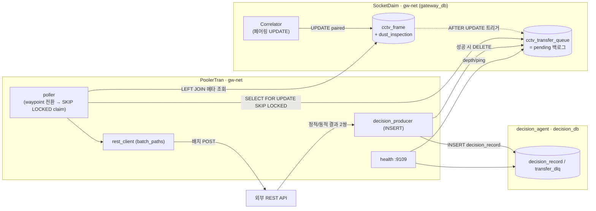
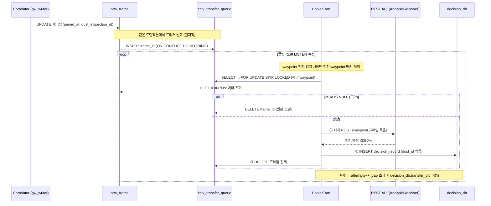

# PoolerTran 프로그램 구조 분석

> 분석 대상: `PoolerTran/` 저장소 (Deahyun/PoolerTran)
> 작성일: 2026-06-05
> 목적: PoolerTran 의 작업 큐·트리거·폴링 판정/전송 루프·결과 적재·DLQ·헬스를 구현 코드 기준으로 상세 분석한 참고 문서
> 선행 설계: [PoolerTran_설계.md](PoolerTran_설계.md)
> 관련 문서: [SocketDaim_구조.md](SocketDaim_구조.md), [DecisionAgent_구조.md](DecisionAgent_구조.md), [WebApp_구조.md](WebApp_구조.md)

---

## 1. 개요

PoolerTran 은 SocketDaim 의 Correlator 가 **페어링을 완료한 `cctv_frame`** 을 감지하여, **waypoint 전환 시점에** 그 waypoint 의 프레임 묶음을 **한 번의 배치 POST**(`batch_paths` 모드)로 **REST API 로 전송**하고 그 결과를 **decision_agent 의 `decision_db.decision_record`** 에 적재하는 컨슈머다. SocketDaim·decision_agent 와 동일하게 Docker 컨테이너로 가동하며 `gw-net` 에 `external` 로 합류한다.

### 1.1 핵심 설계 원칙 ([PoolerTran_설계.md](PoolerTran_설계.md))

| 원칙 | 내용 |
|------|------|
| **Transactional Outbox(Queue)** | 행 존재 = 미처리, 처리 완료 = 행 DELETE. 큐는 **백로그만** 담아 폴링이 항상 가볍다 |
| **트랜잭션 원자 캡처** | Correlator 의 페어링 UPDATE 트리거가 같은 트랜잭션에서 `frame_id` 를 큐에 적재 → 누락 없음 |
| **단방향/읽기 전용** | 소스(`cctv_frame`, `dust_inspection`)는 **읽기만**, 작업 큐는 gateway_db, 결과는 decision_db |
| **삭제 주체 단일화** | 큐 INSERT=Correlator, DELETE=PoolerTran 만. cleaner 는 큐에 권한·FK 없음 → 구조적으로 접근 불가 |
| **at-least-once + 멱등** | ① REST → ② decision_record INSERT → ③ 큐 DELETE 순서, `dust_id` UNIQUE INSERT 로 중복 흡수 |
| **수평 확장 안전** | `FOR UPDATE OF q SKIP LOCKED` 로 다중 인스턴스에서도 같은 행 중복 처리 없음 |
| **SocketDaim 비침투** | 큐/트리거/롤 마이그레이션(`migrate_010`)을 PoolerTran 이 독립 소유, **설치는 가장 마지막** |

### 1.2 SocketDaim 과의 경계

PoolerTran 은 SocketDaim 의 `gateway_db` 를 **읽기 + 큐 소비**만 한다. 큐/트리거/전용 롤을 만드는 `migrate_010` 은 SocketDaim 레포가 아니라 **PoolerTran 이 소유**하며, 전체 파이프라인이 모두 올라온 뒤 **마지막에** 적용한다([README §부팅 순서](PoolerTran/README.md)). 결과는 decision_agent 의 `decision_db`(`decision_record`/`transfer_dlq`)에 적재하며, 그 스키마는 `decision_agent/init_db.sql` 이 소유한다(PoolerTran 은 detector 롤로 INSERT 만).

---

## 2. 전체 아키텍처



**핵심 의존**: SocketDaim 이 먼저 떠야 `gw-net`·`gateway_db`·트리거/큐가 존재하고, decision_agent 가 먼저 떠야 결과 적재 대상 `decision_db`(decision_record/transfer_dlq + detector 롤)가 존재한다. PoolerTran 은 `gw-net` 에 `external: true` 로 합류한다.

### 2.1 컨테이너 일람 ([docker-compose.yml](PoolerTran/docker-compose.yml))

| 컨테이너 | 역할 | 포트 | DB 롤 | 네트워크 |
|---|---|---|---|---|
| `poolertran` | 폴링 컨슈머 + 헬스 HTTP | 9109 | `cctv_forwarder`(gateway) / `sensor_analysis_role`=detector(decision) | gw-net |

- `gw-net` 은 `external: true`, `name: socketdaim_gw-net` — SocketDaim 이 생성
- 결과 적재 대상 `decision_db` 는 decision_agent 가 소유·기동하며(`decision_agent/init_db.sql`), PoolerTran 은 detector 롤로 INSERT 만 한다(별도 결과 DB 컨테이너 없음).

---

## 3. 디렉토리 구조

```
PoolerTran/
├── docker-compose.yml          # poolertran (gw-net external)
├── Dockerfile                  # python:3.11-slim, PYTHONPATH=/app/src
├── migrations/
│   └── migrate_010_cctv_transfer_queue.sql   # ★ gateway_db: 큐 + 트리거 + cctv_forwarder 롤만
│                                              #  (결과/DLQ 테이블은 decision_db 가 보유)
│
├── src/poolertran/
│   ├── main.py                 # 엔트리: 풀 생성 → poller + health gather, 시그널 처리
│   ├── config.py               # PT_* 환경변수 (pydantic-settings)
│   ├── db.py                   # gateway / decision asyncpg 풀 팩토리
│   ├── logging_config.py       # structlog (json/console)
│   ├── poller.py               # ★ 폴링 루프: waypoint 전환 → 배치 REST → decision_record → DELETE, DLQ, LISTEN
│   ├── rest_client.py          # httpx 배치 POST (batch_paths)
│   ├── health.py               # FastAPI /health (queue depth + stats)
│   └── repository/
│       ├── queue_repo.py            # cctv_transfer_queue (gateway_db)
│       └── decision_producer.py     # decision_record / transfer_dlq (decision_db)
│
├── tests/                      # 단위 테스트 (config / 배치 처리)
├── requirements.txt / pytest.ini / .env.example / .gitignore / README.md
```

`Dockerfile` 은 decision_agent 와 동일하게 `requirements.txt` 설치 + `PYTHONPATH=/app/src` + `CMD python -m poolertran.main`.

---

## 4. DB 스키마

### 4.1 gateway_db — 작업 큐 ([migrate_010](PoolerTran/migrations/migrate_010_cctv_transfer_queue.sql))

> 소유는 PoolerTran. 적용 대상은 SocketDaim 의 `gateway_db` 이며 SocketDaim 레포에는 넣지 않는다. 파이프라인 기동의 **마지막**에 적용(설계 §5, SocketDaim 비침투 방침으로 조정).

```sql
CREATE TABLE IF NOT EXISTS cctv_transfer_queue (
    frame_id    BIGINT      PRIMARY KEY,          -- cctv_frame.id (멱등 키, FK 아님)
    enqueued_at TIMESTAMPTZ NOT NULL DEFAULT clock_timestamp(),
    attempts    INTEGER     NOT NULL DEFAULT 0    -- 재시도/포이즌 관측용
);
CREATE INDEX idx_cctv_transfer_queue_order ON cctv_transfer_queue (enqueued_at, frame_id);
```

- **FK 의도적 배제**: `REFERENCES cctv_frame` 을 두지 않는다. CASCADE 면 cleaner 가 큐를 연쇄 삭제(삭제 주체 원칙 위반), RESTRICT 면 cleaner 의 retention DELETE 가 실패(cleaner 파손) — 둘 다 회피.
- **트리거**: Correlator(`gw_writer`)의 UPDATE 트랜잭션 안에서 발화하여 원자 적재.

```sql
CREATE OR REPLACE FUNCTION enqueue_cctv_transfer() RETURNS TRIGGER ... AS $$
BEGIN
    INSERT INTO cctv_transfer_queue (frame_id) VALUES (NEW.id)
    ON CONFLICT (frame_id) DO NOTHING;            -- 멱등
    PERFORM pg_notify('cctv_transfer', NEW.id::text);  -- LISTEN 모드 보조 신호
    RETURN NULL;
END; $$;

CREATE TRIGGER trg_enqueue_cctv_transfer
AFTER UPDATE OF dust_inspection_id ON cctv_frame
FOR EACH ROW
WHEN (OLD.dust_inspection_id IS NULL AND NEW.dust_inspection_id IS NOT NULL)  -- 전이 시 1회
EXECUTE FUNCTION enqueue_cctv_transfer();
```

- `WHEN` 가드로 **미페어링→페어링 전이(NULL→NOT NULL)일 때만** 1회 발화 → 중복 적재 방지.

**권한/롤** (설계 §5.3):

| 주체 | 롤 | 큐 권한 |
|---|---|---|
| Correlator | `gw_writer` | INSERT (트리거 경유) |
| PoolerTran | `cctv_forwarder`(신규) | SELECT / DELETE / UPDATE(attempts만), 소스는 **읽기만** |
| cleaner | `gw_cleaner` | **없음** (+ FK 없음) → 직접·간접 모두 삭제 불가 |

> `cctv_forwarder` 는 read-only `gw_reader` 재사용 금지(DELETE 필요)로 별도 신설. PoolerTran 이 이 롤로 접속하므로 **migrate_010 이 PoolerTran 기동 전에 반드시 적용**되어야 한다([README ⚠️ 필수 규칙](PoolerTran/README.md)).

### 4.2 decision_db — 결과/DLQ ([decision_agent/init_db.sql](decision_agent/init_db.sql))

결과/DLQ 테이블은 PoolerTran 이 만들지 않는다 — **decision_agent 가 소유**하며 `decision_agent/init_db.sql` 이 생성한다. PoolerTran 은 detector 롤(`sensor_analysis_role`)로 다음 두 테이블에 기록한다.

- **`decision_record`** — 관측(=한 waypoint 배치) 1행. PoolerTran(생산자)이 INSERT 하고, `dust_id` UNIQUE → `ON CONFLICT DO NOTHING` 으로 at-least-once 중복을 흡수한다. 채널 결과(`sensor_analysis_result` / `anomaly_detection_result` / `object_detection_result`)는 dust_value(대표=최댓값)·정적/동적 score 를 `classification_threshold` 로 분류한 값. `final_decision` 은 `pending` 으로 두고 **decision_agent 가 판정**한다.
- **`transfer_dlq`** — 포이즌 메시지 격리(재시도 `PT_MAX_ATTEMPTS` 초과). `frame_id` 기준 멱등 UPSERT, `source_row` 에 폴링 행 스냅샷 보존.

> 과거 gateway_db 에 두던 `transfer_result` / `transfer_dlq` 는 제거되었다. 결과·포이즌 메시지는 모두 decision_db 에 둔다(기록 원칙 일원화).

---

## 5. 설정 ([config.py](PoolerTran/src/poolertran/config.py))

`PT_` prefix pydantic-settings. 주요 항목:

| 변수 | 기본값 | 설명 |
|---|---|---|
| `PT_GW_DB_*` | `cctv_forwarder@postgres:5432/gateway_db` | 큐/소스 접속 |
| `PT_DECISION_DB_*` | `sensor_analysis_role@postgres-decision:5432/decision_db` | 결과 DB (decision_record/transfer_dlq) |
| `PT_REST_URL` / `PT_REST_TIMEOUT_SEC` | — / `10` | 전송 대상·타임아웃 |
| `PT_REST_MODE` | `batch_paths` | 전송 모드 (현재 단독 지원) |
| `PT_POLL_INTERVAL_SEC` | `5.0` | 폴링 주기 |
| `PT_BATCH_SIZE` | `100` | 배치 claim 크기 |
| `PT_MAX_ATTEMPTS` | `10` | 초과 시 DLQ |
| `PT_USE_LISTEN` | `false` | LISTEN/NOTIFY 저지연 모드 |
| `PT_HEALTH_HOST` / `PORT` | `0.0.0.0` / `9109` | 헬스 HTTP |
| `PT_LOG_LEVEL` / `FORMAT` | `INFO` / `json` | structlog |

`gw_dsn` / `decision_dsn` 프로퍼티로 DSN 을 합성한다. DB 풀은 [db.py](PoolerTran/src/poolertran/db.py) 가 gateway(cctv_forwarder)·decision(sensor_analysis_role) **2개의 asyncpg 풀**을 생성한다.

---

## 6. Repository 계층

### 6.1 queue_repo — gateway_db ([queue_repo.py](PoolerTran/src/poolertran/repository/queue_repo.py))

**폴링 쿼리** — 동시 컨슈머 안전 + 고아 포착:

```sql
SELECT q.frame_id, q.attempts, q.enqueued_at,
       cf.id AS cf_id, cf.amr_id, cf.file_path, cf.resolution,
       cf.received_at, cf.paired_at,
       di.dust_value, di.dust_alarm, di.waypoint_id, di.mission_id,
       di.waypoint_x, di.waypoint_y, di.waypoint_z
  FROM cctv_transfer_queue q
  LEFT JOIN cctv_frame      cf ON cf.id = q.frame_id            -- 원본이 retention 으로
  LEFT JOIN dust_inspection di ON di.id = cf.dust_inspection_id --  사라졌을 수 있어 LEFT
 ORDER BY q.enqueued_at, q.frame_id
   FOR UPDATE OF q SKIP LOCKED                                  -- 다중 인스턴스 안전
 LIMIT $1
```

- `FOR UPDATE OF q SKIP LOCKED` 로 claim → 락은 **claim 트랜잭션 커밋까지** 유지되어 한 행이 정확히 한 컨슈머에게만 간다.
- **LEFT JOIN** 인 이유: FK 가 없으므로 원본 `cctv_frame` 이 cleaner retention 으로 먼저 삭제된 **고아 큐 행**이 존재할 수 있다. INNER JOIN 이면 영영 안 잡혀 큐에 남으므로, LEFT JOIN 으로 `cf_id IS NULL` 을 감지해 PoolerTran 이 직접 정리.
- 결과는 `QueueRow` 데이터클래스로 매핑하며 `is_orphan`(=`cf_id is None`) 프로퍼티 제공.

메서드: `fetch_batch(conn, limit)`(claim, **트랜잭션 내 호출 필수**), `delete(conn, frame_id)`, `bump_attempts(conn, frame_id)`, `depth()`(헬스용 `COUNT(*)`).

### 6.2 decision_producer — decision_db ([decision_producer.py](PoolerTran/src/poolertran/repository/decision_producer.py))

```sql
INSERT INTO decision_record
    (station_id, observation_timestamp, dust_id,
     sensor_analysis_result, anomaly_detection_result, object_detection_result,
     ..., result_payload, image_b64)
VALUES (...)
ON CONFLICT (dust_id) DO NOTHING;            -- 멱등 INSERT
```

- `insert_decision(...)`: `dust_id` UNIQUE → `ON CONFLICT DO NOTHING` → "REST→decision_record→DELETE" 사이 크래시 시 중복 입력을 흡수(at-least-once). 삽입되면 True, 충돌(중복)이면 False.
- `fetch_thresholds()`: `classification_threshold`(웹UI 편집값 `dust`/`static`/`dynamic`)를 읽어 채널 분류에 사용.
- `dead_letter(...)`: `transfer_dlq` UPSERT(포이즌 격리). `source_row` 에 폴링 행 스냅샷 보존.
- **별도 DB**라서 결과 쓰기는 큐 트랜잭션과 독립적으로 커밋된다 — 이 분리가 at-least-once 순서 보장의 핵심.

---

## 7. REST 클라이언트 ([rest_client.py](PoolerTran/src/poolertran/rest_client.py))

`httpx.AsyncClient` 래퍼. 전송 contract 는 `BaseRestClient` 로 추상화하고 `PT_REST_MODE`(REGISTRY)로 선택하며, 현재 **`batch_paths` 단독 지원**이다. `BatchPathsRestClient.send_batch(amr_id, waypoint_id, rows)` 가 waypoint 분량 프레임을 **한 번의 POST** 로 보내고 `raise_for_status()` → 비2xx·전송오류 시 예외(행 유지·재시도). 반환 `(status_code, response_json)`.

```python
# 배치 payload (batch_paths)
{
  "amr_id": "amr-01",
  "waypoint_id": 5,
  "frames": [
    {"received_time": 1780899354683, "file_path": "/data/storage/cctv/.../..jpg"},
    ...
  ],
}
```

- `received_time` = epoch milliseconds(정수) → 동일 초 내 다중 프레임도 구분.
- 응답 = **정적/동적 결과 2쌍** `[{score,path1,path2}(정적), {score,path1,path2}(동적)]`. poller 가 `_extract_dual` 로 두 score 를, `_static_p1` 으로 첫 이미지 경로를 추출한다.
- `DemoRestClient`(`PT_REST_DEMO=true`)는 HTTP 없이 동일 형식의 더미 응답을 돌려준다(path1·path2 = 첫 입력 프레임 경로 echo).

> 전송 대상은 AnalysisReceiver(`PT_REST_URL`). 배치 응답 스펙(인증 포함)은 설계 §13 미해결 항목.

---

## 8. Poller — 핵심 처리 루프 ([poller.py](PoolerTran/src/poolertran/poller.py))

### 8.1 부팅 시퀀스 ([main.py](PoolerTran/src/poolertran/main.py))

```
run()
├─ PTSettings 로드 + configure_logging
├─ create_gateway_pool() (cctv_forwarder) / create_decision_pool() (sensor_analysis_role)
├─ QueueRepository / DecisionProducer / RestClient / Poller 구성
├─ (PT_CLEAR_QUEUE_ON_START) queue.clear() — 기동 시 큐 전체 삭제
├─ build_app(...) (FastAPI 헬스)
├─ SIGTERM/SIGINT → stop_event.set()
└─ asyncio.gather(poller.run, run_health_server)
   └─ finally: rest.close() → 두 풀 close()
```

### 8.2 실행 루프

```
run(stop_event)
├─ start_listener()                       # PT_USE_LISTEN 시 전용 커넥션 LISTEN cctv_transfer
└─ while not stop:
   ├─ _check_waypoint_transition()        # waypoint 전환 시에만 직전 waypoint 배치 처리
   ├─ _sweep_stale()                      # PT_QUEUE_MAX_AGE_SEC 초과 잔류 행 정리(안전망)
   └─ _wait(stop_event)                   # notify 또는 poll_interval, stop 즉시 반응
```

- **waypoint-batch 모델**: 평상시엔 큐에 **쌓기만** 하고, waypoint 가 바뀌는 순간에만 직전 waypoint 의 큐 행을 처리(① REST → ② decision_record → ③ 큐 DELETE)한다. 큐 DELETE 는 **오직 전환 시점**에만 일어난다(상세: [waypoint_transition_batch.md](waypoint_transition_batch.md)).
- **`_process_waypoint_batch`**: `gw_pool.acquire()` → `conn.transaction()` 안에서 `fetch_batch_for_waypoint`(FOR UPDATE SKIP LOCKED) claim → **배치 1콜로 처리**. 한 배치를 하나의 gateway 트랜잭션으로 처리해 락을 유지(설계 §8.1). REST 호출이 락 보유 중 일어나므로 `PT_BATCH_SIZE` 는 적당히 유지.

### 8.3 배치 처리 (`_process_batch_rows`)

```
orphans = [r for r in rows if r.is_orphan]     # cf_id IS NULL (원본 retention 소멸)
for r in orphans: queue.delete(r); orphans_purged++   # REST 없이 직접 정리(설계 §8.2)
rows = [r for r in rows if not r.is_orphan]

try:
    status, body = rest.send_batch(amr, waypoint, rows)        # ① 배치 REST(1콜)
except Exception: for r in rows: _handle_failure(r); return

try:
    th = decision.fetch_thresholds()                            # 분류 임계
    static, dynamic = _extract_dual(body)                       # 정적/동적 score
    rep = _representative_row(rows)                             # dust_value 최댓값 행
    decision.insert_decision(                                   # ② decision_record (멱등)
        sensor=classify(rep.dust_value, th.dust),
        anomaly=classify(static, th.static),
        object=classify(dynamic, th.dynamic), ...)
except Exception: for r in rows: _handle_failure(r); return

for r in rows: queue.delete(r); processed_ok++                  # ③ 프레임 전체 큐 DELETE
```

처리 순서는 항상 **① REST → ② decision_record(decision_db) → ③ 큐 DELETE**. ②·③ 사이 크래시 시 큐 행이 남아 재처리되지만 ②가 `dust_id` UNIQUE INSERT(멱등)라 중복 흡수. final_decision 은 pending(=decision_agent 가 판정).

### 8.4 실패/포이즌 처리 (`_handle_failure`)

```
attempts = row.attempts + 1
if attempts > max_attempts:                    # 포이즌 메시지(설계 §8.4)
    try:
        decision.dead_letter(...); queue.delete(); dead_lettered++; return
    except Exception:
        log("dead_letter_failed")              # decision_db 장애 → 행 유지로 폴백
queue.bump_attempts(frame_id); failed++        # 일시 실패 → 행 유지·재시도
```

- 일시 실패(REST/decision_record 오류, cap 미만) → `attempts++` 후 행 유지 → 다음 폴링 재시도.
- cap 초과 → `decision_db.transfer_dlq` 로 이동 + 큐 DELETE(무한 재시도로 큐가 막히는 것 방지).
- **견고성**: decision_record 또는 DLQ 쓰기 실패 시 행을 **잃지 않고** bump 로 폴백. gateway 트랜잭션은 decision_db(별도 풀) 예외에 오염되지 않으므로 bump/delete 가 안전.

### 8.5 LISTEN/NOTIFY 저지연 모드 (`PT_USE_LISTEN=true`)

- `start_listener()` 가 **전용 asyncpg 커넥션**으로 `LISTEN cctv_transfer` → 트리거의 `pg_notify` 수신 시 `_notify_event.set()` → `_wait` 가 즉시 깨어 재드레인.
- **큐가 source of truth**, NOTIFY 는 지연 단축용 보조. 컨슈머 다운 중 알림은 유실되므로 폴링을 백업으로 항상 유지(설계 §8.5).

### 8.6 모니터링 카운터

`Poller.stats = {processed_ok, failed, dead_lettered, orphans_purged, waypoint_transitions}` — 헬스 응답에 노출(설계 §13).

---

## 9. Health ([health.py](PoolerTran/src/poolertran/health.py))

FastAPI, 폴러와 같은 이벤트 루프에서 `asyncio.gather` 로 동시 실행, `stop_event` 로 함께 종료.

`GET /health` → gateway/decision DB ping + 큐 depth + 처리 stats:

```json
{
  "status": "ok|degraded",
  "gateway_db": true, "decision_db": true,
  "queue_depth": 0,
  "stats": {"processed_ok":.., "failed":.., "dead_lettered":.., "orphans_purged":.., "waypoint_transitions":..}
}
```

둘 중 하나라도 불가하면 503. 큐 적체(`queue_depth`)·재시도 분포 관측 지점(설계 §13).

---

## 10. 데이터 흐름 (end-to-end)



---

## 11. 테스트 ([tests/](PoolerTran/tests/))

`PYTHONPATH=src pytest` — 외부 서비스 없이 동작하는 단위 테스트.

| 파일 | 검증 대상 |
|---|---|
| [test_config.py](PoolerTran/tests/unit/test_config.py) | 기본값·env 오버라이드·DSN 합성 |
| [test_rest_payload.py](PoolerTran/tests/unit/test_rest_payload.py) | `is_orphan`·배치 payload 형태·NULL 타임스탬프 |
| [test_poller.py](PoolerTran/tests/unit/test_poller.py) | fake 의존성으로 배치 처리 불변식 |
| [test_decision_batch.py](PoolerTran/tests/unit/test_decision_batch.py) | 정적/동적 score 추출·분류·decision_record 적재 |

`test_poller.py` 가 검증하는 핵심 불변식: ① 성공 순서(REST→decision_record→delete), ② 고아 행 REST 없이 삭제, ③ 일시 실패 시 bump+행 유지, ④ 포이즌(>max) DLQ 이동+큐 제거, ⑤ **decision_db 장애 시 재시도 가능(삭제 안 함)**, ⑥ DLQ 쓰기 실패 시 행 보존.

> 통합 테스트(실 DB 필요)는 `PT_TEST_GW_DSN`/`PT_TEST_DECISION_DSN` 설정 시 동작 예정, 미설정 시 스킵.

---

## 12. 배포 메모

### 12.1 부팅 순서 — ⚠️ migrate_010 → PoolerTran 순서 필수

```
1. SocketDaim        docker compose up -d            # gw-net + sd-postgres 생성
2. decision_agent    docker compose up -d            # decision_db(decision_record/transfer_dlq + detector 롤)
3. (기타 컨슈머)
--- 가장 마지막: PoolerTran 설치 ---
4. migrate_010 적용   docker exec -i sd-postgres psql -U postgres -d gateway_db \
                          < migrations/migrate_010_cctv_transfer_queue.sql
5. PoolerTran        docker compose up -d --build
```

- PoolerTran 은 migrate_010 이 만든 `cctv_forwarder` 롤로 접속하고 그 큐/트리거를 폴링한다. **migrate_010 미적용 시 PoolerTran 은 부팅 단계에서 즉시 실패·종료** — 재시도로 우회하지 않고 운영 절차로 순서를 보장하는 설계([README ⚠️ 필수 규칙](PoolerTran/README.md)).
- migrate_010 미적용 상태는 SocketDaim 본체에 무영향이므로 PoolerTran 도입 전까지는 적용하지 않는다.

### 12.2 접속

| 항목 | 위치 |
|---|---|
| Health / 모니터링 | `http://localhost:9109/health` |
| 결과 DB | decision_agent 의 decision_db (`psql -U sensor_analysis_role -d decision_db`) |

### 12.3 미해결 / 후속 (설계 §13)

- 배치 REST 응답 스펙(정적/동적 score 2쌍) 최종 확정 — 인증
- `attempts` 임계 초과분 DLQ 정책 세부(보존/알림)
- 대량 트래픽 시 트리거 statement-level(`REFERENCING NEW TABLE`) 전환 검토
- `migrate_010` 롤백 스크립트(트리거/큐/롤 DROP)

---

## 13. 참고 문서

| 문서 | 위치 |
|---|---|
| PoolerTran 설계(의사결정 근거) | [PoolerTran_설계.md](PoolerTran_설계.md) |
| 작업 큐 마이그레이션 | [migrations/migrate_010_cctv_transfer_queue.sql](PoolerTran/migrations/migrate_010_cctv_transfer_queue.sql) |
| 결과 DB 스키마(decision_record/transfer_dlq) | [decision_agent/init_db.sql](decision_agent/init_db.sql) |
| 운영 가이드 | [README.md](PoolerTran/README.md) |
| Correlator 페어링 로직 | [SocketDaim/ingestion_gateway/correlator.py](SocketDaim/ingestion_gateway/correlator.py) |
| SocketDaim 전체 구조 | [SocketDaim_구조.md](SocketDaim_구조.md) |
| Decision Agent 구조 | [DecisionAgent_구조.md](DecisionAgent_구조.md) |
| Dumopro WebApp 구조 | [WebApp_구조.md](WebApp_구조.md) |
