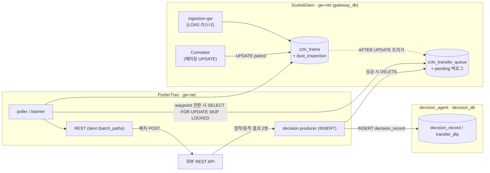
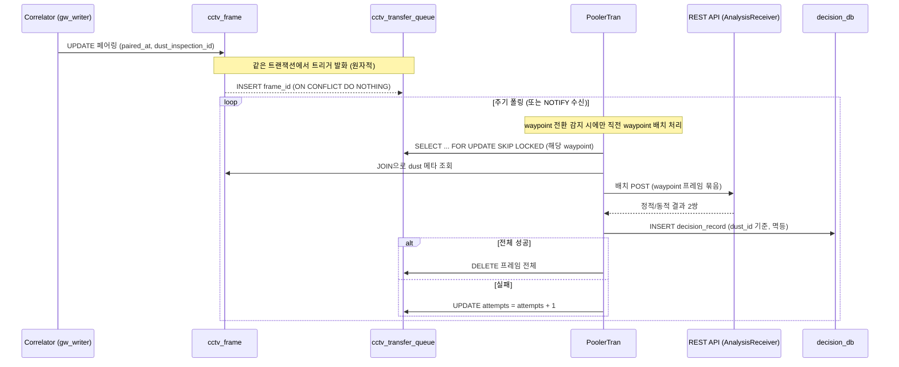

# PoolerTran 설계 문서

> 작성일: 2026-06-04
> 대상 독자: SocketDaim / decision_agent 운영·개발자
> 목적: Correlator가 페어링을 완료한 CCTV 프레임을 waypoint 전환 시점에 배치로 REST API에 전달하고, 그 결과를 decision_agent의 decision_db(decision_record)에 적재하는 컨슈머 프로그램(**PoolerTran**)의 설계 정의

---

## 1. 개요

### 1.1 프로그램 역할

PoolerTran 은 SocketDaim 의 `gateway_db` 에서 **Correlator(`ingestion_gateway/correlator.py`)가 페어링을 완료한 `cctv_frame` 행**을 감지하여:

1. **waypoint 전환 시점에** 그 waypoint 의 프레임 묶음을 **한 번의 배치 POST**(`batch_paths` 모드)로 **REST API 로 전송**하고
2. 그 응답(정적/동적 결과 2쌍)을 **decision_agent 의 decision_db(`decision_record`)에 적재**한다.

SocketDaim, decision_agent 와 동일하게 **Docker 컨테이너**로 가동하며, SocketDaim 이 생성하는 `gw-net` 네트워크에 `external` 로 합류한다.

### 1.2 입력의 정의 — "Correlator update 완료 값"

PoolerTran 의 입력은 **"Correlator 가 페어링을 완료한 `cctv_frame` 행"** 이다. 완료 판단 기준은 §3 참조.

### 1.3 단방향 흐름 원칙 준수

SocketDaim 설계 원칙([refs/gateway_plan.md §5.8](SocketDaim/refs/gateway_plan.md)) — "컨슈머는 공용 저장소에 read-only 접근, 단방향 흐름을 DB 권한으로 강제" — 을 지킨다. PoolerTran 은 소스 테이블(`cctv_frame`, `dust_inspection`)을 **읽기만** 하며, 작업 큐(§5)는 gateway_db 의 별도 객체, 결과는 decision_agent 의 decision_db(`decision_record`)에서 관리한다.

---

## 2. 배경 — Correlator 의 페어링 동작

LOAS 모드에서 DUST(13310)·CCTV(13320) 리스너는 서로를 모른 채 각각 INSERT 만 한다. **Correlator** 가 10초 주기로 `cctv_frame.received_at` 이 `dust_inspection.received_at ± 윈도우(기본 ±2초)` 안에 들어오는 가장 가까운 dust 행과 매칭하여 `cctv_frame` 의 두 컬럼을 채운다 ([correlator.py:32-51](SocketDaim/ingestion_gateway/correlator.py#L32-L51)):

```sql
UPDATE cctv_frame f
   SET dust_inspection_id = sub.inspection_id,   -- NULL → dust 행 FK
       paired_at          = clock_timestamp()    -- NULL → 페어링 시각
 ...
 WHERE f.id = sub.frame_id
```

- 갱신 대상 식별 키: `cctv_frame.id`(PK)
- 매칭(조인) 키: `received_at` 시간창
- 한 프레임 → 최대 1개 inspection (시간차 최소, `DISTINCT ON (f2.id)`)

---

## 3. 완료 판단 기준

Correlator 는 위 UPDATE 한 문장에서 **두 컬럼을 원자적으로 동시에** 채운다. 따라서 완료 기준은:

| 기준 | 의미 |
|---|---|
| `paired_at IS NOT NULL` | 페어링 완료 시각 존재 |
| `dust_inspection_id IS NOT NULL` | dust 행과 짝지어짐 |

두 값은 항상 함께 세팅되므로 어느 것으로 판단해도 동일하다.

### 3.1 폴링 커서로 `cctv_frame.id` 를 쓰면 안 되는 이유

페어링은 **삽입 순서(id)가 아니라 매칭되는 dust 가 도착한 순서**로 일어난다. 낮은 id 프레임이 (근처 dust 가 늦게 와서) 높은 id 프레임보다 나중에 페어링될 수 있다. `WHERE id > last_id` 로 폴링하면 이미 지나친 낮은 id 의 뒤늦은 페어링을 영구히 놓친다. → **id 커서 금지.**

---

## 4. 설계 결정 및 채택 사유

논의 과정에서 검토한 대안과 최종 결정을 기록한다.

| # | 검토안 | 결정 | 사유 |
|---|---|---|---|
| 1 | 소스 `cctv_frame` 에 `transfer` 플래그 컬럼 추가 | ❌ 기각 | 단방향/WORM 원칙 위반, 다중 컨슈머 비확장(컨슈머마다 컬럼 필요), 핫테이블 쓰기 경합 |
| 2 | 별도 "done 로그" 테이블 + anti-join 폴링 | ❌ 기각 | 테이블이 **이력 규모**로 증가, 폴링이 전체 페어링 이력 스캔 → 시간 갈수록 느려짐 |
| 3 | 본인 DB 에 `paired_at` 워터마크 | △ 가능 | write 없음(순수). 단 행단위 재시도/가시성 약함, 워터마크 전진 규칙 복잡 |
| 4 | **Correlator UPDATE 트리거 → pending 큐 적재 → 완료 시 DELETE** | ✅ **채택** | 큐가 **백로그만** 보관(이력 아님) → 폴링 항상 가벼움, 트랜잭션 원자 캡처(누락 없음), 기존 패턴(outbox·NOTIFY)과 일치 |
| 5 | 큐 저장소를 SQLite 사용(egress outbox 처럼) | ❌ 기각 | PG 트리거는 SQLite 에 쓸 수 없음 → 트리거 원자 캡처 불가. 컨테이너 간 큐 동시성에도 SQLite 부적합. (egress 의 SQLite 는 "외부 원본의 로컬 outbound spool" 이라는 다른 상황이라 적합했던 것) |

### 4.1 핵심 패턴 — Transactional Outbox(Queue)

- **행의 존재 = 미처리, 처리 완료 = 행 삭제(DELETE)** — Egress 의 [outbox.py](SocketDaim/egress_gateway/outbox.py) 철학과 동일.
- 큐는 **pending 백로그**만 담으므로 보통 수 건~수십 건 규모를 유지 → 폴링 비용이 테이블 이력 크기와 무관하게 일정.
- 큐 적재는 **Correlator 트랜잭션 안에서 트리거로** 수행 → 페어링 커밋과 큐 적재가 원자적, 캡처 누락/경합 없음.

---

## 5. DB 변경사항 (gateway_db) — `migrate_010`

> SocketDaim 소유 스키마를 변경하므로 SocketDaim 레포의 다음 마이그레이션 `scripts/migrate_010_cctv_transfer_queue.sql` 로 버전 관리한다. (임시 적용 시 `down -v`/재초기화에서 사라져 drift 발생)

### 5.1 작업 큐 테이블

```sql
-- 생성(INSERT)은 Correlator 트리거만, 삭제(DELETE)는 PoolerTran 만 수행한다.
-- cleaner 는 이 테이블을 절대 건드리지 않는다 → FK/CASCADE 를 두지 않는다.
CREATE TABLE cctv_transfer_queue (
    frame_id    BIGINT PRIMARY KEY,            -- cctv_frame.id (멱등 키, FK 아님)
    enqueued_at TIMESTAMPTZ NOT NULL DEFAULT clock_timestamp(),
    attempts    INTEGER     NOT NULL DEFAULT 0   -- 재시도/포이즌 메시지 관측용
);
```

- `frame_id` PK → 멱등(트리거 `ON CONFLICT DO NOTHING`).
- **FK(`REFERENCES cctv_frame`)를 의도적으로 두지 않는다.** 이유:
  - FK + `ON DELETE CASCADE` 를 걸면 cleaner 가 `cctv_frame` 행을 지울 때 큐 행이 **연쇄 삭제**된다. CASCADE 는 권한과 무관하게 수행되므로 "삭제는 PoolerTran 만" 원칙이 깨진다.
  - FK + `ON DELETE RESTRICT`(기본)를 걸면 반대로 cleaner 의 정상 retention DELETE 가 **FK 위반으로 실패**해 cleaner 가 망가진다.
  - 따라서 **FK 없는 독립 테이블**로 두고, 삭제는 오직 PoolerTran 이 책임진다(원본이 retention 으로 먼저 사라진 고아 행도 PoolerTran 이 직접 정리 — §8.2, §12).

### 5.2 트리거 함수 + 트리거

```sql
CREATE OR REPLACE FUNCTION enqueue_cctv_transfer()
RETURNS TRIGGER LANGUAGE plpgsql AS $$
BEGIN
    INSERT INTO cctv_transfer_queue (frame_id)
    VALUES (NEW.id)
    ON CONFLICT (frame_id) DO NOTHING;   -- 멱등
    -- (선택) 저지연을 원하면: PERFORM pg_notify('cctv_transfer', NEW.id::text);
    RETURN NULL;                         -- AFTER 트리거라 반환값 무시
END;
$$;

-- 미페어링→페어링 "전이" 시에만 1회 발화
CREATE TRIGGER trg_enqueue_cctv_transfer
AFTER UPDATE OF dust_inspection_id ON cctv_frame
FOR EACH ROW
WHEN (OLD.dust_inspection_id IS NULL AND NEW.dust_inspection_id IS NOT NULL)
EXECUTE FUNCTION enqueue_cctv_transfer();
```

- `WHEN` 가드로 NULL→NOT NULL 전이일 때만 발화 → 중복 적재 방지.
- Correlator(`gw_writer`)의 UPDATE 트랜잭션 안에서 실행 → 원자 캡처.

### 5.3 권한 (롤)

```sql
-- INSERT(생성)는 Correlator 트리거(gw_writer 권한)만 가능
GRANT INSERT ON cctv_transfer_queue TO gw_writer;

-- PoolerTran 전용 롤 (read-only 롤 gw_reader 재사용 금지: DELETE 필요)
-- SELECT/DELETE/UPDATE(attempts) 만 부여 → 삭제 주체는 오직 PoolerTran
CREATE ROLE cctv_forwarder LOGIN PASSWORD 'dev_forwarder_pw';
GRANT CONNECT ON DATABASE gateway_db        TO cctv_forwarder;
GRANT USAGE  ON SCHEMA public               TO cctv_forwarder;
GRANT SELECT ON cctv_frame, dust_inspection TO cctv_forwarder;   -- 소스: 읽기만
GRANT SELECT, DELETE, UPDATE (attempts) ON cctv_transfer_queue TO cctv_forwarder;

-- cleaner(gw_cleaner)에는 이 테이블에 어떤 권한도 부여하지 않는다.
-- FK 도 없으므로 cleaner 는 큐를 직접/간접(CASCADE) 어느 쪽으로도 삭제할 수 없다.
```

> 운영 비밀번호는 `dev_*` 대신 시크릿으로 주입한다.

### 5.4 책임 분리 (큐 테이블)

큐 행의 생애주기는 **생성=Correlator, 삭제=PoolerTran** 으로 엄격히 나뉜다. cleaner 는 큐에 관여하지 않는다.

| 작업 | 주체 | 롤 | 수단 |
|---|---|---|---|
| INSERT (생성) | Correlator | `gw_writer` | AFTER UPDATE 트리거 **만** |
| SELECT (조회) | PoolerTran | `cctv_forwarder` | 폴링/LISTEN |
| DELETE (완료·고아정리) | PoolerTran | `cctv_forwarder` | 처리 완료 **직후** |
| UPDATE attempts | PoolerTran | `cctv_forwarder` | 실패 시 |
| (어떤 작업도 없음) | cleaner | `gw_cleaner` | 권한·FK 없음 → 접근 불가 |

---

## 6. 아키텍처



핵심 의존: **SocketDaim 이 먼저 떠야** `gw-net` 과 트리거/큐가 존재한다. PoolerTran 은 `gw-net` 에 `external: true` 로 합류한다.

---

## 7. 데이터 흐름 (end-to-end)



**decision_record 입력 성공 직후 PoolerTran 이 그 배치의 프레임을 즉시 DELETE** 한다. 큐 삭제 주체는 오직 PoolerTran 이며(cleaner 아님), 큐 자체가 end-to-end 재시도 버퍼가 된다(별도 SQLite spool 불필요).

---

## 8. PoolerTran 프로그램 설계

### 8.1 폴링 쿼리 (동시 컨슈머 안전)

```sql
SELECT q.frame_id, cf.id AS cf_id,
       cf.file_path, cf.resolution, cf.received_at, cf.paired_at,
       di.dust_value, di.dust_alarm, di.waypoint_id, di.mission_id,
       di.waypoint_x, di.waypoint_y, di.waypoint_z
  FROM cctv_transfer_queue q
  LEFT JOIN cctv_frame      cf ON cf.id = q.frame_id          -- 원본이 retention 으로
  LEFT JOIN dust_inspection di ON di.id = cf.dust_inspection_id --  사라졌을 수 있어 LEFT
 ORDER BY q.enqueued_at, q.frame_id
   FOR UPDATE OF q SKIP LOCKED      -- 컨슈머를 여러 개로 늘려도 충돌 없이 분배
 LIMIT $1;                          -- 배치 크기
```

- 큐는 백로그만 담으므로 항상 작고 빠르다.
- `FOR UPDATE OF q ... SKIP LOCKED` 로 수평 확장(다중 인스턴스) 시에도 같은 행을 두 번 처리하지 않는다.
- **LEFT JOIN** 인 이유: FK 가 없으므로(§5.1), 장기 다운 등으로 원본 `cctv_frame` 이 cleaner retention 에 의해 먼저 삭제된 **고아 큐 행**이 있을 수 있다. INNER JOIN 이면 그런 행은 영영 조회되지 않아 큐에 남으므로, LEFT JOIN 으로 잡아 PoolerTran 이 직접 정리한다(아래 루프).

### 8.2 처리 루프 (의사 코드)

```
while not stop:
    rows = poll(batch_size)            # 8.1 쿼리 (FOR UPDATE SKIP LOCKED)
    if not rows:
        wait(poll_interval | notify)   # NOTIFY 사용 시 이벤트 대기
        continue
    for r in rows:
        if r.cf_id is None:                    # 원본이 retention 으로 이미 소멸한 고아 행
            queue_delete(r.frame_id)           #   → PoolerTran 이 직접 정리
            log("source_purged", r.frame_id)
            continue
        try:
            result = rest_post(r)              # ① REST 호출 (타임아웃/재시도)
            insert_decision(r, result)         # ② decision_record INSERT (멱등)
            queue_delete(r.frame_id)           # ③ ②성공 직후 큐 행 즉시 삭제(PoolerTran)
        except Exception:
            queue_bump_attempts(r.frame_id)    # 실패 → 행 유지, 다음 폴링에 재시도
            log(...)
```

> 실제 구현은 위 per-row 의사코드가 아니라 **waypoint 단위 배치**다 — waypoint 전환 시 그 waypoint 의 프레임을 한 번의 배치 POST 로 보내고(`batch_paths`), 응답을 decision_record 1행으로 적재한 뒤 프레임 전체를 DELETE 한다(상세: [waypoint_transition_batch.md](waypoint_transition_batch.md)). 처리 순서 ①→②→③ 불변식은 동일하다.

처리 순서는 반드시 **① REST → ② decision_record 입력 → ③ 큐 DELETE** 이며, ③(삭제)은 ②(decision_db 입력)가 성공한 **그 직후**에 PoolerTran 이 수행한다. ②와 ③ 사이에서 크래시가 나면 큐 행이 남아 다음 폴링에 재처리되지만, ②가 `dust_id` UNIQUE INSERT(멱등)이므로 중복 입력은 흡수된다(at-least-once).

### 8.3 멱등성 / at-least-once

- "REST → decision_record → 큐 DELETE" 사이 크래시 시 중복 처리가 가능하므로, **decision_db 쓰기는 `dust_id` UNIQUE INSERT(`ON CONFLICT DO NOTHING`, 멱등)** 로 한다.
- 큐 DELETE 는 decision_record 쓰기 성공 확인 후에만 수행한다.

### 8.4 재시도 / 포이즌 메시지

- 실패 행은 큐에 남아 자동 재시도되며 `attempts` 가 증가한다.
- `attempts` 가 임계치(예: `PT_MAX_ATTEMPTS`)를 넘으면 `decision_db.transfer_dlq` 로 이동한다(무한 재시도 방지).

### 8.5 (선택) LISTEN/NOTIFY 저지연 모드

- 트리거에서 `pg_notify('cctv_transfer', ...)` 를 발행(§5.2 주석)하고 PoolerTran 이 `LISTEN cctv_transfer` 로 즉시 깨어난다(cleaner 의 `NOTIFY cleanup_trigger` 와 동일 패턴).
- **큐 테이블이 source of truth**, NOTIFY 는 지연 단축용 보조다(컨슈머 다운 중 알림은 유실되므로 폴링을 백업으로 유지).

---

## 9. 결과 적재 — decision_db (`decision_record`)

결과는 PoolerTran 전용 DB 가 아니라 **decision_agent 의 `decision_db`** 에 적재한다. 스키마(`decision_record` / `transfer_dlq` / `classification_threshold` + detector 롤)는 `decision_agent/init_db.sql` 이 소유하며, PoolerTran 은 detector 롤(`sensor_analysis_role`)을 재사용해 INSERT 만 한다.

- waypoint 배치 1건 = `decision_record` 1행. 배치 REST 응답(정적/동적 score 2쌍)과 dust_value(대표=최댓값)를 `classification_threshold`(`dust`/`static`/`dynamic`)로 분류해 3채널 결과(`sensor_analysis_result` / `anomaly_detection_result` / `object_detection_result`)에 기록한다.
- `final_decision` 은 `pending` 으로 두고 **decision_agent 가 판정**한다(PoolerTran 은 쓰지 않음).
- 멱등: `dust_id` UNIQUE → `ON CONFLICT DO NOTHING` 으로 at-least-once 중복을 흡수.

```sql
INSERT INTO decision_record
    (station_id, observation_timestamp, dust_id,
     sensor_analysis_result, anomaly_detection_result, object_detection_result,
     ..., result_payload, image_b64)
VALUES (...)
ON CONFLICT (dust_id) DO NOTHING;
```

> 과거 설계의 `result_db` / `transfer_result`(별도 컨테이너·`frame_id` UPSERT)는 제거되었다.

---

## 10. 환경변수 (`PT_` prefix 제안)

| 변수 | 기본값(예) | 설명 |
|---|---|---|
| `PT_GW_DB_HOST` | `postgres` | gateway_db 호스트(gw-net 내부) |
| `PT_GW_DB_PORT` | `5432` | 포트 |
| `PT_GW_DB_NAME` | `gateway_db` | DB 명 |
| `PT_GW_DB_USER` | `cctv_forwarder` | 전용 롤 |
| `PT_GW_DB_PASSWORD` | (시크릿) | 비밀번호 |
| `PT_DECISION_DB_HOST` | `postgres-decision` | 결과 DB(decision_db) 호스트 |
| `PT_DECISION_DB_NAME` | `decision_db` | 결과 DB 명 |
| `PT_DECISION_DB_USER` / `PASSWORD` | `sensor_analysis_role` / (시크릿) | decision_db 계정(detector 롤 재사용) |
| `PT_REST_URL` | — | 전송 대상 REST 엔드포인트(AnalysisReceiver) |
| `PT_REST_MODE` | `batch_paths` | 전송 모드(현재 단독 지원) |
| `PT_REST_TIMEOUT_SEC` | `10` | REST 타임아웃 |
| `PT_POLL_INTERVAL_SEC` | `5` | 폴링 주기 |
| `PT_BATCH_SIZE` | `100` | 배치 크기 |
| `PT_MAX_ATTEMPTS` | `10` | 재시도 상한(초과 시 DLQ/경고) |
| `PT_USE_LISTEN` | `false` | LISTEN/NOTIFY 저지연 모드 |
| `PT_LOG_LEVEL` / `PT_LOG_FORMAT` | `INFO` / `json` | 로깅 |

---

## 11. Docker 구성

### 11.1 네트워크

- `gw-net`(=`socketdaim_gw-net`)에 `external: true` 로 합류 (decision_agent 와 동일).
- 결과 적재 대상 `decision_db` 는 decision_agent 가 소유·기동한다(별도 결과 DB 컨테이너 없음).

### 11.2 docker-compose (골격)

```yaml
services:
  poolertran:
    build:
      context: .
      dockerfile: Dockerfile
    container_name: poolertran
    environment:
      PT_GW_DB_HOST: "postgres"               # gw-net 내부 sd-postgres
      PT_GW_DB_USER: "cctv_forwarder"
      PT_DECISION_DB_HOST: "postgres-decision" # decision_agent 의 decision_db
      PT_DECISION_DB_USER: "sensor_analysis_role"
      PT_REST_MODE: "batch_paths"
      PT_REST_URL: "http://analysis-receiver:8000/ingest"
      # ... §10 환경변수
    networks: [gw-net]
    restart: unless-stopped

networks:
  gw-net:
    external: true                       # SocketDaim 이 생성
    name: socketdaim_gw-net
```

### 11.3 부팅 순서

```
1. SocketDaim   (gw-net 생성 + migrate_010 적용으로 큐/트리거 존재)
2. decision_agent  (decision_db: decision_record/transfer_dlq + detector 롤)
3. PoolerTran   (gw-net 합류)
```

> `migrate_010`(큐/트리거/`cctv_forwarder` 롤)이 gateway_db 에 적용돼 있어야 하고, decision_agent 의 `decision_db` 스키마가 존재해야 PoolerTran 이 동작한다.

---

## 12. 장애 / 엣지 케이스 처리

| 상황 | 동작 |
|---|---|
| REST 또는 decision_db 쓰기 실패 | 큐 행 유지 + `attempts++` → 다음 폴링 재시도 |
| PoolerTran 다운 후 재기동 | 큐에 남은 백로그를 그대로 재처리(내구성) |
| 처리 중 크래시(중복 가능) | decision_record `dust_id` UNIQUE INSERT(멱등)로 흡수 |
| cleaner 가 미처리 프레임 삭제(장기 다운 시) | FK 가 없어 큐 행은 **남는다**(cleaner 는 큐를 못 건드림). PoolerTran 이 폴링 시 LEFT JOIN 으로 `cf_id IS NULL` 을 감지 → 고아 큐 행을 **PoolerTran 이 직접 DELETE**(원본이 retention 으로 이미 소멸). 정상 운영(처리지연 ≪ 보존기간)에선 미발생 |
| 큐 삭제 주체 혼선 방지 | cleaner(`gw_cleaner`)에 큐 권한 미부여 + FK 미설정 → 큐 삭제는 구조적으로 PoolerTran 만 가능 |
| 다중 인스턴스 동시 처리 | `SKIP LOCKED` 로 행 중복 처리 방지 |
| 포이즌 메시지(영구 실패) | `attempts > PT_MAX_ATTEMPTS` → DLQ/경고 |

---

## 13. 미해결 / 후속 검토 항목

- [ ] 배치 REST 응답 스펙(정적/동적 score 2쌍) 최종 확정 — 인증 방식
- [ ] `attempts` 임계 초과분의 DLQ 정책(decision_db.transfer_dlq 보존/알림)
- [ ] 대량 트래픽 시 트리거를 statement-level(`REFERENCING NEW TABLE`)로 전환해 배치 INSERT 최적화 검토
- [ ] `migrate_010` 의 롤백 스크립트(트리거/큐/롤 DROP) 준비
- [ ] 모니터링: 큐 적체(`COUNT(*)`), 평균 처리 지연, `attempts` 분포 대시보드

---

## 부록 A. 핵심 설계 한 줄 요약

> Correlator 의 페어링 UPDATE 에 걸린 **AFTER UPDATE 트리거**가 같은 트랜잭션에서 `cctv_transfer_queue` 에 `frame_id` 를 원자적으로 적재한다. PoolerTran 은 이 **백로그 큐**를 폴링(또는 LISTEN)하다가 **waypoint 전환 시점에** 그 waypoint 의 프레임을 배치 REST 전송 → decision_db `decision_record` INSERT 후 **큐 행을 DELETE** 한다. 큐는 이력이 아닌 미처리분만 담아 항상 가볍고, 행 존재=미처리/삭제=완료 라는 outbox 철학을 따른다.

## 부록 B. 참고

| 항목 | 위치 |
|---|---|
| Correlator 페어링 로직 | [SocketDaim/ingestion_gateway/correlator.py](SocketDaim/ingestion_gateway/correlator.py) |
| cctv_frame 스키마 | [SocketDaim/init_db.sql](SocketDaim/init_db.sql) (cctv_frame, 인덱스, 롤) |
| outbox(행 존재=미처리 패턴) | [SocketDaim/egress_gateway/outbox.py](SocketDaim/egress_gateway/outbox.py) |
| NOTIFY 트리거 선례 | cleaner `NOTIFY cleanup_trigger` (admin_ui → cleaner) |
| 단방향/권한 원칙 | [SocketDaim/refs/gateway_plan.md](SocketDaim/refs/gateway_plan.md) §5.8, §8 |
| 전체 시스템 구조 | [SocketDaim_구조.md](SocketDaim_구조.md) |
