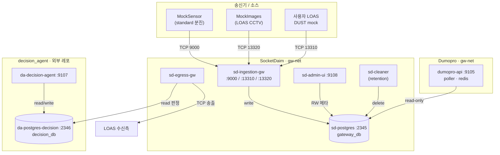
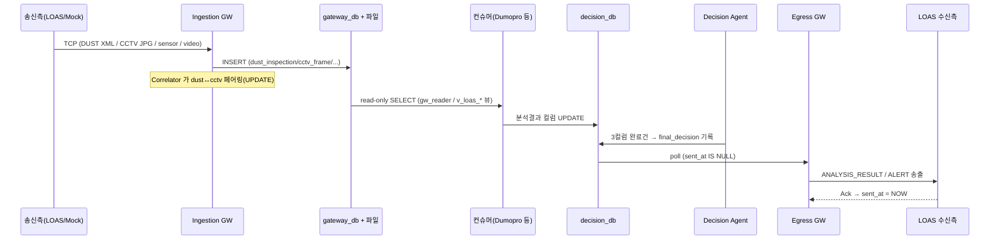

# SocketDaim 프로그램 구조 분석

> 분석 대상: `SocketDaim/` 저장소 (ggapsang/SocketDaim)
> 작성일: 2026-06-04
> 목적: SocketDaim 게이트웨이 시스템의 아키텍처, 서비스 구성, 데이터 모델, 프로토콜을 코드 기준으로 상세 분석한 참고 문서

---

## 1. 개요

SocketDaim 은 분진센서(Tfoi v4a) 측정 데이터와 CCTV 영상을 외부 송신측(LOAS 또는 Mock)으로부터 **TCP 소켓으로 수신·적재**하고, 컨슈머의 분석 결과를 다시 **외부로 송출**하는 게이트웨이 시스템이다. 더 큰 EcoproBM 분석 파이프라인의 **입출력 관문(gateway)** 역할을 한다.

### 1.1 핵심 설계 원칙 ([refs/gateway_plan.md](SocketDaim/refs/gateway_plan.md))

| 원칙 | 내용 |
|------|------|
| **프로토콜 교체 가능성** | 벤더(LOAS) 스펙 변경에 대비해 프로토콜 처리 계층(`gw_proto`)을 비즈니스 로직과 분리 (Anti-Corruption Layer / Hexagonal) |
| **단방향 흐름** | Ingestion 은 공용 저장소에 **쓰기만**, 컨슈머는 **읽기만**, Egress 는 판정 DB 에서 **읽기만** |
| **컨테이너 1개 = 관심사 1개** | Ingestion / Egress / Admin / Cleaner 가 별도 컨테이너 |
| **공용 라이브러리 단일 소스** | 프로토콜 코드는 `libs/gw_proto` 한 곳에서만 정의, 빌드 시 COPY + pip install |
| **DB 권한 분리** | 역할(role)별 계정 분리로 단방향 흐름을 DB 권한 레벨에서 강제 |

### 1.2 듀얼 프로토콜 모드

`IGW_PROTOCOL` 환경변수가 동작 축을 결정한다.

- **`loas` (기본)** — DUST(13310) + CCTV(13320) 듀얼 리스너. `dust_inspection` / `cctv_frame` 테이블 적재. (MockImages + 사용자 분진 mock 흐름)
- **`standard`** — 단일 9000 포트. `sensor_sample` / `video` 테이블 적재. 레거시 `gw_proto` 프로토콜. (MockSensor + Dumopro 분석 흐름)

---

## 2. 전체 아키텍처



**핵심 의존**: SocketDaim 이 **가장 먼저** 떠야 한다 — `gw-net`(=`socketdaim_gw-net`) 도커 네트워크를 생성하기 때문. 다른 레포(decision_agent, Dumopro)는 이 네트워크를 `external: true` 로 참조한다.

### 2.1 컨테이너 일람 ([docker-compose.yml](SocketDaim/docker-compose.yml))

| 컨테이너 | 역할 | 포트 | DB 롤 | 메모리 한도 |
|---|---|---|---|---|
| `sd-postgres` | 공용 저장소 (gateway_db) | 2345→5432 | (superuser) | 4G |
| `sd-ingestion-gw` | 수신 게이트웨이 | 9000 / 13310 / 13320 | `gw_writer` | 2G |
| `sd-egress-gw` | 송출 게이트웨이 | (포트 없음) | `egress_role`(decision_db) | 512M |
| `sd-admin-ui` | 관리 UI (FastAPI) | 9108 | `gw_admin` | 512M |
| `sd-cleaner` | 보존정책 집행 | (포트 없음) | `gw_cleaner` | 1G |

- `sd-postgres` 는 메모리 4G 한도 내 동작하도록 튜닝됨 (shared_buffers=1G, effective_cache_size=3G, work_mem=32MB, max_connections=30) — [docker-compose.yml:37-48](SocketDaim/docker-compose.yml#L37-L48)
- `ingestion-gw` / `cleaner` 는 `user: "1000:1000"` 으로 실행 → 호스트 `./storage/` bind mount 파일을 GUI 탐색기에서 sudo 없이 접근 가능 — [docker-compose.yml:78](SocketDaim/docker-compose.yml#L78)
- `decision_db`(postgres-decision)·decision-agent 는 **외부 레포(decision_agent)** 가 소유하며 `gw-net` 에 합류 ([decision_db/README.md](SocketDaim/decision_db/README.md), 2026-05-04 이관)

---

## 3. 디렉토리 구조

```
SocketDaim/
├── docker-compose.yml          # dev 구성 (5개 서비스)
├── docker-compose.deploy.yml   # 폐쇄망 배포 구성
├── init_db.sql                 # 전체 DDL + role + view (최초 1회 자동 실행)
├── seed_test_stations.sql      # 테스트 station seed (현재 미마운트)
├── quickstart.md               # 부팅/배포 절차
│
├── libs/gw_proto/              # ★ 공용 프로토콜 라이브러리 (stdlib only)
│   └── gw_proto/
│       ├── framing.py          #   standard 8-byte 프레이밍
│       ├── messages.py         #   Message/MessageType 정의
│       ├── codec/              #   StandardCodec + LOAS 코덱
│       │   ├── base.py, standard.py
│       │   └── loas/           #   dust_framing, dust_xml, cctv_framing, constants
│       └── transport/          #   TcpServer/Client + LoasDust/CctvTcpServer
│
├── ingestion_gateway/          # ★ 수신 게이트웨이
│   ├── main.py                 #   부팅·프로토콜 분기
│   ├── correlator.py           #   dust↔cctv 시간창 페어링
│   ├── session.py              #   TCP 세션·비디오 버퍼
│   ├── handler/                #   control/sensor/video + loas_dust/loas_cctv
│   └── repository/             #   테이블별 INSERT/SELECT
│
├── egress_gateway/             # ★ 송출 게이트웨이
│   ├── poller.py, sender.py, outbox.py
│   └── repository/decision_repo.py
│
├── admin_ui/                   # ★ 관리 UI (FastAPI + Jinja2)
│   ├── app.py                  #   REST 엔드포인트
│   ├── seed_data.py
│   ├── repository/             #   station/request/video/waypoint
│   └── templates/, static/     #   Win9x 톤 어드민 페이지
│
├── cleaner/                    # ★ 보존정책 집행 데몬
│   ├── main.py, cleanup.py
│
├── scripts/                    # 마이그레이션 + 송신 테스트 스크립트
│   ├── migrate_001~009_*.sql
│   └── send_sensor.py, send_video.py
│
├── tests/                      # 통합·핸들러 테스트 + mock LOAS 서버
└── refs/                       # 설계 문서 (gateway_plan, gw_protocol_spec 등)
```

---

## 4. 공용 프로토콜 라이브러리 (`gw_proto`)

벤더 종속을 배제한 **중립 네이밍**의 프로토콜 처리 라이브러리. Ingestion / Egress / Mock 세 곳에서 공용으로 사용된다. **외부 의존성 없음(stdlib only)** — [libs/gw_proto/pyproject.toml](SocketDaim/libs/gw_proto/pyproject.toml).

### 4.1 Standard 프로토콜 (length-prefixed framing)

[framing.py](SocketDaim/libs/gw_proto/gw_proto/framing.py) — 8바이트 헤더:

```
+------------------+------------------+---------------------+
| 4 bytes          | 4 bytes          | N bytes             |
| payload length   | message type     | payload             |
| (uint32, BE)     | (uint32, BE)     |                     |
+------------------+------------------+---------------------+
```

- `HEADER_STRUCT = struct.Struct("!II")` (빅엔디안 uint32 2개), `HEADER_SIZE = 8`
- 최대 payload 512MB (영상 청크 대응), 읽기 timeout 60초 / 쓰기 30초

**MessageType** ([messages.py](SocketDaim/libs/gw_proto/gw_proto/messages.py)):

| 코드 | 타입 | 방향 | 페이로드 |
|---|---|---|---|
| `0x0001` | VIDEO_CHUNK | Ingress | JSON 헤더 + `\n` + 바이너리 |
| `0x0002` | VIDEO_COMPLETE | Ingress | JSON |
| `0x0010` | SENSOR_SAMPLE | Ingress | JSON |
| `0x0100` | ANALYSIS_RESULT | Egress | JSON |
| `0x0101` | ALERT | Egress | JSON |
| `0x0F00` | HEARTBEAT | 양방향 | JSON |
| `0x0F01` | ACK | 양방향 | JSON |
| `0x0FFF` | ERROR | 양방향 | JSON `{"error": ...}` |

- `VideoChunkMeta` / `SensorSamplePayload` 데이터클래스 + `parse_video_chunk()` / `build_video_chunk_payload()` 헬퍼 제공
- **wire 식별자는 `station_name`** (UUID 가 아님) — UUID 는 각 시스템 로컬

**Codec 인터페이스** ([codec/base.py](SocketDaim/libs/gw_proto/gw_proto/codec/base.py)): `encode(Message)` / `decode(type, payload)`. `get_codec("standard")` 가 `StandardCodec` 반환. 벤더(LOAS) 프로토콜은 `Codec` 인터페이스를 따르지 않고 **애플리케이션 계층에서 직접 와이어링**한다.

### 4.2 LOAS 벤더 프로토콜 (Tfoi v4a)

LOAS 는 **단방향 푸시 프로토콜**(ACK·하트비트 없음). DUST 와 CCTV 두 서비스가 각각 고유 프레이밍을 가진다.

**DUST 프레임** ([codec/loas/dust_framing.py](SocketDaim/libs/gw_proto/gw_proto/codec/loas/dust_framing.py)) — 12바이트 고정 헤더 (리틀엔디안 `<HHBBIH`):

| offset | 필드 | 타입 | 값 |
|---|---|---|---|
| 0 | sop | uint16 | `0xAABB` (프레임 시작 매직) |
| 2 | id | uint16 | `0xD002` (DUST_INSPECTION_INFOR) |
| 4 | ver | uint8 | `0x02` |
| 5 | encryption | uint8 | 0=평문, 1=암호화 |
| 6 | timestamp | uint32 | UTC epoch 초 |
| 10 | length | uint16 | 본문 길이 (≤1448) |

- 본문은 **XML** ([dust_xml.py](SocketDaim/libs/gw_proto/gw_proto/codec/loas/dust_xml.py)): 루트 `<ELEMENT>`, 필수 `<CMD_ID>DUST_INSPECTION_INFOR</CMD_ID>`, 나머지 측정값/위치/회전/ID 필드는 선택적
- **인코딩 폴백**: UTF-8 → 실패 시 EUC-KR (한국 산업 시스템 호환)
- **오타 호환**: `DUST_ALARM`/`DUST_ALRAM`, `INSPECTION_LOCAL_ID`/`INSPECTION_LOACL_ID` 양쪽 태그 수용
- 암호화 프레임(encryption=1)은 본문을 읽어 와이어에서 제거하되 **드롭**(복호화 키 없음), 스트림은 유지

**CCTV 프레임** ([codec/loas/cctv_framing.py](SocketDaim/libs/gw_proto/gw_proto/codec/loas/cctv_framing.py)) — 9바이트 고정 헤더:

| offset | 필드 | 타입 | 값 |
|---|---|---|---|
| 0 | m_type | char[5] | ASCII 해상도 태그: `V1080`/`V720p`/`V640p` |
| 5 | m_len | uint32 (BE) | JPEG 본문 길이 |

- SOP 매직 없음 → **해상도 태그 자체가 프레임 동기화 판별자**
- 본문은 메타 없는 순수 **JPEG** (최대 16MB 가드)
- 바이트 순서 미명시 대응: BE 로 읽은 길이가 비논리적으로 크면 **LE 폴백** 시도 ([transport/loas_cctv_server.py](SocketDaim/libs/gw_proto/gw_proto/transport/loas_cctv_server.py))

### 4.3 Transport 계층

| 클래스 | 용도 | 특성 |
|---|---|---|
| `TcpServer` | Ingestion standard 모드 | 양방향, 세션 추적, 하트비트, 핸들러 dispatch |
| `TcpClient` | Egress / Mock | 양방향, 자동 재연결(1→2→…→60초 백오프), 30초 하트비트 |
| `LoasDustTcpServer` | Ingestion LOAS DUST | 수신전용, 12B 헤더+XML, 프레임당 콜백, 검증 실패 시 연결 종료 |
| `LoasCctvTcpServer` | Ingestion LOAS CCTV | 수신전용, 9B 헤더+JPEG, 연결 독립 처리(슬롯 추적 없음 → 프레임 손실 방지), 본문 읽기 타임아웃 |

---

## 5. Ingestion Gateway (수신 게이트웨이)

외부에서 TCP 로 데이터를 받아 메타데이터를 부여하고 공용 저장소(PostgreSQL + 파일)에 적재한다. **WORM 원칙**(수신 즉시 무수정 저장).

### 5.1 부팅 시퀀스 ([ingestion_gateway/main.py](SocketDaim/ingestion_gateway/main.py))

```
run()
├─ IngestionSettings 로드 (config.py)
├─ configure_logging() / SIGTERM·SIGINT 핸들러 등록
├─ create_pool()  (asyncpg, gw_writer 롤)
└─ IGW_PROTOCOL 분기
   ├─ "standard" → _run_standard()
   └─ "loas"     → _run_loas()
```

**Standard 모드** (`_run_standard`): `TcpServer` 한 개를 9000 포트에 띄우고, 메시지 타입별로 dispatch.
- VIDEO_CHUNK/COMPLETE → `VideoHandler`, SENSOR_SAMPLE → `SensorHandler`, HEARTBEAT/ERROR → `ControlHandler`
- `SessionRegistry` 로 TCP 연결별 상태·비디오 버퍼 추적

**LOAS 모드** (`_run_loas`): 세 개의 비동기 태스크를 동시 실행.
1. `LoasDustTcpServer` (13310) → `LoasDustHandler`
2. `LoasCctvTcpServer` (13320) → `LoasCctvHandler`
3. `FrameCorrelator` (10초 주기 배치 페어링)
- `asyncio.wait(FIRST_COMPLETED)` 로 어느 태스크든 실패 시 즉시 감지 → graceful shutdown (correlator 먼저 중지하여 UPDATE 완료 대기)

### 5.2 핸들러

| 핸들러 | 처리 | 적재 대상 |
|---|---|---|
| `ControlHandler` | HEARTBEAT(last_heartbeat 갱신+ACK), ERROR(로그) | ingestion_log |
| `SensorHandler` | station_name→ID 조회 → 센서값 INSERT | sensor_sample |
| `VideoHandler` | 청크 버퍼링 → COMPLETE 시 조합·파일저장·메타INSERT | video + 파일 |
| `LoasDustHandler` | XML 디코딩·파싱 → INSERT (raw_xml 보존) | dust_inspection |
| `LoasCctvHandler` | JPG 원자적 저장 → INSERT (amr_id 스탬프) | cctv_frame + 파일 |

- **파일 경로 규칙**:
  - 영상: `{STORAGE_ROOT}/videos/{station_id}/{YYYY-MM-DD}/{video_id}.bin`
  - CCTV: `{STORAGE_ROOT}/cctv/{amr_id}/{YYYY-MM-DD}/{HH}/{epoch_us}_{resolution}.jpg` (microsecond → 1fps 충돌 방지, 시간별 하위폴더로 파일 폭증 방지)
- **일관성**: 파일 쓰기 실패 시 DB row 미생성 / 파일 성공 후 DB 실패 시 orphan 파일 삭제 시도
- **unknown station 처리**: `lookup_by_name()` 실패 시 `station_request` UPSERT + 에러 로그 + `Message.error()` 응답 (standard 모드)

### 5.3 Correlator — dust ↔ cctv 시간창 페어링 ([correlator.py](SocketDaim/ingestion_gateway/correlator.py))

리스너는 INSERT 만, **UPDATE 는 Correlator 가 전담**(deferred 배치). DUST 이벤트 시점 T 의 ±윈도우 내 도착 프레임을 잡아야 하는데 핸들러 시점엔 아직 프레임이 도착 전일 수 있기 때문.

```sql
UPDATE cctv_frame f
   SET dust_inspection_id = sub.inspection_id, paired_at = clock_timestamp()
  FROM (
    SELECT DISTINCT ON (f2.id) f2.id AS frame_id, di.id AS inspection_id
      FROM cctv_frame f2
      JOIN dust_inspection di
        ON f2.received_at BETWEEN di.received_at - make_interval(secs => $1)   -- before 2.0s
                              AND di.received_at + make_interval(secs => $2)   -- after  2.0s
     WHERE f2.dust_inspection_id IS NULL
       AND f2.received_at > clock_timestamp() - make_interval(secs => $3)      -- lookback 600s
     ORDER BY f2.id, abs(extract(epoch FROM (f2.received_at - di.received_at)))
  ) sub
 WHERE f.id = sub.frame_id
```

- 각 프레임은 **최대 1개** inspection 과 매칭(시간 차 최소). 10초 간격 tick, 최근 600초만 스캔
- 예외 발생 시 로그만 하고 계속(DB 임시 장애 대응)

### 5.4 주요 환경변수 (`IGW_` prefix, [config.py](SocketDaim/ingestion_gateway/config.py))

| 변수 | 기본값 | 설명 |
|---|---|---|
| `IGW_PROTOCOL` | `loas` | `standard`\|`loas` |
| `IGW_TCP_PORT` | `9000` | standard 포트 |
| `IGW_LOAS_DUST_PORT` | `13310` | DUST 리스너 |
| `IGW_LOAS_CCTV_PORT` | `13320` | CCTV 리스너 |
| `IGW_LOAS_AMR_ID` | `amr-01` | cctv_frame.amr_id 스탬프 |
| `IGW_LOAS_WINDOW_BEFORE_SEC` / `AFTER_SEC` | `2.0` / `2.0` | Correlator 시간창 |
| `IGW_LOAS_CORRELATOR_INTERVAL_SEC` | `10.0` | Correlator tick |
| `IGW_LOAS_LOOKBACK_SEC` | `600.0` | 스캔 히스토리 깊이 |
| `IGW_DB_USER` / `PASSWORD` | `gw_writer` / `dev_writer_pw` | DB 계정 |
| `IGW_STORAGE_ROOT` | `/data/storage` | 파일 저장 루트 |

---

## 6. Egress Gateway (송출 게이트웨이)

판정 DB(decision_db)에서 최종 판정 결과를 **polling** 하여 LOAS 측으로 TCP 송출하는 배치 서비스. HTTP 없음. 컨슈머 독자 DB 의 존재를 모르며 **판정 DB 하나만** 바라본다.

### 6.1 동작 흐름

```
Poller (5초 주기, batch 100)
  └─ DecisionRepository.fetch_pending()
       WHERE final_decision <> 'pending' AND sent_at IS NULL ORDER BY decided_at
  └─ Sender.send_record()
       ├─ msg_type: 'warning' → ALERT(0x0101), 그 외 → ANALYSIS_RESULT(0x0100)
       ├─ Outbox.add() (SQLite, durability 우선)
       ├─ TcpClient.send() → ACK 대기(10초)
       ├─ 성공 → DecisionRepository.mark_sent() (sent_at=NOW) + Outbox.remove()
       └─ 실패 → Outbox.bump_attempts() + 재연결 백오프
```

### 6.2 Outbox 패턴 ([outbox.py](SocketDaim/egress_gateway/outbox.py))

전송 보증을 위한 Transactional Outbox (로컬 SQLite, `EGW_OUTBOX_PATH=/data/outbox.db`):

```sql
CREATE TABLE outbox (
    outbox_id   INTEGER PRIMARY KEY AUTOINCREMENT,
    decision_id TEXT NOT NULL UNIQUE,   -- idempotent (INSERT OR IGNORE)
    msg_type    INTEGER NOT NULL,
    payload     BLOB NOT NULL,
    attempts    INTEGER NOT NULL DEFAULT 0,
    created_at  TEXT NOT NULL
);
```

서비스 시작 시 `_drain_outbox()` 가 미처리 행을 FIFO 로 재송신한다.

### 6.3 주요 환경변수 (`EGW_` prefix)

| 변수 | 기본값 | 설명 |
|---|---|---|
| `EGW_LOAS_HOST` / `PORT` | `loas-receiver` / `9001` | LOAS 수신 엔드포인트(실제 값으로 교체) |
| `EGW_DB_HOST` / `NAME` / `USER` | `postgres-decision` / `decision_db` / `egress_role` | 판정 DB 접속 |
| `EGW_POLL_INTERVAL_SEC` / `BATCH_SIZE` | `5` / `100` | 폴링 주기·배치 |
| `EGW_OUTBOX_PATH` | `/data/outbox.db` | SQLite 경로 |

> decision_db 가 미가용이면 연결 실패를 로그하고 **재시도만** 반복한다(내구성 설계).

---

## 7. Admin UI (관리 UI)

FastAPI + Jinja2 기반 웹 콘솔(Win9x/2000 톤). `gw_admin` 롤로 station 메타 CRUD, station_request 트리아지, 영상 라벨링, LOAS waypoint 라벨링, 디스크/수신 모니터링을 제공한다. 포트 **9108**.

### 7.1 주요 엔드포인트 ([admin_ui/app.py](SocketDaim/admin_ui/app.py))

| 그룹 | 엔드포인트 | 기능 |
|---|---|---|
| 상태 | `GET /admin/api/status` | DB 상태, station 카운트, 디스크 사용률, DB 크기 |
| Station | `GET/POST/PATCH/DELETE /admin/api/stations[/{id}]` | station CRUD (UPDATE 는 COALESCE 부분 수정) |
| Request | `GET /admin/api/requests` + `approve`/`reject`/`restore` | unknown station 트리아지 (승인 시 station 생성 원자적 트랜잭션) |
| Video | `GET /admin/api/videos` (페이징·필터) | 영상 목록 |
| Video | `PATCH /admin/api/videos/{id}` | `is_valid`/`is_excluded` 라벨링 |
| Video | `GET .../stream`, `.../download` | 스트리밍/다운로드 |
| Waypoint | `GET/PUT/DELETE /admin/api/waypoints[/{station_id}]` | LOAS 자동발견 waypoint 라벨 upsert |
| 모니터링 | `GET /admin/api/recent-activity`, `recent-errors` | LOAS 수신활동(dust+cctv), ingestion 에러 |
| 액션 | `POST /admin/api/seed-samples` | 샘플 4개 station idempotent INSERT |
| 액션 | `POST /admin/api/cleanup/run` | `NOTIFY cleanup_trigger` → cleaner 즉시 실행 |

- **권한 분리 강제**: 영상 UPDATE 권한 부족 시 HTTP 403 + `migrate_005` 안내, FK 위반 삭제 시 HTTP 409
- `video_repo.list_paged()` 는 정렬·필터를 **화이트리스트 dict** 로 검증해 SQL injection 방지
- `waypoint_repo` 는 `loas_station_id(7-tuple)` 함수로 자동발견된 관측개소를 그룹핑하여 라벨 매핑
- UI: 5초마다 status/waypoint/activity 갱신, 10초마다 에러 로그 갱신 ([static/js/admin.js](SocketDaim/admin_ui/static/js/admin.js))

---

## 8. Cleaner (보존정책 집행 데몬)

`gateway_plan.md §9` 보존정책을 매일 **03:00 KST** 자동 집행. `gw_cleaner` 롤(SELECT+DELETE)로 동작하며 bind mount 된 `./storage` 의 파일 unlink 까지 수행한다.

### 8.1 보존 정책 ([cleaner/cleanup.py](SocketDaim/cleaner/cleanup.py))

| 대상 | 조건 | 보존 기간 |
|---|---|---|
| 정상 영상 | `is_valid AND NOT is_excluded` | 14일 (`SDC_VIDEO_NORMAL_DAYS`) |
| 이상 영상 | `NOT is_valid OR is_excluded` | 180일 (`SDC_VIDEO_ANOMALY_DAYS`) |
| 센서 샘플 | `sensor_sample` | 180일 (`SDC_SENSOR_DAYS`) |
| 수집 로그 | `ingestion_log` | 180일 (`SDC_INGESTION_LOG_DAYS`) |

- 배치(200행) 단위로 처리하여 테이블 lock 최소화
- 영상은 **파일 unlink 먼저 → DB DELETE**. 일반 실행에서는 unlink 실패해도 DB DELETE 진행(orphan 파일 용인)

### 8.2 Emergency Purge (디스크 압박 안전장치)

nightly 14일 정책으로 못 막는 부하 폭주 대비. `SDC_DISK_CHECK_INTERVAL_SEC`(300초)마다 사용률 점검:

- 사용률 ≥ `SDC_EMERGENCY_PURGE_AT_PERCENT`(85%) 이면 → **label/나이 무시**하고 `captured_at` 오래된 순으로 삭제, `SDC_EMERGENCY_TARGET_PERCENT`(70%) 미만까지 반복
- 일반 실행과 달리 unlink 실패 시 **DB row 유지**(다음 tick 재시도). 최대 1000배치 가드(무한루프 방지)

### 8.3 트리거 경로

- **스케줄**: 03:00 KST (`_next_scheduled_run` 이 UTC→KST 환산)
- **즉시 실행**: Admin UI "[지금 정리]" → `NOTIFY cleanup_trigger` → PostgreSQL 리스너가 감지 → 메인 루프 즉시 기상
- **수동**: `docker exec sd-cleaner python -m cleaner.main --once`

---

## 9. 데이터 모델 (gateway_db)

스키마는 [init_db.sql](SocketDaim/init_db.sql) 에 정의되며 PostgreSQL 공식 이미지의 `/docker-entrypoint-initdb.d/` 메커니즘으로 **최초 1회 자동 실행**(Alembic 미사용). 이후 변경은 `scripts/migrate_*.sql` 수동 적용.

### 9.1 테이블 요약

| 테이블 | PK | 핵심 컬럼 | 용도 |
|---|---|---|---|
| `station` | station_id (UUID) | station_name, amr_id, status, capture_cycle | 관측소 메타 |
| `video` | video_id (UUID) | station_id(FK), file_path, source_format, is_valid, is_excluded, captured_at | standard 영상 메타 |
| `sensor_sample` | id (BIGSERIAL) | station_id(FK), measurement_type, value, unit, sampled_at | standard 센서 시계열 |
| `ingestion_log` | id (BIGSERIAL) | station_id(FK,nullable), message_type, status, error_message | 수신 감사 로그 |
| `station_request` | **station_name** | first_seen, last_seen, attempts, status(pending/approved/rejected) | unknown station 트리아지 |
| `dust_inspection` | id (BIGSERIAL) | received_at, dust_value, dust_alarm, waypoint_*, rot_*, mission_id, raw_xml (33컬럼) | LOAS DUST 측정 |
| `cctv_frame` | id (BIGSERIAL) | received_at, amr_id, resolution, file_path, **dust_inspection_id(FK)**, paired_at | LOAS CCTV 프레임 |
| `waypoint_label` | **station_id** (UUID) | waypoint_id, x/y/z, pan/tilt/lift, label, location | LOAS 관측개소 사람용 라벨 |

- `station` 상태: `collecting`/`waiting`/`training`/`inferring`/`inactive`
- `dust_alarm`: 0=Fault, 1=Maint, 2=Alert, 3=Normal (인덱스는 `< 3` 비정상만)
- `cctv_frame.dust_inspection_id` 는 `ON DELETE SET NULL` (orphan 은 cleaner 가 처리)
- 인덱스: 시간/외래키/미페어링(부분 인덱스) 등에 다수 정의

### 9.2 DB 역할(role) 권한

| 롤 | 사용 서비스 | 권한 |
|---|---|---|
| `gw_writer` | ingestion-gw | station SELECT, video/sensor/log INSERT, station_request UPSERT, dust/cctv INSERT+컬럼한정 UPDATE |
| `gw_reader` | 컨슈머(Dumopro 등) | 모든 테이블/뷰 SELECT (읽기 전용) |
| `gw_admin` | admin-ui | station·station_request 풀 RW, video SELECT+UPDATE(라벨만), waypoint_label CRUD, dust/cctv/뷰 SELECT |
| `gw_cleaner` | cleaner | video/sensor/log/dust/cctv SELECT+DELETE (메타 테이블은 보호) |

이 권한 분리로 "단방향 흐름" 원칙이 DB 레벨에서 강제된다.

### 9.3 Dumopro 호환 View

Dumopro WebApp 은 standard 스키마(station + sensor_sample)만 이해하므로, LOAS 데이터를 reshape 하는 뷰 제공:

- **`v_loas_stations`**: `dust_inspection` 의 distinct 7-tuple(waypoint_id, x/y/z, pan/tilt/lift)마다 1 station. `station_id = loas_station_id(...)`(md5→UUID, IMMUTABLE), 라벨 있으면 라벨명, 없으면 `WP-{id}/p{pan}t{tilt}l{lift}` 자동 생성
- **`v_loas_sensor_sample`**: `dust_inspection` 을 sensor_sample 형태로 변환 (measurement_type='dust_concentration', unit='mg/m3', value=dust_value, sampled_at=received_at)
- **`v_inspection_with_frames`**: dust LEFT JOIN cctv (Decision Agent 편의용)

### 9.4 마이그레이션 타임라인 ([scripts/](SocketDaim/scripts/))

| # | 파일 | 변경 내용 |
|---|---|---|
| 001 | station_request | station_request 테이블 신설 (PK=station_id UUID) |
| 002 | video_source_format | video.source_format 컬럼 추가 |
| 003 | station_request_by_name | PK 를 station_id → **station_name** 으로 변경 (wire 식별자 정합) |
| 004 | gw_cleaner_role | gw_cleaner 롤 + 권한 추가 |
| 005 | video_admin_update | gw_admin 에 video UPDATE 권한 추가(라벨링 UI) |
| 006 | loas_tables | dust_inspection / cctv_frame / v_inspection_with_frames 신설 |
| 007 | dumopro_loas_views | v_loas_stations / v_loas_sensor_sample 초판 (waypoint_id 단순 합성) |
| 008 | waypoint_label | waypoint_label 테이블(초판 PK=waypoint_id) + 뷰에 라벨 JOIN |
| 009 | station_id_composite | `loas_station_id()` 7-tuple 함수 도입, waypoint_label PK→station_id(UUID), 뷰 재정의 |

> 009 의 핵심: 같은 waypoint 라도 **좌표·자세(pan/tilt/lift)가 다르면 별도 station 으로 분리 분석**.

---

## 10. 판정 DB (decision_db) — 외부 레포 소유

[decision_db/README.md](SocketDaim/decision_db/README.md) 기준, decision_db 의 schema·seed·컨테이너는 **2026-05-04 에 `decision_agent` 레포로 이관**되었다. SocketDaim 은 더 이상 마운트하지 않는다.

판정 입력 테이블 구조([gateway_plan.md §6.4](SocketDaim/refs/gateway_plan.md)):

| 컬럼 | 작성 주체 |
|---|---|
| `static_model_result` (정상/이상/미수신) | 이상감지 모듈 |
| `dynamic_model_result` | 객체감지 모듈 |
| `sensor_result` | 데이터분석 모듈 |
| `final_decision` (정상/주의/경고/미판정) + `decided_at` | Decision Agent |
| `sent_at` | Egress Gateway |

3개 컨슈머가 각자 컬럼만 UPDATE → Decision Agent 가 3컬럼 모두 채워진 건에 매핑 적용 → Egress 가 `final_decision IS NOT NULL AND sent_at IS NULL` 건을 송출.

---

## 11. 전체 데이터 흐름 (end-to-end)



---

## 12. 배포 메모

- **부팅 순서**: SocketDaim(gw-net 생성) → decision_agent → Dumopro → MockImages → FrameExtractor. 종료는 역순 ([quickstart.md](SocketDaim/quickstart.md)).
- **폐쇄망(air-gap) 배포**: 외부망에서 `docker save` 로 이미지 tar 화 → 폐쇄망에서 `docker load`. compose 의 `build:` 를 `image: ...:latest` + `pull_policy: never` 로 교체 ([docker-compose.deploy.yml](SocketDaim/docker-compose.deploy.yml)).
- **DB 초기화**: `init_db.sql` 은 볼륨이 비어있는 최초 기동 시에만 자동 실행. 스키마 변경은 `migrate_*.sql` 수동 적용 또는 `down -v` 후 재기동.
- **포트 충돌 회피**: PostgreSQL 호스트 포트는 5432/5433 점유로 인해 **2345** 사용(내부는 5432 유지).

---

## 13. 참고 문서

| 문서 | 위치 |
|---|---|
| 게이트웨이 설계 기획안 | [refs/gateway_plan.md](SocketDaim/refs/gateway_plan.md) |
| standard 프로토콜 스펙 | [refs/gw_protocol_spec.md](SocketDaim/refs/gw_protocol_spec.md) |
| LOAS 벤더 스펙 (원문) | [Tfoi v4a 분진센서 정합_r3.pdf](SocketDaim/Tfoi%20v4a%20%EB%B6%84%EC%A7%84%EC%84%BC%EC%84%9C%20%EC%A0%95%ED%95%A9_r3.pdf) |
| decision_agent 연계 회신 | [refs/reply_to_decision_agent_2026-05-04.md](SocketDaim/refs/reply_to_decision_agent_2026-05-04.md) |
| 컨슈머 접근 가이드 | [refs/consumer_access_guide.md](SocketDaim/refs/consumer_access_guide.md) |
| 부팅/배포 절차 | [quickstart.md](SocketDaim/quickstart.md) |
