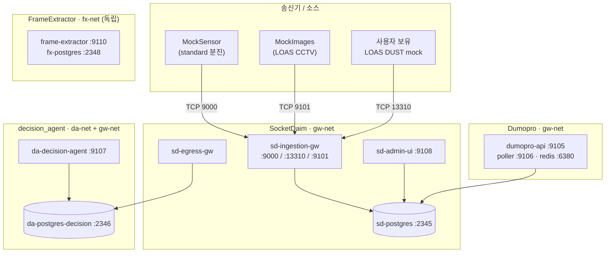

# Quickstart — EcoproBM

`c:/EcoproBM/` 아래 6개 레포를 **독립된 docker compose** 로 띄운다.
환경 가정: 외부망 = Windows / PowerShell, 폐쇄망 = Linux / bash.

---

## Cheat Sheet

> `&&` 는 PowerShell 5.1 에서 안 먹는다 → 한 줄씩. `cd` 대신 `-f <path>`.

### Path A — 외부망 (Windows / PowerShell)

```powershell
cd c:/EcoproBM

# (선택) 기존 컨테이너 정리
docker compose -f FrameExtractor/docker-compose.yml down
docker compose -f Dumopro_Data_Analysis_WebApp/docker-compose.yml down
docker compose -f MockImages/docker-compose.yml down
docker compose -f MockSensor/docker-compose.yml down
docker compose -f decision_agent/docker-compose.yml down
docker compose -f SocketDaim/docker-compose.yml down

# 호스트 폴더 (Windows 는 chown 불필요)
New-Item -ItemType Directory -Force SocketDaim/storage, MockImages/media | Out-Null

# 부팅 — SocketDaim 가장 먼저 (gw-net 생성). 이후는 순서 무관.
docker compose -f SocketDaim/docker-compose.yml up -d --build
docker compose -f decision_agent/docker-compose.yml up -d --build
docker compose -f Dumopro_Data_Analysis_WebApp/docker-compose.yml up -d --build
docker compose -f MockImages/docker-compose.yml up -d --build
Invoke-RestMethod -Method Post -Uri http://localhost:8081/api/runtime/resume
docker compose -f FrameExtractor/docker-compose.yml up -d --build

# (standard 모드 흐름이면 MockImages 대신 MockSensor)
# docker compose -f MockSensor/docker-compose.yml up -d --build

docker ps --format "table {{.Names}}\t{{.Status}}\t{{.Ports}}"
```

### 재기동 — 이미 빌드된 이미지로 다시 켜기 (Windows / PowerShell)

> Path A 는 **첫 부팅 / 코드 변경 후** — `--build` 가 매번 이미지 재생성 (수십 초).
> 코드 안 바뀌었으면 `--build` 빼면 캐시된 이미지로 즉시 기동 (1~2초).

```powershell
# 코드 변경 없음 → 캐시된 이미지로 그대로 띄움
docker compose -f SocketDaim/docker-compose.yml up -d
docker compose -f decision_agent/docker-compose.yml up -d
docker compose -f Dumopro_Data_Analysis_WebApp/docker-compose.yml up -d
docker compose -f MockImages/docker-compose.yml up -d
docker compose -f FrameExtractor/docker-compose.yml up -d

# 특정 컨테이너만 그대로 재시작 (이미지·볼륨 그대로 — 가장 빠름)
docker restart sd-ingestion-gw

# 특정 서비스 한 개만 코드 변경 → 그것만 rebuild
docker compose -f SocketDaim/docker-compose.yml up -d --build ingestion-gw
```

### Path B-1 — 외부망에서 build + tar save (Windows / PowerShell)

```powershell
cd c:/EcoproBM

# 모든 레포 빌드 (SocketDaim 부터 — MockImages 가 libs/gw_proto COPY)
docker compose -f SocketDaim/docker-compose.yml build
docker compose -f decision_agent/docker-compose.yml build
docker compose -f MockSensor/docker-compose.yml build
docker compose -f MockImages/docker-compose.yml build
docker compose -f Dumopro_Data_Analysis_WebApp/docker-compose.yml build
docker compose -f FrameExtractor/docker-compose.yml build

$bundle = "$env:USERPROFILE\airgap-bundle"
New-Item -ItemType Directory -Force "$bundle\images" | Out-Null
cd "$bundle\images"

# 베이스 이미지
docker save -o postgres-16.tar postgres:16
docker save -o redis-7-alpine.tar redis:7-alpine

# 자체 빌드 이미지
docker save -o sd-ingestion-gw.tar socketdaim-ingestion-gw:latest
docker save -o sd-admin-ui.tar socketdaim-admin-ui:latest
docker save -o sd-cleaner.tar socketdaim-cleaner:latest
docker save -o sd-egress-gw.tar socketdaim-egress-gw:latest
docker save -o da-decision-agent.tar decision_agent-decision-agent:latest
docker save -o mock-sender.tar mocksender-mock-sender:latest
docker save -o mock-images.tar mockimages-mock-images:latest
docker save -o dumopro-api.tar dumopro-dumopro-api:latest
docker save -o dumopro-poller.tar dumopro-dumopro-poller:latest
docker save -o frame-extractor.tar frameextractor-frame-extractor:latest

# 소스/설정 동봉
cd $bundle
New-Item -ItemType Directory -Force src | Out-Null
Copy-Item -Recurse c:/EcoproBM/* src/

# src/*/docker-compose.yml 의 자체 빌드 서비스에
# build: 주석 처리 + image: ...:latest + pull_policy: never 로 교체
```

### Path B-2 — 폐쇄망에서 load + 부팅 (Linux / bash)

```bash
cd /opt/airgap-bundle/images
for t in *.tar; do docker load -i "$t"; done

sudo cp -r /opt/airgap-bundle/src/* /opt/ecoprobm/
cd /opt/ecoprobm
sudo mkdir -p SocketDaim/storage MockImages/media
sudo chown -R 1000:1000 SocketDaim/storage

docker compose -f SocketDaim/docker-compose.yml up -d --no-build
docker compose -f decision_agent/docker-compose.yml up -d --no-build
docker compose -f Dumopro_Data_Analysis_WebApp/docker-compose.yml up -d --no-build
docker compose -f MockImages/docker-compose.yml up -d --no-build
curl -X POST http://localhost:8081/api/runtime/resume
docker compose -f FrameExtractor/docker-compose.yml up -d --no-build
```

### 운용 한 줄 (PowerShell)

```powershell
# 송신 재개
Invoke-RestMethod -Method Post -Uri http://localhost:8081/api/runtime/resume

# 리스너 확인
docker exec sd-ingestion-gw ss -tlnp 2>$null | Select-String "13310|9101"

# DB row 확인 (loas)
docker exec sd-postgres psql -U postgres -d gateway_db -c "SELECT (SELECT count(*) FROM dust_inspection) AS dust, (SELECT count(*) FROM cctv_frame) AS cctv;"

# 전체 정지 (역순)
docker compose -f FrameExtractor/docker-compose.yml down
docker compose -f Dumopro_Data_Analysis_WebApp/docker-compose.yml down
docker compose -f MockImages/docker-compose.yml down
docker compose -f MockSensor/docker-compose.yml down
docker compose -f decision_agent/docker-compose.yml down
docker compose -f SocketDaim/docker-compose.yml down
```

### 깨끗하게 초기화 (DB 볼륨 삭제 — 데이터 손실 주의)

```powershell
docker compose -f c:\EcoproBM\Dumopro_Data_Analysis_WebApp\docker-compose.yml down
docker compose -f c:\EcoproBM\MockImages\docker-compose.yml down
docker compose -f c:\EcoproBM\MockSensor\docker-compose.yml down
docker compose -f c:\EcoproBM\decision_agent\docker-compose.yml down
docker compose -f c:\EcoproBM\SocketDaim\docker-compose.yml down -v
docker compose -f c:\EcoproBM\SocketDaim\docker-compose.yml up -d --build
docker compose -f c:\EcoproBM\decision_agent\docker-compose.yml up -d --build
docker compose -f c:\EcoproBM\Dumopro_Data_Analysis_WebApp\docker-compose.yml up -d --build
docker compose -f c:\EcoproBM\MockImages\docker-compose.yml up -d --build
```

---

## 전체 구조



핵심 의존: **SocketDaim 이 가장 먼저 떠야** 한다 — `gw-net` (=`socketdaim_gw-net`) 네트워크를 생성하므로. 다른 레포는 `external: true` 로 참조. `FrameExtractor` 만 예외 (독자 `fx-net`).

---

## 포트 일람

| 포트 | 컨테이너 | 출처 |
|---|---|---|
| 2345 | sd-postgres | SocketDaim |
| 2346 | da-postgres-decision | decision_agent |
| 2348 | fx-postgres | FrameExtractor |
| 6380 | dumopro-redis | Dumopro |
| 8080 | mock-sender (admin) | MockSensor |
| 8081 | mock-images (admin) | MockImages |
| 9000 | sd-ingestion-gw (standard TCP) | SocketDaim |
| 9101 | sd-ingestion-gw (LOAS CCTV) | SocketDaim |
| 9105 | dumopro-api | Dumopro |
| 9106 | dumopro-poller (health) | Dumopro |
| 9107 | da-decision-agent | decision_agent |
| 9108 | sd-admin-ui | SocketDaim |
| 9110 | frame-extractor | FrameExtractor |
| 13310 | sd-ingestion-gw (LOAS DUST) | SocketDaim |

---

## 프로토콜 모드

SocketDaim 의 `IGW_PROTOCOL` env 가 동작 축 결정:

- **`loas` (기본)** — DUST 13310 + CCTV 9101 듀얼 리스너. `dust_inspection` / `cctv_frame` 적재. **MockImages + 사용자 분진 mock** 흐름과 호환.
- **`standard`** — 단일 9000 포트. `sensor_sample` / `video` 적재. **MockSensor + Dumopro** 분석 흐름과 호환.

Dumopro 도 동일하게 `STATION_SOURCE` / `SAMPLE_SOURCE` env 로 분기 (기본 = LOAS view). standard 모드와 함께 쓰려면 두 env 를 `station` / `sensor_sample` 로 오버라이드.

---

## 폐쇄망 적용 시 — `build:` → `image:` 교체

각 compose 의 자체 빌드 서비스에:

```yaml
ingestion-gw:
  # build: # ← 주석
  # context: .
  # dockerfile: ingestion_gateway/Dockerfile
  image: socketdaim-ingestion-gw:latest # ← 추가
  pull_policy: never # ← 추가
  container_name: sd-ingestion-gw
  ...
```

적용 대상: SocketDaim 의 ingestion-gw / admin-ui / cleaner / egress-gw, decision_agent 의 decision-agent, MockSensor 의 mock-sender, MockImages 의 mock-images, Dumopro 의 poller / api, FrameExtractor 의 frame-extractor.

`postgres:16` / `redis:7-alpine` 처럼 Hub 그대로 쓰는 서비스에도 `pull_policy: never` 만 추가.

---

## 참고 문서

| 문서 | 위치 |
|---|---|
| SocketDaim 설계 | [SocketDaim/refs/gateway_plan.md](SocketDaim/refs/gateway_plan.md) |
| standard 프로토콜 스펙 | [SocketDaim/refs/gw_protocol_spec.md](SocketDaim/refs/gw_protocol_spec.md) |
| LOAS 벤더 스펙 | [SocketDaim/Tfoi v4a 분진센서 정합_r3.pdf](SocketDaim/Tfoi%20v4a%20%EB%B6%84%EC%A7%84%EC%84%BC%EC%84%9C%20%EC%A0%95%ED%95%A9_r3.pdf) |
| MockSensor | [MockSensor/README.md](MockSensor/README.md) |
| MockImages | [MockImages/README.md](MockImages/README.md) |
| Dumopro | [Dumopro_Data_Analysis_WebApp/refs/dumopro_analysis_app_plan.md](Dumopro_Data_Analysis_WebApp/refs/dumopro_analysis_app_plan.md) |
| FrameExtractor | [FrameExtractor/README.md](FrameExtractor/README.md) |
