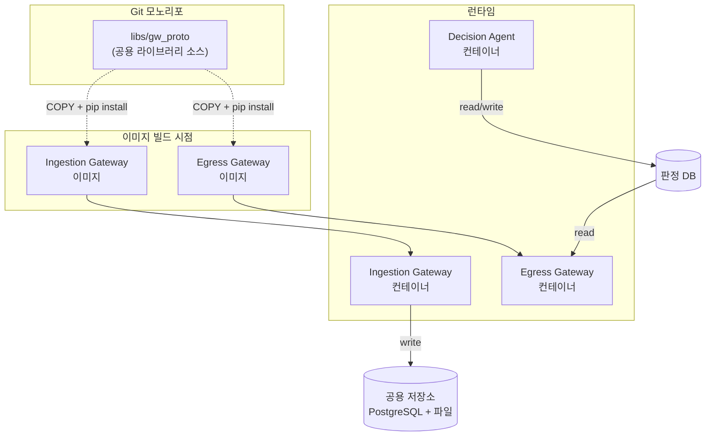
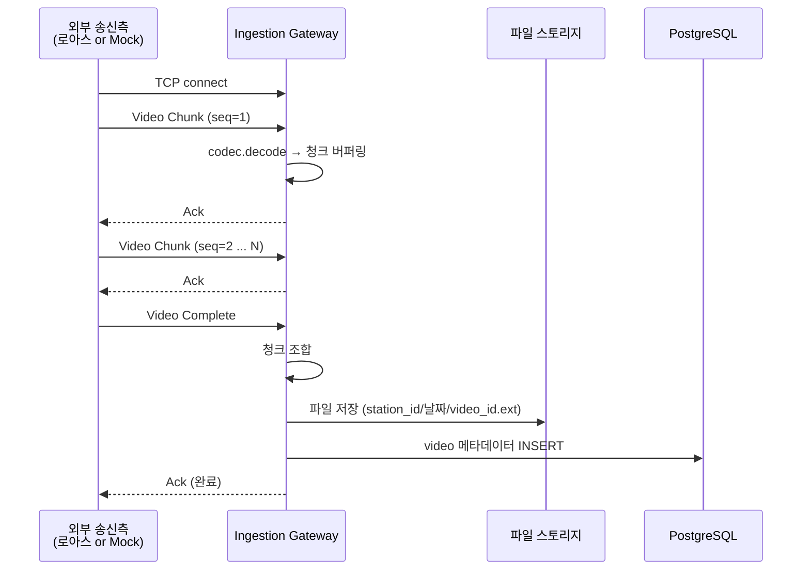
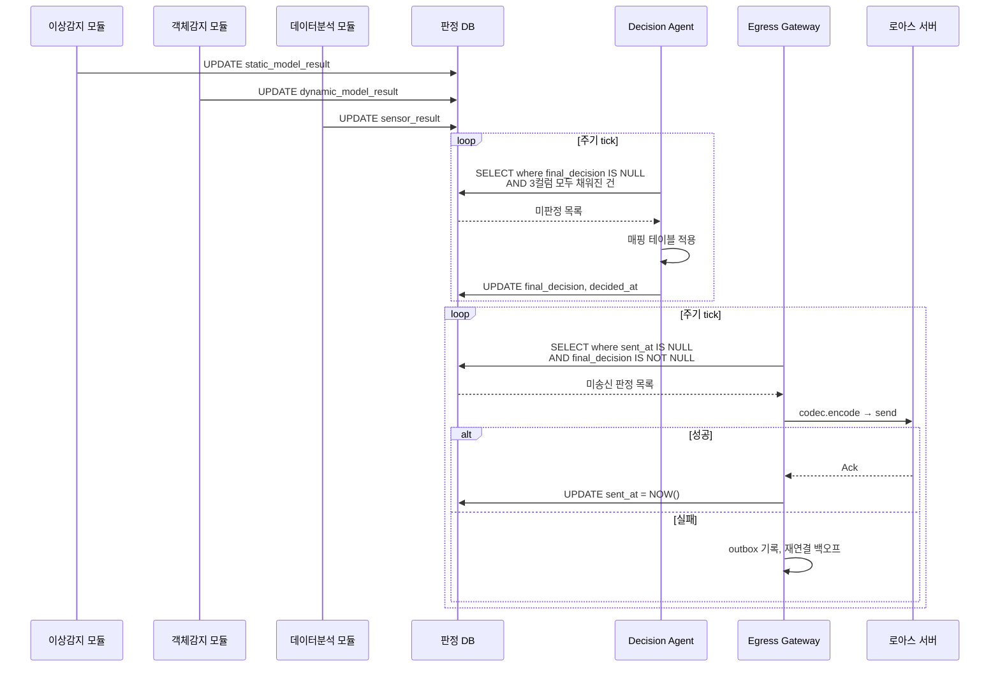
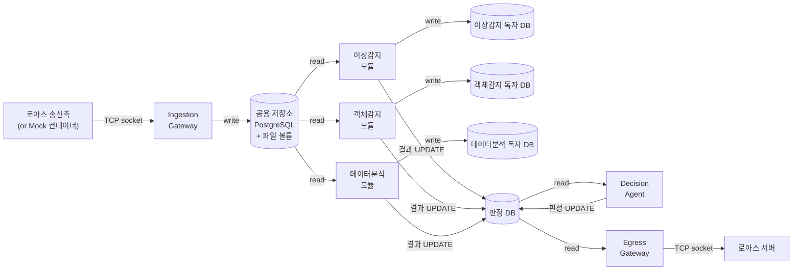

# TCP/IP Ingestion / Egress Gateway 기획안

> 작성일: 2026-04-16 (최종 수정: 2026-04-30)
> 선행 문서: `data_ingestion_architecture.md`
> 본 문서의 목적: 로아스 프로토콜 스펙 확정 이전에 Gateway 골격을 선제 구현하기 위한 기획안. 표준 소켓 프로토콜로 먼저 동작하는 Gateway를 만들고, 추후 로아스 스펙을 어댑터로 교체하는 전략을 전제한다.

---

## 1. 범위와 전제

### 1.1 포함 범위

- Ingestion Gateway 컨테이너 기획
- Egress Gateway 컨테이너 기획
- Decision Agent 컨테이너 기획
- 두 Gateway가 공유할 프로토콜 라이브러리 기획
- 로아스 스펙 미정 상황에 대응하는 임시 표준 프로토콜 정의
- 추후 작성될 Mock 송신 컨테이너와의 호환 전제
- Docker 기반 배포 구성
- 데이터 보존 정책

### 1.2 핵심 설계 원칙

- **프로토콜 교체 가능성**: 로아스 스펙이 언제든 바뀔 수 있음을 전제로, 프로토콜 처리 계층을 비즈니스 로직과 분리한다.
- **단방향 흐름**: Ingestion은 공용 저장소에 쓰기만, 컨슈머는 공용 저장소에서 읽기만, Egress는 판정 DB에서 읽기만 한다.
- **컨테이너 1개 = 관심사 1개**: Ingestion, Decision Agent, Egress는 별개 컨테이너.
- **공용 라이브러리 단일 소스**: 프로토콜 처리 코드는 한 곳에서만 정의한다.
- **독자 DB 원칙**: 각 컨슈머는 자기 업무의 입출력을 독자 DB에서 관리한다. 컨슈머 간 DB 접근은 허용하지 않는다.

---

## 2. 컨테이너 구성

### 2.1 전체 구조



- Ingestion Gateway, Decision Agent, Egress Gateway는 **독립 컨테이너**로 운영한다.
- 공용 라이브러리는 별도 컨테이너가 아니다. 각 Gateway 이미지 빌드 시점에 소스를 COPY하여 Python 패키지로 `pip install`한다. 런타임에는 각 컨테이너 안에 이미 설치된 상태로 존재한다.

### 2.2 공용 라이브러리 배포 방식

- 개발 단계: Git 모노리포 구조. `libs/gw_proto/` 경로에 라이브러리 소스를 두고, 각 Gateway의 Dockerfile이 빌드 컨텍스트에서 이 경로를 COPY한 뒤 `pip install`한다. 라이브러리 코드 변경 시 `docker compose build`로 일괄 반영된다.
- 고객사 배포: 빌드된 **Docker 이미지** 형태로 반입한다. 고객사 환경에서는 소스 접근이 없어도 이미지 내에 라이브러리가 이미 포함된 상태이다.

---

## 3. 공용 프로토콜 라이브러리 (`gw-proto`)

> `gw-proto`는 Gateway Protocol의 줄임이다. 벤더(로아스) 종속성을 배제하기 위한 중립 네이밍이며, 동일 라이브러리가 Ingestion / Egress / Mock 세 컨테이너에서 공용으로 사용된다.

### 3.1 책임

- 소켓 메시지의 인코딩/디코딩
- 프레이밍(메시지 경계 구분)
- 재연결 정책 및 keep-alive
- 프로토콜 버전 협상 (향후)

### 3.2 책임 경계

라이브러리는 **프로토콜만** 다룬다. 다음은 라이브러리 밖의 일이다.

- 비즈니스 로직 (메타데이터 부여, DB 접근)
- 저장소 I/O
- 인증/인가 (별도 모듈)

### 3.3 핵심 추상 — Codec 인터페이스

로아스 프로토콜 전환 시 교체할 지점은 이 한 곳이다.

```python
class Codec(Protocol):
    def encode(self, message: Message) -> bytes: ...
    def decode(self, stream: BufferedReader) -> Message: ...

class StandardCodec(Codec):      # 임시 표준 구현
    ...

class VendorCodec(Codec):        # 외부 벤더(로아스 등) 프로토콜 코덱 (스펙 확정 후 구현)
    ...
```

Gateway 코드는 `Codec` 인터페이스만 의존한다. 런타임에는 환경변수(`PROTOCOL=standard|vendor`)로 주입한다.

### 3.4 모듈 구조 (제안)

```
gw_proto/
├── __init__.py
├── codec/
│   ├── base.py           # Codec 인터페이스
│   ├── standard.py       # 임시 표준 코덱 구현
│   └── vendor.py         # 벤더(로아스 등) 프로토콜 코덱 placeholder
├── framing.py            # 길이 기반 프레이밍
├── messages.py           # Message 타입 정의 (Video, Sensor, Result)
├── transport/
│   ├── server.py         # TCP 서버 래퍼 (Ingestion용)
│   └── client.py         # TCP 클라이언트 래퍼 (Egress, Mock용)
└── errors.py
```

---

## 4. 임시 표준 소켓 프로토콜 사양

로아스 스펙 확정 전까지 사용한다. 표준적이고 구현이 단순한 형태로 정의한다.

### 4.1 프레이밍

Length-prefixed framing 방식을 채택한다.

```
+------------------+------------------+---------------------+
| 4 bytes          | 4 bytes          | N bytes             |
| payload length   | message type     | payload             |
| (uint32, BE)     | (uint32, BE)     |                     |
+------------------+------------------+---------------------+
```

- 총 헤더 8바이트
- payload length의 최대값: 512 MB (영상 청크 대응)
- byte order: big-endian (네트워크 표준)

### 4.2 메시지 타입

| type code | 방향 | 용도 |
|---|---|---|
| `0x0001` | Ingress | Video Frame Chunk (대용량 영상 스트림 청크) |
| `0x0002` | Ingress | Video Complete (영상 수신 완료 신호) |
| `0x0010` | Ingress | Sensor Sample (센서 단일 측정치) |
| `0x0100` | Egress | Analysis Result (분석 결과 송신) |
| `0x0101` | Egress | Alert (경보 송신) |
| `0x0F00` | 양방향 | Heartbeat (keep-alive) |
| `0x0F01` | 양방향 | Ack |
| `0x0FFF` | 양방향 | Error |

### 4.3 Payload 포맷

- 제어 메시지(Sensor, Result, Alert, Heartbeat 등): **JSON (UTF-8)**
- 대용량 바이너리(Video Chunk): **raw bytes** (앞쪽에 JSON 헤더 + `\n` 구분자 + binary body)

Video Chunk 예시:

```
{"video_id":"uuid","chunk_seq":3,"total_chunks":10,"station_id":"...","captured_at":"..."}
\n
<binary bytes...>
```

### 4.4 연결 정책

- **Ingestion**: TCP 서버, 단일 포트(예: 9000) listen. 연결당 1개 세션.
- **Egress**: TCP 클라이언트, 로아스 서버로 connect. 단일 영속 연결 + 자동 재연결.
- **Heartbeat**: 30초 간격 (양쪽 모두)
- **Timeout**: 읽기 60초, 쓰기 30초
- **재연결 백오프**: 1s → 2s → 4s → ... → max 60s (Egress만 해당)

---

## 5. Ingestion Gateway 상세

### 5.1 책임

- 외부(로아스 또는 Mock)로부터 TCP 소켓으로 영상/센서 데이터 수신
- 수신 데이터에 메타데이터 부여
- 공용 저장소(파일 볼륨 + PostgreSQL)에 적재

### 5.2 비책임 (명시적 제외)

- 영상 품질 검증, 전처리, 분석은 Consumer의 일이다. Gateway는 원본을 있는 그대로 저장한다.
- 데이터 수정/가공은 하지 않는다. 수신 즉시 WORM(Write Once, Read Many) 원칙.

### 5.3 공용 저장소 스펙

- **DBMS**: PostgreSQL (최신 stable, 본 기획 기준 16.x 이상 권장)
- **호스트 노출 포트**: `2345`
  - 관례 포트인 5432는 호스트에서 이미 점유 중
  - 대체 후보인 5433도 막혀 있음
  - 따라서 `2345`를 사용. 컨테이너 내부 포트는 5432 유지, docker-compose의 포트 매핑에서 `2345:5432`로 매핑
- **파일 저장 경로 규칙**:
  ```
  {STORAGE_ROOT}/videos/{station_id}/{YYYY-MM-DD}/{video_id}.{ext}
  ```
- **접속 URL 예시**: `postgresql://gw_user:<password>@postgres:5432/gateway_db`
  - 컨테이너 내부 네트워크에서는 기본 포트(5432) 사용
  - 호스트에서 디버깅 시에만 `localhost:2345`로 접근

### 5.4 DB 스키마 초기화 방식

오토인코더 프로젝트와 동일한 방식으로, **최초 1회 DDL 스크립트 실행**으로 처리한다. Alembic 등 마이그레이션 도구는 사용하지 않는다.

- `init_db.sql` 파일을 리포지토리에 포함한다.
- PostgreSQL 공식 Docker 이미지의 `/docker-entrypoint-initdb.d/` 기능을 활용한다. 이 디렉토리에 마운트된 `.sql` 파일은 **데이터 볼륨이 비어 있는 최초 기동 시 자동 실행**된다.
- docker-compose에서 아래와 같이 마운트한다.
  ```
  volumes:
    - ./init_db.sql:/docker-entrypoint-initdb.d/init_db.sql:ro
  ```
- 이후 기동에서는 자동 실행되지 않으므로, 스키마 변경이 필요하면 수동 DDL 또는 볼륨 초기화로 대응한다.

### 5.5 테이블 범위

초기 스키마에는 다음 테이블만 포함한다. 이후 Consumer별 독자 DB는 각 Consumer 쪽에서 관리한다.

- `station` — 개소
- `video` — 수신 영상 메타데이터
- `sensor_sample` — 센서 시계열 원본
- `ingestion_log` — Gateway 수신 로그 (디버깅/감사용)

각 테이블의 상세 컬럼은 `implementation_checklist_v2.md` 및 `program_dev_plan.md`의 데이터 모델 항목을 따른다.

### 5.6 내부 컴포넌트

```
Ingestion Gateway Container
├── transport        : gw_proto.transport.server (TCP listen)
├── codec            : gw_proto.codec.StandardCodec (런타임 주입)
├── handler/
│   ├── video_handler.py    # Video Chunk 수집 → 완성 시 파일 저장
│   ├── sensor_handler.py   # Sensor Sample → DB 적재
│   └── control_handler.py  # Heartbeat, Ack
└── repository/
    ├── video_repo.py       # video 테이블 INSERT
    └── sensor_repo.py      # sensor_sample 테이블 INSERT
```

> Station 테이블은 Gateway가 직접 CRUD하지 않는다. 별도 관리자 도구에서 관리하며, Gateway는 영상 수신 시 `station_id` 유효성 검사를 위해 SELECT만 수행한다. 이 용도의 read 경로는 `repository/` 밖으로 내지 말고 handler 내부에서 단순 조회로 처리한다.

### 5.7 영상 수신 흐름



### 5.8 Consumer 및 관리 도구의 공용 저장소 접근 정책

Gateway는 공용 저장소에 **쓰기만** 담당한다. 조회 경로는 Gateway를 거치지 않는다.

- **Consumer**: 공용 저장소(PostgreSQL)에 **직접 read-only 접속**한다. Station 목록이든 영상 메타데이터든 필요한 데이터를 Consumer가 직접 SELECT한다. Gateway에 HTTP API를 두지 않는다.
- **Station 등록/수정/삭제**: Gateway의 책임이 아니다. **별도 관리자 도구**(관리자 UI 컨테이너 등)가 공용 저장소에 직접 INSERT/UPDATE/DELETE한다.
- **DB 권한 분리**: 공용 저장소 PostgreSQL에 다음 역할(role)을 각각 생성하고 접속 계정을 분리한다.
  - `gw_writer` (Gateway 전용): `station` 테이블을 제외한 쓰기 테이블에 INSERT 권한, `station`에는 SELECT만
  - `admin_rw` (관리자 도구 전용): 모든 테이블 RW
  - `consumer_ro` (Consumer 전용): 모든 테이블 SELECT만
- **Gateway의 Station 참조 범위**: 영상 수신 시 `station_id`가 실제 존재하는지 검증하는 SELECT만 허용. 이 경로는 handler 내부 조회로 처리하고, 외부에 API로 노출하지 않는다.

이 구조로 단방향 흐름 원칙이 DB 권한 레벨에서 강제된다.

---

## 6. Decision Agent 상세

### 6.1 역할

각 컨슈머의 분석 결과를 수집하고, 알람 매핑 테이블을 적용하여 최종 판정(정상/주의/경고)을 내린다. 판정 이력을 판정 DB에 기록한다.

### 6.2 책임

- 판정 DB에서 각 컨슈머가 업데이트한 분석 결과(정상/이상)를 조회
- 알람 매핑 테이블(정적 분진 모델, 동적 분진 모델, IoT 센서의 3채널 조합)을 적용하여 최종 판정 산출
- 최종 판정 결과를 판정 DB에 기록
- 판정 이력의 영구 보존

### 6.3 비책임

- 분석 수행은 Consumer의 일이다.
- 외부 전송은 Egress Gateway의 일이다.
- 공용 저장소 접근은 Ingestion의 영역이다.

### 6.4 판정 DB 구조

판정 DB는 독립 PostgreSQL 인스턴스로 운영한다. 각 컨슈머는 자기 독자 DB와 별개로 이 판정 DB의 특정 컬럼에만 UPDATE 권한을 가진다.

판정 입력 테이블(예시):

| 컬럼 | 타입 | 작성 주체 |
|---|---|---|
| `id` | UUID, PK | 자동 생성 |
| `station_id` | FK | 최초 INSERT 시 |
| `timestamp` | TIMESTAMPTZ | 최초 INSERT 시 |
| `static_model_result` | ENUM(정상/이상/미수신) | 이상감지 모듈 |
| `dynamic_model_result` | ENUM(정상/이상/미수신) | 객체감지 모듈 |
| `sensor_result` | ENUM(정상/이상/미수신) | 데이터분석 모듈 |
| `final_decision` | ENUM(정상/주의/경고/미판정) | Decision Agent |
| `decided_at` | TIMESTAMPTZ | Decision Agent |
| `sent_at` | TIMESTAMPTZ | Egress Gateway |

각 컨슈머는 분석 완료 시 자기 컬럼만 업데이트한다. Decision Agent는 세 컬럼이 모두 채워진 건에 대해 매핑 테이블을 적용하여 `final_decision`과 `decided_at`을 기록한다. Egress Gateway는 `final_decision`이 채워지고 `sent_at`이 NULL인 건을 polling하여 송신 후 `sent_at`을 기록한다.

### 6.5 내부 컴포넌트

```
Decision Agent Container
├── poller.py              # 판정 DB에서 세 컬럼이 채워진 미판정 건 조회
├── mapping_table.py       # 알람 매핑 테이블 로직 (3채널 조합 → 최종 판정)
├── writer.py              # 최종 판정 결과 UPDATE
└── scheduler.py           # polling 주기 관리
```

### 6.6 판정 흐름



---

## 7. Egress Gateway 상세

### 7.1 책임

- 판정 DB에서 최종 판정이 완료되고 미송신인 건을 polling
- 판정 결과를 프로토콜 메시지로 포장
- TCP 클라이언트로 로아스 서버에 송신
- 송신 실패 시 재시도 및 outbox 관리

### 7.2 비책임

- 분석 수행은 Consumer의 일이다.
- 판정 수행은 Decision Agent의 일이다.
- 공용 저장소 접근은 Ingestion의 영역이다.
- 컨슈머 독자 DB 접근은 하지 않는다.

### 7.3 내부 컴포넌트

```
Egress Gateway Container
├── transport        : gw_proto.transport.client (TCP connect to LOAS)
├── codec            : gw_proto.codec.StandardCodec
├── poller.py        # 판정 DB에서 미송신 건 조회
├── outbox.py        # 송신 실패 건 영속화 (재전송용)
└── sender.py        # codec.encode → LOAS 전송, Ack 처리, sent_at 기록
```

Egress Gateway는 컨슈머 독자 DB의 존재를 모른다. 판정 DB 하나만 바라보며, 컨슈머가 추가되거나 교체되어도 Egress Gateway는 변경 없이 그대로 동작한다.

### 7.4 소스 수집 방식

**Polling 방식**으로 운영한다. 판정 DB의 판정 테이블에서 `final_decision IS NOT NULL AND sent_at IS NULL`인 건을 주기적으로 조회한다.

### 7.5 Outbox 패턴

송신 실패를 대비해 송신 대상 메시지를 로컬(Redis 또는 SQLite)에 기록하고, Ack 수신 후 제거한다. 네트워크 복구 시 outbox를 먼저 drain한다.

---

## 8. DB 구성

### 8.1 물리적 분리 원칙

각 DB는 **독립 PostgreSQL 인스턴스(컨테이너)**로 운영한다. 각 모듈이 별도로 개발되고 스키마 변경이 빈번한 상황에서, 마이그레이션 시 다른 모듈에 영향을 주지 않기 위함이다.

### 8.2 DB 목록

| DB | 전용 컨테이너 | 쓰기 주체 | 읽기 주체 |
|---|---|---|---|
| 공용 저장소 DB | `postgres-ingestion` | Ingestion Gateway, 관리자 도구 | 이상감지, 객체감지, 데이터분석 (read-only) |
| 이상감지 모듈 독자 DB | `postgres-anomaly` | 이상감지 모듈 | 이상감지 모듈 |
| 객체감지 모듈 독자 DB | `postgres-objdet` | 객체감지 모듈 | 객체감지 모듈 |
| 데이터분석 모듈 독자 DB | `postgres-sensor` | 데이터분석 모듈 | 데이터분석 모듈 |
| 판정 DB | `postgres-decision` | 3개 컨슈머(자기 컬럼만), Decision Agent | Decision Agent, Egress Gateway |

### 8.3 리소스 영향

PostgreSQL 컨테이너 1개의 유휴 메모리 약 30~50MB. 5개 합산 약 250MB. 현장 서버(32GB RAM) 기준으로 문제 없는 수준이다.

---

## 9. 데이터 보존 정책

### 9.1 일일 데이터 적재량

전제: 관측 개소 37개, 개소당 체류 45초, 이동 45초, 이미지 1fps(IR + 고해상도 가시광선 동시), 센서 초당 30건, 가동률 80%

| 데이터 유형 | 일일 적재량 |
|---|---|
| 이미지 (IR 100KB + 가시광선 1MB, 33,300장/일) | 약 36.6 GB |
| 센서 원본 (약 100만 건/일) | 약 300 MB |
| 컨슈머 추론 결과 + 판정 이력 | 약 100~200 MB |
| **합계** | **약 37.1 GB/일** |

### 9.2 스토리지 용량 (2TB, RAID 1 시 실효 1TB → 비RAID 시 2TB)

시스템 영역(OS, Docker 이미지, swap, PostgreSQL 임시 영역) 약 100GB를 제외한 데이터 가용 공간: **약 1,900GB**

### 9.3 데이터 종류별 보존 정책

| 데이터 종류 | 보존 기간 | 사유 |
|---|---|---|
| 판정 이력 (Decision Agent) | 영구 보존 | 용량 극소. 고객 문의 대응 및 감사 추적 필수 |
| 컨슈머 추론 결과 | 영구 보존 | 용량 소. 판정 근거 추적용 |
| 센서 원본 | 6개월 원본 보존, 이후 시간대별 통계 집계 후 원본 삭제 | 일일 300MB 수준으로 6개월 약 54GB |
| 이상 판정 이미지 | 6개월 보존 | 전체의 극소수, 용량 부담 미미 |
| 정상 판정 이미지 | **14일 보존 후 삭제** | 일일 약 36.6GB의 대부분 차지 |

### 9.4 예상 상시 점유량 (이상 발생 비율 5% 가정)

| 항목 | 용량 |
|---|---|
| 정상 이미지 (14일) | 약 487 GB |
| 이상 이미지 (6개월) | 약 329 GB |
| 센서 원본 (6개월) | 약 54 GB |
| 판정/추론 이력 (영구) | 약 20 GB |
| **합계** | **약 890 GB** |

가용 1,900GB 대비 약 1,000GB 여유. 이상 비율이 실제로 1% 미만이라면 여유는 더 증가한다.

### 9.5 보존 정책 자동화

Ingestion Gateway 또는 별도 cron 컨테이너에서 보존 기간이 지난 정상 이미지를 삭제하는 배치 작업을 스케줄링한다. 삭제 대상 판단은 판정 DB의 `final_decision` 값과 공용 저장소의 `captured_at` 기준으로 수행한다.

---

## 10. Mock 송신 컨테이너 예비 설계

> 본 기획안에서는 Mock 컨테이너의 상세 구현은 다루지 않는다. 다만 현 Gateway 설계가 Mock과 호환되도록 하기 위한 전제 조건을 명시한다.

### 10.1 재사용 대상

Mock 컨테이너는 `gw-proto` 라이브러리의 **client 측**(`transport/client.py`, `codec`)을 그대로 재사용한다. 즉 Gateway와 Mock은 프로토콜 코드를 공유한다. 이는 "프로토콜 구현체가 한 곳에 있어야 한다"는 원칙의 실제 검증 수단이 된다.

### 10.2 Mock이 갖춰야 할 조건

- 시나리오 파일(YAML) 기반으로 "몇 초 간격으로 어떤 메시지를 쏠지" 정의 가능
- 샘플 영상 파일을 청크로 쪼개 Video Chunk + Video Complete 시퀀스로 송출
- 센서 연속 스트림을 일정 간격으로 발생
- `PROTOCOL=standard` 환경변수로 Gateway와 동일한 코덱 사용

### 10.3 네트워크 구성

Mock 컨테이너는 Ingestion Gateway와 동일한 Docker network에 두고, `INGESTION_HOST=ingestion-gw`, `INGESTION_PORT=9000`을 환경변수로 주입받는다.

---

## 11. 전체 데이터 흐름



---

## 12. 배포 구성

- 개발 환경: Git 모노리포에서 `docker compose up`으로 Ingestion Gateway, Decision Agent, Egress Gateway, PostgreSQL 인스턴스 5개를 동시 기동한다. 구체 compose 파일 구조는 개발자 재량에 맡긴다.
- 고객사 배포: 빌드된 Docker 이미지를 반입하여 고객사 환경에서 기동한다.
- 공용 저장소 PostgreSQL은 호스트 포트 `2345`로 노출한다(컨테이너 내부는 5432).
- 최초 기동 시 `init_db.sql`이 PostgreSQL 공식 이미지의 자동 초기화 메커니즘으로 실행된다.

---

## 13. 프로토콜 교체 전환 계획

로아스 스펙이 확정되었을 때의 작업 범위를 미리 정해둔다.

### 13.1 교체가 필요한 파일

- `gw_proto/codec/vendor.py` — 로아스 코덱 구현체 신규 작성
- `gw_proto/messages.py` — 필요 시 로아스 메시지 타입 추가
- Gateway 환경변수 `PROTOCOL=standard` → `PROTOCOL=vendor`

### 13.2 교체가 필요 없는 부분

- Gateway의 handler, repository, poller, sender 등 **비즈니스 로직 전체**
- Decision Agent 전체
- DB 스키마
- Docker compose 구성
- Consumer 컨테이너들

이것이 Anti-Corruption Layer와 Hexagonal Architecture 패턴을 채택한 실익이다.

### 13.3 검증 방법

- 표준 코덱으로 기존 테스트 스위트 통과 확인
- 로아스 코덱으로 같은 테스트 스위트 재실행
- Mock 컨테이너에 `PROTOCOL=vendor` 주입하여 end-to-end 검증

---

## 14. 구현 우선순위 체크리스트

### Phase G-1. 공용 라이브러리 뼈대

- [ ] `gw_proto` 패키지 구조 생성
- [ ] `Codec` 인터페이스 정의
- [ ] `StandardCodec` 구현 (length-prefixed framing + JSON/binary payload)
- [ ] `Message` 타입 정의
- [ ] `server.py`, `client.py` TCP 래퍼 구현
- [ ] 단위 테스트 (encode/decode 왕복)

### Phase G-2. Ingestion Gateway

- [ ] Dockerfile 작성 (gw_proto 설치)
- [ ] `init_db.sql` DDL 작성 (station, video, sensor_sample, ingestion_log)
- [ ] PostgreSQL 컨테이너 기동 + 2345 포트 노출 + 최초 1회 스키마 자동 적용 확인
- [ ] TCP 서버 기동 + Heartbeat 응답
- [ ] Video Chunk 버퍼링 + Video Complete 처리
- [ ] 영상 파일 저장 + 메타데이터 INSERT
- [ ] Sensor Sample 수신 + INSERT
- [ ] 로컬 루프백으로 검증 (Python 스크립트로 송신 테스트)

### Phase G-3. Decision Agent

- [ ] Dockerfile 작성
- [ ] 판정 DB PostgreSQL 컨테이너 기동 + 스키마 초기화
- [ ] 판정 입력 테이블 DDL 작성
- [ ] 알람 매핑 테이블 로직 구현
- [ ] 미판정 건 polling + 최종 판정 UPDATE 구현
- [ ] 단위 테스트 (매핑 테이블 8가지 조합 검증)

### Phase G-4. Egress Gateway

- [ ] Dockerfile 작성
- [ ] TCP 클라이언트 connect + Heartbeat
- [ ] 판정 DB polling 구현 (미송신 건 조회)
- [ ] Outbox 영속화
- [ ] 재연결 백오프 및 Ack 확인
- [ ] 수신 측 에코 서버로 검증

### Phase G-5. 통합 검증

- [ ] Ingestion + Decision Agent + Egress 동시 기동
- [ ] Consumer 연계 (공용 저장소 read, 독자 DB write, 판정 DB 결과 UPDATE)
- [ ] 판정 흐름 end-to-end 검증 (컨슈머 결과 → 판정 → 송신)
- [ ] 프로토콜 스왑 테스트 (`PROTOCOL` 환경변수 변경 시 동작 확인)

### Phase G-6. Mock 송신 컨테이너 (별도 기획)

- 본 기획안 이후에 별도 문서로 분리 작성