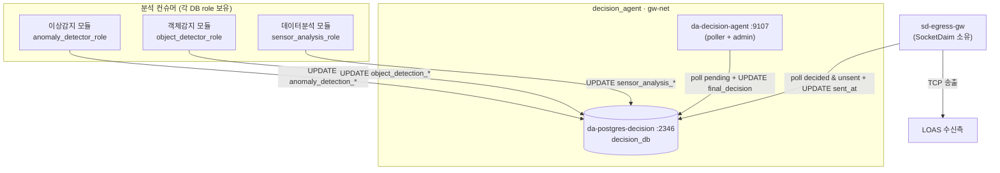
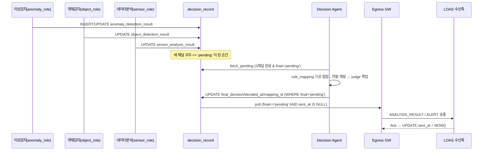

# Decision Agent 프로그램 구조 분석

> 분석 대상: `decision_agent/` 저장소 (ggapsang/decision_agent)
> 작성일: 2026-06-05
> 목적: Decision Agent 의 판정 파이프라인, 판정 DB 스키마, 역할/알람 매핑, 폴링 판정 로직, 어드민 UI 를 코드 기준으로 상세 분석한 참고 문서
> 관련 문서: [SocketDaim_구조.md](SocketDaim_구조.md), [PoolerTran_설계.md](PoolerTran_설계.md)

---

## 1. 개요

Decision Agent 는 세 분석 채널 — **정적 분진 탐지 모델(static)·동적 분진 탐지 모델(dynamic)·IoT 센서(iot)** — 의 결과가 모두 도착한 관측 건에 대해, **알람 매핑 진리표(truth table)** 를 적용하여 최종 판정(`normal`/`caution`/`warning`)을 산출하는 **순수 판정 엔진**이다. EcoproBM 파이프라인에서 SocketDaim(수집)과 Egress(송출) 사이의 **판정 단계**를 담당한다.

### 1.1 핵심 설계 원칙 ([refs/decision_agent_plan.md](decision_agent/refs/decision_agent_plan.md))

| 원칙 | 내용 |
|------|------|
| **판정 로직의 데이터화** | 판정 규칙(12행 진리표)을 코드가 아닌 `alarm_mapping` 테이블에 둠 → 코드 변경 없이 DB UPDATE 로 규칙 조정 |
| **역할↔컴포넌트 분리** | 어느 분석 컴포넌트가 어느 탐지 역할을 맡을지(`role_mapping`)를 런타임 테이블로 관리 → 배정 변경 시 코드 무수정 |
| **컬럼 단위 권한 분리** | 컨슈머 3종은 각자 자기 채널 컬럼만 UPDATE, DA 는 판정 컬럼만, Egress 는 `sent_at` 만 — DB role 로 강제 |
| **API 없는 인터페이스** | DA 는 REST/RPC 를 제공하지 않음. 모든 협업은 **`decision_record` 테이블 한 곳**에서 컬럼 UPDATE 로 발생(공유 DB 패턴) |
| **race-safe 판정** | `mark_decided` 는 `WHERE final_decision='pending'` 가드 → 다중 인스턴스/중복 폴링에도 한 번만 판정 |
| **순수 룩업** | `Judge.judge()` 는 부수효과 없는 dict 룩업(12행 캐시) — DB 왕복 없이 in-memory 결정 |

### 1.2 SocketDaim 과의 경계 (2026-05-04 이관 완료)

판정 DB(`decision_db`)의 스키마·시드·컨테이너·볼륨은 원래 SocketDaim 소유였으나 **2026-05-04 에 Decision Agent 레포로 완전 이관**되었다 ([letters/..._postgres_decision_handover.md](decision_agent/refs/letters/2026-05-04_socketdaim_postgres_decision_handover.md)).

| 항목 | Owner |
|---|---|
| `postgres-decision` 컨테이너 + `decision-pgdata` 볼륨, `init_db.sql`/`seed_*.sql` | **Decision Agent** |
| `decision-agent` 서비스(admin 포함, 9107) | **Decision Agent** |
| `gw-net` 네트워크, 공용 storage, ingestion/egress 게이트웨이 | **SocketDaim** (그대로 유지) |

→ DA 는 `gw-net` 을 `external: true` 로 join 하고, Egress 는 `gw-net` 위에서 `postgres-decision` 호스트명으로 판정 DB 에 접속한다.

---

## 2. 전체 아키텍처



**판정 흐름**: 3개 컨슈머가 각자 컬럼을 채움 → 세 채널이 모두 `pending` 이 아니게 된 순간 DA 폴러가 포착 → 진리표 룩업 → `final_decision`/`decided_at`/`mapping_id` 기록 → Egress 가 `final_decision <> 'pending' AND sent_at IS NULL` 건을 송출.

### 2.1 컨테이너 일람 ([docker-compose.yml](decision_agent/docker-compose.yml))

| 컨테이너 | 역할 | 포트 | DB 롤 |
|---|---|---|---|
| `da-postgres-decision` | 판정 DB (decision_db) | 2346→5432 | (postgres superuser) |
| `da-decision-agent` | 폴링 판정 + 어드민 HTTP | 9107 | `decision_agent_role` |

- `postgres-decision` 은 `init_db.sql`(01) → `seed_mapping.sql`(02) → `seed_test_decisions.sql`(03) 순으로 **최초 1회 자동 초기화** ([docker-compose.yml:26-29](decision_agent/docker-compose.yml#L26-L29))
- `gw-net` 은 `external: true`, `name: socketdaim_gw-net` — **SocketDaim 이 먼저 떠야** join 가능 ([docker-compose.yml:68-71](decision_agent/docker-compose.yml#L68-L71))
- 부팅 순서: SocketDaim(gw-net 생성) → decision_agent → (Dumopro/PoolerTran 등)

---

## 3. 디렉토리 구조

```
decision_agent/
├── docker-compose.yml          # postgres-decision + decision-agent (gw-net external)
├── Dockerfile                  # python:3.11-slim, PYTHONPATH=/app/src
├── init_db.sql                 # ★ 판정 DB DDL: enum/role/table/index/grant
├── seed_mapping.sql            # role_mapping 3행 + alarm_mapping 12행 (idempotent)
├── seed_test_decisions.sql     # Egress dev 전용 더미 decision_record 4건
├── requirements.txt            # asyncpg, pydantic, structlog, fastapi, uvicorn, ...
│
├── src/decision_agent/
│   ├── main.py                 # ★ 엔트리: pool→judge.load→resolver.start→poller+admin gather
│   ├── config.py               # DA_* 환경변수 (pydantic-settings)
│   ├── db.py                   # asyncpg pool 팩토리
│   ├── poller.py               # ★ 폴링 루프: fetch_pending → role 매핑 → judge → mark_decided
│   ├── judge.py                # ★ alarm_mapping 12행 캐시 + 순수 룩업
│   ├── role_resolver.py        # role_mapping 캐시 + 주기 refresh (component↔role)
│   ├── logging_config.py       # structlog (json/console)
│   ├── repository/
│   │   └── decision_repo.py    # decision_record SELECT/UPDATE (fetch_pending/mark_decided/browse/force)
│   └── admin/                  # ★ FastAPI 어드민 (Win9x 톤, 5영역 grid)
│       ├── app.py              #   REST 엔드포인트 + uvicorn 통합 실행
│       ├── templates/index.html
│       └── static/css/admin.css, js/admin.js
│
├── tests/                      # judge(12조합 전수) / role_resolver / poller 통합 / admin API·디자인
└── refs/                       # 설계 문서 + 이관 letters
    ├── decision_agent_plan.md, admin_page_plan.md, design_guideline.md
    └── letters/2026-05-04_*.md
```

---

## 4. 판정 DB 스키마 (decision_db)

스키마는 [init_db.sql](decision_agent/init_db.sql) 에 정의되며 PostgreSQL 공식 이미지의 `/docker-entrypoint-initdb.d/` 메커니즘으로 **최초 1회 자동 실행**(Alembic 미사용).

### 4.1 ENUM 타입 ([init_db.sql:32-49](decision_agent/init_db.sql#L32-L49))

| 타입 | 값 | 용도 |
|---|---|---|
| `sensor_level` | normal / caution / warning | IoT 센서 3단계 |
| `model_result` | normal / abnormal | 비전 모델(static·dynamic) 2단계 |
| `final_level` | normal / caution / warning | `alarm_mapping.final_decision` |
| `channel_result` | normal / abnormal / **caution / warning** / pending | `decision_record` 의 3개 채널 컬럼(통합 superset) |
| `decision_result` | normal / caution / warning / pending | `decision_record.final_decision` |

> **설계 deviation**: plan §4.1 은 채널 컬럼에 `component_result(normal/abnormal/pending)` 를 쓰려 했으나, IoT 채널은 `caution/warning` 을 표현해야 한다. 그래서 **두 출력을 모두 담을 수 있는 superset `channel_result`** 를 도입하고, 어떤 값이 유효한지는 **`judge` 가 룩업 시점에 role 별로 검증**한다 ([init_db.sql:25-31](decision_agent/init_db.sql#L25-L31)).

### 4.2 테이블

| 테이블 | PK | 핵심 컬럼 | 용도 |
|---|---|---|---|
| `role_mapping` | id (SERIAL) | **detection_role**(UNIQUE), component_name, updated_at | 탐지역할 → 컴포넌트 배정 |
| `alarm_mapping` | id (SERIAL) | iot_sensor_level, static_model_result, dynamic_model_result (3-tuple UNIQUE), final_decision, description | 12행 판정 진리표 |
| `decision_record` | id (UUID) | station_id, observation_timestamp, 3채널(result+at), final_decision, decided_at, mapping_id(FK), sent_at | 관측 1건당 1행 |

**decision_record 컬럼의 작성 주체** ([init_db.sql:103-122](decision_agent/init_db.sql#L103-L122)):

| 컬럼군 | 작성 주체 | 기본값 |
|---|---|---|
| `anomaly_detection_result` / `_at` | 이상감지 모듈 | `pending` |
| `object_detection_result` / `_at` | 객체감지 모듈 | `pending` |
| `sensor_analysis_result` / `_at` | 데이터분석 모듈 | `pending` |
| `final_decision` / `decided_at` / `mapping_id`(→alarm_mapping FK) | **Decision Agent** | `pending` |
| `sent_at` | Egress Gateway | NULL |

> 채널 컬럼명은 **컴포넌트 기준**(`anomaly`/`object`/`sensor`)이고, 역할(`static`/`dynamic`/`iot`)이 아니다. 역할↔컴포넌트 변환은 `role_mapping` 으로 런타임 수행(§6).

### 4.3 인덱스 (부분 인덱스 중심)

| 인덱스 | 정의 | 목적 |
|---|---|---|
| `idx_decision_pending` | `(final_decision) WHERE final_decision='pending'` | DA 폴링 — 미판정 건 빠른 스캔 |
| `idx_decision_unsent` | `(decided_at) WHERE sent_at IS NULL AND final_decision<>'pending'` | Egress 폴링 — 송출 대기 건 |
| `idx_decision_station_time` | `(station_id, observation_timestamp)` | 관측소·시간 조회 |

### 4.4 DB 역할(role) 권한 ([init_db.sql:141-204](decision_agent/init_db.sql#L141-L204))

| 롤 | 사용 주체 | 권한 |
|---|---|---|
| `anomaly_detector_role` | 이상감지 모듈 | SELECT 전체 + INSERT + **UPDATE (anomaly_detection_result, anomaly_detection_at)** 만 |
| `object_detector_role` | 객체감지 모듈 | SELECT 전체 + INSERT + **UPDATE (object_detection_*)** 만 |
| `sensor_analysis_role` | 데이터분석 모듈 | SELECT 전체 + INSERT + **UPDATE (sensor_analysis_*)** 만 |
| `decision_agent_role` | Decision Agent | SELECT 전체 + **UPDATE (final_decision, decided_at, mapping_id)** + role_mapping/alarm_mapping SELECT+UPDATE(어드민 편집용) |
| `egress_role` | Egress Gateway | SELECT 전체 + **UPDATE (sent_at)** 만 |

이 **컬럼 수준 GRANT** 가 "각 주체는 자기 책임 컬럼만 쓴다"는 원칙을 DB 레벨에서 강제한다. INSERT 는 컨슈머 3종만 가능(먼저 도착한 컨슈머가 `INSERT ... ON CONFLICT DO NOTHING` 으로 행 생성, 이후 컨슈머는 UPDATE).

> 패스워드는 모두 `dev_*` (개발용). 운영 시 Docker secret 으로 주입 — plan §8.3 에서 단일 dev 패스워드 유지가 의도적 결정임을 명시.

---

## 5. 알람 매핑 진리표 (alarm_mapping)

IoT 센서 3단계 × static 2단계 × dynamic 2단계 = **12가지 조합**. 각 조합의 `final_decision` 은 [seed_mapping.sql:22-42](decision_agent/seed_mapping.sql#L22-L42) 에 정의된다.

| iot | static | dynamic | **final** | 해석 요약 |
|---|---|---|---|---|
| normal | normal | normal | **normal** | 전부 정상 |
| normal | normal | abnormal | caution | 동적 분진만 이상 — 오탐 vs 탐지실패 |
| normal | abnormal | normal | caution | 정적 분진만 이상 — 누출 잔여물 가능성 |
| normal | abnormal | abnormal | caution | 비전 모두 이상, 센서 정상 — 범위 밖 누출 vs 비전 오탐 |
| caution | normal | normal | caution | 센서만 이상 — 센서 오탐 vs 비전 탐지실패 |
| caution | normal | abnormal | **warning** | 센서+동적 이상 — 실시간 미량 누출 가능성↑ |
| caution | abnormal | normal | caution | 센서+정적 이상 — 누출 후 흔적 잔존 |
| caution | abnormal | abnormal | **warning** | 센서+비전 전부 이상 — 미량 장시간 누출 |
| warning | normal | normal | **warning** | 센서 강한 이상 — 직접 유입 vs 대량 누출 미탐지 |
| warning | normal | abnormal | **warning** | 센서+동적 이상 — 실시간 대량 누출↑ |
| warning | abnormal | normal | **warning** | 센서+정적 이상 — 대량 누출 진행 후 종료 |
| warning | abnormal | abnormal | **warning** | 전부 이상 — 실시간 대량 누출 진행중 |

**판정 경향**: IoT 센서가 `warning` 이면 비전 결과와 무관하게 항상 `warning`(센서 우선 보수적 판정). `caution` 센서는 동적 분진까지 겹칠 때만 `warning` 으로 격상. `normal` 센서는 최대 `caution` 까지만.

---

## 6. Role Resolver — 역할↔컴포넌트 매핑 캐시 ([role_resolver.py](decision_agent/src/decision_agent/role_resolver.py))

`role_mapping` 테이블(역할→컴포넌트)을 캐시하고, 폴러가 쓰는 **역방향(역할→컬럼)** 을 제공한다.

```
role_mapping (DB)              _COMPONENT_TO_COLUMN (코드 상수)
detection_role → component  →  component → decision_record 컬럼
─────────────────────────      ──────────────────────────────────
static_dust  → anomaly_detection → anomaly_detection_result
dynamic_dust → object_detection  → object_detection_result
iot_sensor   → sensor_analysis   → sensor_analysis_result
```

- `column_for_role(role)`: `role → component → column` 2단 룩업. 둘 중 하나라도 없으면 `KeyError`.
- `role_columns()`: 3개 표준 역할 전부에 대한 `{role: column}` 스냅샷(폴러가 tick 당 1회 호출).
- **주기 refresh**: `start()` 가 즉시 1회 로드 후 `_refresh_loop` 백그라운드 태스크 기동 → `DA_ROLE_REFRESH_SEC`(기본 300초)마다 갱신. 어드민 PATCH 시에는 `update_component()` 가 **즉시 refresh**.
- refresh 시 `static_dust`/`dynamic_dust`/`iot_sensor` 중 누락이 있으면 `role_mapping_incomplete` 경고.

> 이 간접층 덕분에 "이상감지 모듈을 동적 역할로 재배정" 같은 변경이 코드 수정 없이 `role_mapping.component_name` UPDATE 한 줄로 끝난다 (plan §2).

---

## 7. Judge — 진리표 캐시 + 순수 룩업 ([judge.py](decision_agent/src/decision_agent/judge.py))

```python
self._table: dict[tuple[str,str,str], tuple[str,int]]
#   (iot_level, static_result, dynamic_result) → (final_decision, mapping_id)
```

- `load()`: 기동 시 `alarm_mapping` 12행을 in-memory dict 로 적재. 행 수가 12 가 아니면 `alarm_mapping_unexpected_size` 경고(룩업 자체는 동작).
- `judge(iot, static, dynamic)`: **부수효과 없는 dict 룩업**. 키 미존재 시 `JudgeLookupError`(KeyError 하위) 발생 → 폴러가 `alarm_mapping_miss` 로깅 후 해당 건 스킵(다음 폴링 재시도).
- `update_final(mapping_id, final)`: 어드민 편집. `VALID_FINAL_LEVELS(normal/caution/warning)` 검증 후 UPDATE, 성공 시 캐시 `load()` 재실행.

판정이 DB 왕복 없는 in-memory 룩업이므로 폴링 배치 100건도 빠르게 처리된다.

---

## 8. Poller — 판정 루프 ([poller.py](decision_agent/src/decision_agent/poller.py))

### 8.1 부팅 시퀀스 ([main.py](decision_agent/src/decision_agent/main.py))

```
run()
├─ DASettings 로드 + configure_logging
├─ create_pool() (asyncpg, decision_agent_role)
├─ DecisionRepository(pool)
├─ Judge(pool).load()                 # 12행 캐시
├─ RoleResolver(pool).start()         # role_mapping 캐시 + refresh 태스크
├─ Poller(repo, judge, resolver)
├─ build_app(...)                     # FastAPI 어드민
├─ SIGTERM/SIGINT → stop_event.set()
└─ asyncio.gather(poller.run, run_admin_server)   # 폴러 + 어드민 동시 실행
   └─ finally: resolver.stop() → pool.close()
```

### 8.2 tick 처리 흐름

```
_tick()
├─ records = repo.fetch_pending(batch_size)        # 8.3 쿼리
├─ role_columns = resolver.role_columns()          # tick 당 1회 스냅샷
└─ for rec in records: _decide(rec, role_columns)

_decide(rec)
├─ role_columns 로 iot/static/dynamic 역할 → 컬럼명 결정
├─ getattr(rec, column) 으로 각 채널 실제 값 추출
├─ judge.judge(iot, static, dynamic) → (final, mapping_id)
│    └─ JudgeLookupError → alarm_mapping_miss 로깅 후 스킵
└─ repo.mark_decided(rec.id, final, mapping_id)
     ├─ updated=True  → decision_decided 로깅
     └─ updated=False → 이미 다른 인스턴스가 판정 → debug 스킵
```

- 루프는 `while not stop_event.is_set()` + `asyncio.wait_for(stop_event.wait(), timeout=interval)` 패턴 → 폴링 주기 대기 중에도 종료 신호 즉시 반응.
- tick 예외는 `poller_tick_error` 로깅 후 **루프 계속**(일시적 DB 장애가 폴러를 영구 정지시키지 않음).

### 8.3 미판정 건 조회 ([decision_repo.py:34-65](decision_agent/src/decision_agent/repository/decision_repo.py#L34-L65))

```sql
SELECT id, station_id, observation_timestamp,
       anomaly_detection_result::text, object_detection_result::text,
       sensor_analysis_result::text
  FROM decision_record
 WHERE final_decision = 'pending'
   AND anomaly_detection_result <> 'pending'
   AND object_detection_result  <> 'pending'
   AND sensor_analysis_result   <> 'pending'
 ORDER BY observation_timestamp ASC      -- 오래된 관측부터
 LIMIT $1
```

**부분 도착 처리**: 세 채널이 **모두** `pending` 이 아니어야 조회 대상. 일부만 도착한 건은 자동으로 다음 폴링까지 대기(별도 처리 없음). 장시간 한 채널이 안 오는 "stuck" 건은 **어드민의 수동 force-decide** 로 해소(자동 타임아웃 정책은 v2 보류, plan §5.2/§8.2).

### 8.4 race-safe 판정 ([decision_repo.py:170-199](decision_agent/src/decision_agent/repository/decision_repo.py#L170-L199))

```sql
UPDATE decision_record
   SET final_decision = $2::decision_result, decided_at = NOW(), mapping_id = $3
 WHERE id = $1 AND final_decision = 'pending'    -- ★ 가드
```

`WHERE final_decision='pending'` 가드로 두 폴러(또는 어드민 force)가 같은 행을 동시에 건드려도 **먼저 커밋한 쪽만** `UPDATE 1`, 나머지는 `UPDATE 0` → 폴러가 `decision_already_decided` 로 안전 스킵. 다중 인스턴스 운영에도 중복 판정이 발생하지 않는다.

### 8.5 주요 환경변수 (`DA_` prefix, [config.py](decision_agent/src/decision_agent/config.py))

| 변수 | 기본값 | 설명 |
|---|---|---|
| `DA_DB_HOST` / `PORT` / `NAME` | `postgres-decision` / `5432` / `decision_db` | 판정 DB 접속 |
| `DA_DB_USER` / `PASSWORD` | `decision_agent_role` / `dev_decision_pw` | DA 전용 롤 |
| `DA_DB_POOL_MIN` / `MAX` | `2` / `10` | asyncpg 풀 크기 |
| `DA_POLL_INTERVAL_SEC` | `5.0` | 폴링 주기 |
| `DA_BATCH_SIZE` | `100` | tick 당 처리 건수 |
| `DA_ROLE_REFRESH_SEC` | `300.0` | role_mapping 캐시 갱신 주기 |
| `DA_ADMIN_HOST` / `PORT` | `0.0.0.0` / `9107` | 어드민 HTTP |
| `DA_ADMIN_STUCK_AFTER_SEC` | `300` | stuck 판정 기준(관측 후 경과초) |
| `DA_LOG_LEVEL` / `FORMAT` | `INFO` / `json` | structlog |

---

## 9. Admin UI (관리 UI) ([admin/app.py](decision_agent/src/decision_agent/admin/app.py))

FastAPI + Jinja2 단일 페이지(Win9x/2000 클래식 톤, 5영역 grid — [admin_page_plan.md](decision_agent/refs/admin_page_plan.md)). 폴러와 **같은 이벤트 루프**에서 `asyncio.gather` 로 동시 실행되며, `stop_event` 로 함께 종료된다([app.py:268-299](decision_agent/src/decision_agent/admin/app.py#L268-L299)). 포트 **9107**.

### 9.1 엔드포인트

| 그룹 | 엔드포인트 | 기능 |
|---|---|---|
| 페이지 | `GET /` | 어드민 HTML(5영역 grid) |
| 상태 | `GET /admin/api/status` | DB ok, pending/decided_last_hour/stuck 카운트, 캐시 로드 시각 |
| 리로드 | `POST /admin/api/reload/role-mapping` | `resolver.refresh()` 수동 트리거 |
| 리로드 | `POST /admin/api/reload/alarm-mapping` | `judge.load()` 수동 트리거 |
| role | `GET /admin/api/role-mapping` | 3행 조회 |
| role | `PATCH /admin/api/role-mapping/{role}` | component_name 변경 → 자동 refresh (404 if 미존재) |
| alarm | `GET /admin/api/alarm-mapping` | 12행 조회 |
| alarm | `PATCH /admin/api/alarm-mapping/{id}` | final_decision 변경 → 자동 refresh |
| 브라우저 | `GET /admin/api/decisions?tab=recent\|pending\|stuck&page&page_size` | decision_record 페이징 조회 |
| 액션 | `POST /admin/api/decisions/{id}/force` | stuck 건 강제 판정(409 if 이미 판정) |

- `browse()` 의 탭은 `recent`/`pending`/`stuck` **화이트리스트**로만 분기, `tab`/`page`/`page_size` 는 FastAPI `Query(pattern=..., ge/le=...)` 로 검증 → 임의 입력 차단 ([app.py:188-208](decision_agent/src/decision_agent/admin/app.py#L188-L208)).
- 요청 바디는 pydantic 모델로 `final_decision` 을 `^(normal|caution|warning)$` 정규식 검증.
- `force_decide` 는 `force_decide()` 가 `WHERE ... AND final_decision='pending'` 가드 → 이미 판정된 건은 409. (DDL 상 mapping_id 는 NULL 로 기록 — 수동 판정은 진리표 근거 없음.)
- 미처리 예외는 전역 핸들러가 `{"error":"internal_error"}` 500 으로 봉인 + `admin_unhandled_error` 로깅.

### 9.2 stuck 정의

`final_decision='pending' AND observation_timestamp < NOW() - DA_ADMIN_STUCK_AFTER_SEC초`. 즉 **세 채널 중 일부가 장시간 안 와서 멈춘 관측 건**. 운영자가 Stuck 탭에서 채널 현황을 보고 `Force Decide` 로 수동 판정한다(자동 타임아웃 대체).

---

## 10. 전체 데이터 흐름 (end-to-end)



**Egress 인터페이스**(plan §6): DA 는 API 를 제공하지 않으며, Egress 는 `decision_record` 를 직접 폴링한다.

```sql
SELECT id, station_id, observation_timestamp, final_decision, decided_at
  FROM decision_record
 WHERE final_decision <> 'pending' AND sent_at IS NULL
 ORDER BY decided_at ASC LIMIT 100;
-- 송출 성공 후: UPDATE decision_record SET sent_at = NOW() WHERE id = :id;
```

---

## 11. 테스트 ([tests/](decision_agent/tests/))

| 파일 | 검증 대상 |
|---|---|
| `test_judge.py` | 12가지 매핑 조합 **전수** + 룩업 미스(negative) |
| `test_role_resolver.py` | role→component→column 변환, 누락 매핑 처리 |
| `test_integration.py` | 컨슈머 INSERT → DA 판정 → DB UPDATE (12 시나리오 + 부분 도착 스킵 + 중복 판정 방지) |
| `test_admin_api.py` | 어드민 라우트 회귀(status/role/alarm/decisions/force) |
| `test_admin_html_design.py` | Win9x 디자인 가드(border-radius/box-shadow/gradient 부재 검증) |

> plan §8: 2026-05-04 v1 구현 완료, 통합테스트 19/19 통과 기록.

---

## 12. 배포 메모

- **부팅 순서**: SocketDaim(`gw-net` 생성) → decision_agent(`docker compose up -d --build`) → 컨슈머/Egress. 종료는 역순(Egress 가 살아있는데 판정 DB 를 내리면 Egress 가 connection error 반복 — outbox 로 회복).
- **DB 초기화**: `init_db.sql`/`seed_mapping.sql`/`seed_test_decisions.sql` 은 볼륨이 빈 최초 기동 시에만 자동 실행. 재시드는 `down -v` 후 재기동.
- **포트**: 판정 DB 호스트 포트 **2346**(내부 5432 유지), 어드민 **9107**.
- **v2 보류 항목**(plan §8.2): 부분 도착 자동 타임아웃 정책, LOAS 한↔영 payload 호환성 확인, 다중 인스턴스 캐시 동기화. 자동 hot-reload·자체 모니터링은 의도적 제외(§8.3).

---

## 13. 참고 문서

| 문서 | 위치 |
|---|---|
| Decision Agent 구현 계획 | [refs/decision_agent_plan.md](decision_agent/refs/decision_agent_plan.md) |
| 어드민 페이지 기획 | [refs/admin_page_plan.md](decision_agent/refs/admin_page_plan.md) |
| 디자인 가이드(Win9x 톤) | [refs/design_guideline.md](decision_agent/refs/design_guideline.md) |
| postgres-decision 컨테이너 이관 letter | [refs/letters/2026-05-04_socketdaim_postgres_decision_handover.md](decision_agent/refs/letters/2026-05-04_socketdaim_postgres_decision_handover.md) |
| decision_db 스키마 이관 letter | [refs/letters/2026-05-04_socketdaim_decision_db_migration.md](decision_agent/refs/letters/2026-05-04_socketdaim_decision_db_migration.md) |
| SocketDaim 전체 구조 | [SocketDaim_구조.md](SocketDaim_구조.md) |
| PoolerTran 설계 | [PoolerTran_설계.md](PoolerTran_설계.md) |
